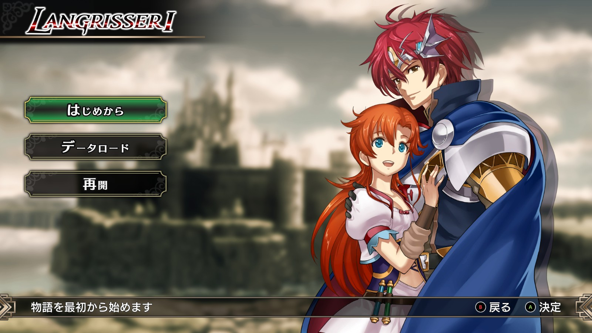

# ラングリッサーⅠ【Steam 版ラングリッサーⅠ＆Ⅱリメイク】攻略メモ

## はじめに

ラングリッサーⅠ＆Ⅱ（LANGRISSER 1&2）リメイクのラングリッサーⅠを Steam 版（PC 版）でプレイしています。基本的には PS4 版・Switch 版と同じはずですが、わずかに異なる部分もあるようです。

2022 年 11 月現在、Steam 版の情報がほとんど見当たらないので、攻略メモを残しておきます。後続の方の参考になれば幸いです。ゲームをかなり進めてからメモを残すことを思い立ったので、最初のほうの章の記述は少なめです。

縮小表示されている画像はクリックすると拡大します。

お約束ですが、内容を保証するものではありません。

## 目次

- [ゲーム概要](docs/Overview.md)
- [体験版のバグ対応](docs/Trial.md)
- [攻略基本情報](docs/Basics.md)
- [クラスチェンジ](docs/ClassChanges.md)
- [特殊範囲魔法](docs/SpecialMagics.md)
- [英語表記](docs/English.md)
- [参考リンク集](docs/Links.md)

## ストーリー攻略メモ（Steam 版）

### A ルート

- 1 章：[王城脱出](docs/Chapter1A.md)
- 2 章：[サルラスへ](docs/Chapter2A.md)
- 3 章：[襲撃](docs/Chapter3A.md)
- 4 章：[死霊の森](docs/Chapter4A.md)
- 5 章：[帝国軍親衛隊](docs/Chapter5A.md)
- 6 章：[バルディア城の攻防](docs/Chapter6A.md)
- 7 章：[砦の勇者](docs/Chapter7A.md)
- 8 章：[追撃](docs/Chapter8A.md)
- 9 章：[ワールの激流](docs/Chapter9A.md)
- 10 章：[湖上の城](docs/Chapter10A.md)
- 11 章：[ダルシス城](docs/Chapter11A.md) → C ルートへ分岐
- 12 章：[ツインキャッスル](docs/Chapter12A.md)
- 13 章：[石像の町](docs/Chapter13A.md)
- 14 章：[ウルフパック](docs/Chapter14A.md)
- 15 章：[邪竜の叫び](docs/Chapter15A.md)
- 16 章：[暗闇の中で](docs/Chapter16A.md)
- 17 章：[禁断の地ヴェルゼリア](docs/Chapter17A.md) → B ルートへ分岐
- 18 章：[廃墟の中で](docs/Chapter18A.md)
- 19 章：[地下神殿](docs/Chapter19A.md)
- 20 章：[闇の封印](docs/Chapter20A.md)
