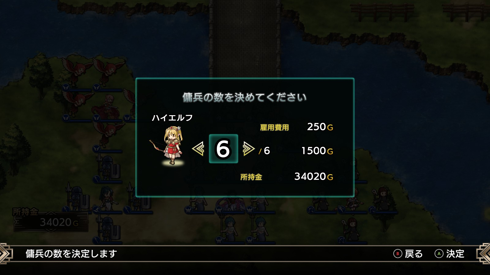
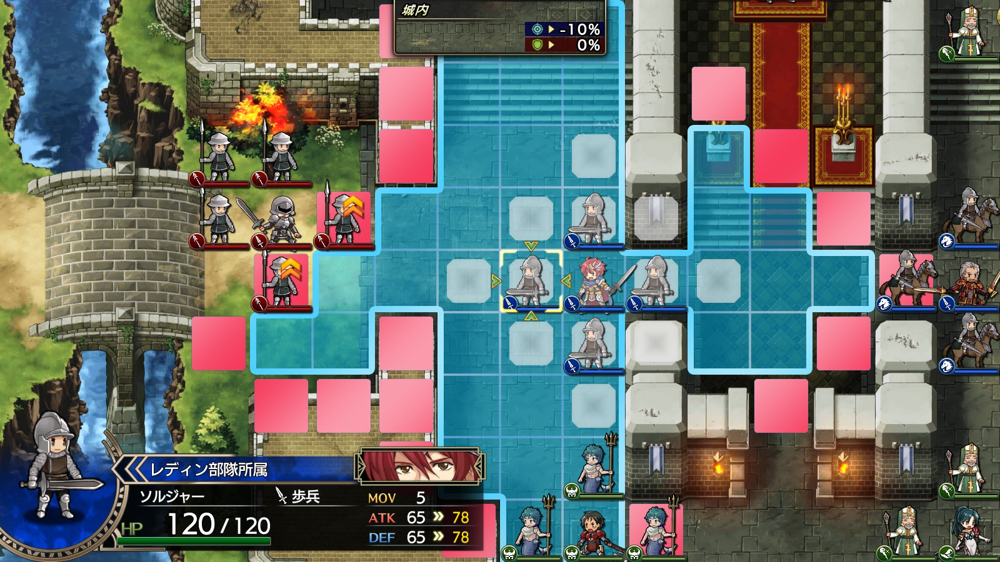

# 攻略基本情報

- [体験版からの引き継ぎ](#体験版からの引き継ぎ)
- [キーボード操作](#キーボード操作)
- [最初の質問（キャラメイク）](#最初の質問)
- [出撃前の準備](#出撃前の準備)
- [傭兵雇用](#傭兵雇用)
- [兵科相性](#兵科相性)
- [その他](#その他)

## 体験版からの引き継ぎ

  

体験版をプレイしてから製品版をプレイすると、初期の所持金が増えます。デフォルトは 10,000 G ですが、20,000 G に倍増します。

詳細な条件は把握していませんが、体験版を少しだけやって（ほぼ起動確認）、ちょっとだけセーブしてすぐに製品版を買ってしまったのですが、それでも増えました。

セーブデータについては、少なくともちょっとだけの範囲では引き継がれませんでした。

## キーボード操作

ラングリッサーⅠはキーボードでも操作することができますが、キーボード操作中でも画面の案内はコントローラーのものなので、非常にわかりにくいです。

上記画像はデフォルトのキーボード設定です。例えば、コントローラーの A ボタンはキーボードの X キーに対応します。慣れないうちは上記画像を見える位置に表示しておくほうがいいかもしれません。

## 最初の質問

  

体験版には質問がありませんが、製品版ではゲームスタート時に質問されすることでキャラメイクされます。回答内容によって主人公（レディン）のスキルなどが変化します。

質問内容については[こちらのサイト](https://gamerch.com/langrisser1-2/entry/70240)が参考になりました。

## 出撃前の準備

### ショップ

  

ストーリー各章開始前の準備画面で必ず行うべきことは、まず、ショップでの買い物です。毎章ラインナップが良くなっていきます。

ラングリッサーⅠではランクの高い傭兵を雇いすぎない限り資金難に陥ることはないと思いますので、欲しいアイテムは遠慮せずに買った方が良いと思います。

### クラスツリー

  

続いて指揮官の見直しです。

クラスツリーを確認し、CP（クラスポイント）が溜まって進化できる場合は基本的に進化させたほうが得です。クラスデータは[こちらのサイト](https://pepedash.biz/langrisser1-classchange/)が分かりやすいです。

逆に、下位クラスの場合は、CP や再進化との兼ね合いもありますが、開放することで称号や魔法などを得られますので、場合によっては開放したほうがいいこともあります。

例えばベテランお付きポジションのヴォルコフは 1 章の時点で CP が余っているので、下位クラスのロードをいったん開放してヒール 1 を覚えることができます。

  

退化させると当然ステータスは下がりますので、再度、最上位クラスに進化させるのを忘れないようにします（一度開放したクラスは CP 不要で再進化できます）。

### スキル

クラスを開放するとスキルを習得しますので、スキルも付け直します。

### アイテム

ショップで買ったアイテムを装備させます。

## 傭兵雇用

  

戦闘準備画面で傭兵雇用ができます。傭兵は指揮官の配下となるユニットで、指揮官の近辺（指揮範囲内）で戦わせることで能力が向上します。

傭兵雇用には金がかかり、各章クリアまで生き残っても次章には引き継げませんし、金も戻ってきません。言い方は悪いですが完全に使い捨てです。

最初に自動編成してから、気に入らない部分を手動で調整していくのが早いと思います。

雇用できる種族とユニット数は指揮官によって異なりますが、いずれの場合も、1 指揮官につき 1 種族のみです。1 種族の中でユニット数を決めます。種族混成部隊は作れません。

  

控えの指揮官がいる場合は、傭兵雇用画面で出撃指揮官との入れ替えもできます。

## 兵科相性

  

ラングリッサーⅠでは、武器（アイテム）ではなく兵科で相性が決まります。

- 騎兵 ＞ 歩兵 ＞ 槍兵 ＞ 騎兵（三すくみ）
- 弓兵 ＞ 飛兵

例えば、槍兵（パイクなど）に対しては歩兵（ソルジャーなど）で攻撃するようにします。有利兵科の場合は橙色の上向き矢印が表示されます。不利兵科の場合は青い下向き矢印です。

  

指揮官と配下で兵科が異なる場合もあるので注意が必要です。

## その他

- 指揮官の HP が 0 になっても退却扱いなので死にません。
    - 次章で復活します。
    - 章クリア時の撃破ボーナスはもらえなくなるので、生き残るに越したことはありません。
- 指揮官が退却すると配下の傭兵は即時全滅します。
    - 敵を倒すときは指揮官を最後にするほうが経験値を稼げます。
- 武器に使用回数制限はありません。
- ステータス的にクリア困難になった場合は同じマップを周回してレベル上げができるようです。
- マップ上の敵ユニットにカーソルを合わせて C キーを押すと、攻撃範囲を確認できます。
- セーブデータは「保存したゲーム」フォルダーに保存されます。
    - %UserProfile%\保存したゲーム\Langrisser I & II
    - クラウド同期されます。

  <a href="../README.md">［ホームへ戻る］</a>

