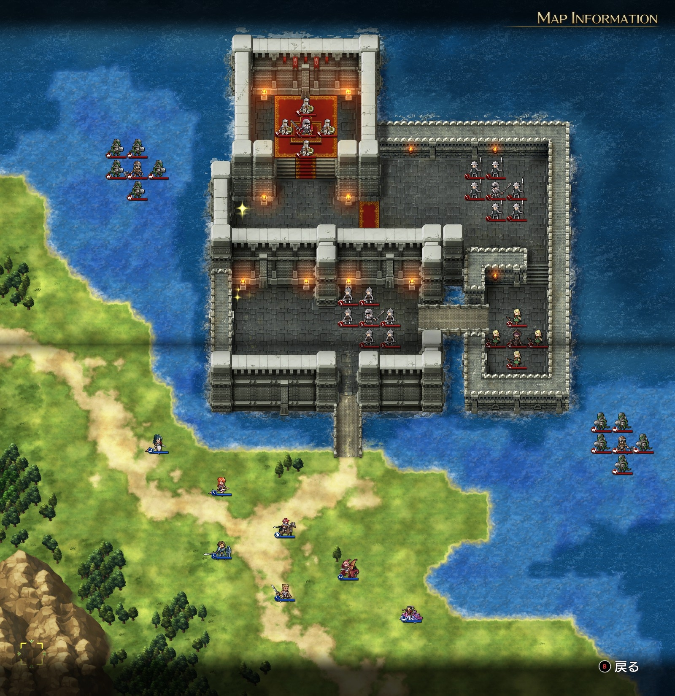

# A ルート 10 章：湖上の城

## マップ

  

光るマス
- 城内、南西
- 城内、玉座の間の手前西側

## 条件

- 勝利条件
    - キルヒナーの撃破
- 敗北条件
    - レディンの死亡

## 攻略メモ

### 出撃指揮官

|指揮官|クラス|傭兵|
|---|---|---|
|レディン|ハイランダー|トルーパー|
|クリス|プリースト|ウィッチ|
|ナーム|ドラゴンナイト|エンジェル|
|ジェシカ|メイジ|モンク|
|アルバート|ソードマン|ソルジャー|
|ソーン|ハイロード|トルーパー|
|テイラー|サーペンナイト|リザードマン|

### 作戦

敵は水兵 2 部隊以外は、援軍が来るまでは基本的に動きません。

魚のエサにしてやると襲ってくる西側の水兵には、ナーム隊とジェシカ隊で対応。

東側の水兵にはテイラー隊が対応。

援軍対策としてソーンとアルバートを平原に残しつつ、正面からの突入はレディン王子自らが行い、クリスが続きます。

4 ターン目と早い段階で敵の援軍が南に到着。援軍が到着すると、キルヒナー以外の敵軍も打って出てきます。

城南側の横向きの橋に帝国指揮官（パラディン）に陣取られてしまい、一時膠着状態になってしまいました。テイラー隊が橋の途中や城壁から侵入し、帝国指揮官の傭兵を片付けてから、ようやく帝国指揮官を撃破でき、進軍を再開できました。

援軍にも苦戦。ディスタンが思いのほか強く、かなり損耗しました。アルバートの傭兵ランクをケチったのも原因かもしれませんが……。

キルヒナーもしたたかでしたが、なんとか撃破できました。

### 反省点

陸上ユニットが城の左右から壁越えで侵入できないのが誤算でした（浅瀬ではなく海なので）。

西側の水兵は揚陸するまで待って陸上部隊で対応し、東側はナーム隊が水兵を振り切ってトルネードを避けつつ北東から侵入、水兵にテイラー隊が対応するようにすれば、もっと迅速に制圧できたかもしれません。

  <a href="../README.md">［ホームへ戻る］</a>

