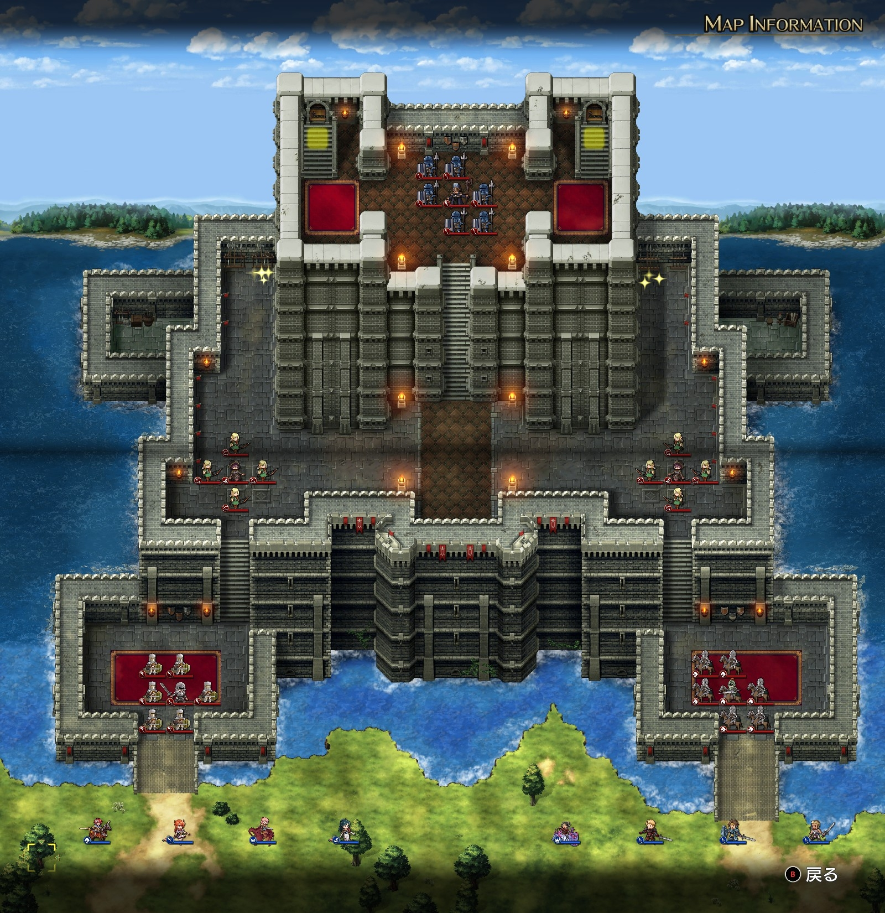

# A ルート 11 章：ダルシス城

## マップ

  

光るマス
- 北西の外廊下
- 北東の外廊下

## 条件

- 勝利条件
    - 敵の全滅
    - レディンが最上階への階段に到達
- 敗北条件
    - レディンの死亡

## 攻略メモ

### 出撃指揮官

|指揮官|クラス|傭兵|
|---|---|---|
|レディン|ナイトマスター|トルーパー|
|クリス|プリースト|ウィッチ|
|ナーム|ドラゴンナイト|エンジェル|
|ジェシカ|メイジ|モンク|
|ホーキング|ハイロード|ファランクス|
|アルバート|ソードマン|パイク|
|ソーン|ハイロード|トルーパー|
|テイラー|サーペンナイト|リザードマン|

### 作戦

敵は基本的には動きません。

東西の入口から二手に分かれて北上していきます。

西側は主力のレディンを中心に攻め入っていきます。

中段の帝国指揮官はトルネードを持っていますが 1 発しか撃てないので、囮に打たせた後で攻め入ります。とはいえ、狭い階段をエルフで塞がれてしまうので、被害は少ないが時間はかかってしまいます。

飛兵は海側から城壁を越えて中段に、最上空から上段に侵入できますが、エルフを倒すまで中段付近で待機です。

途中で南にまたしてもランスが増援として来るので、ファランクスを擁するホーキングは城には入れずに置いていきます。兵種相性はすさまじく、ほとんど無傷といってもいいくらいの状態でランス隊に勝てます。

東側の守備隊は騎兵なので、パイクを擁するアルバート隊で攻め入ります。中段は西側と同様です。

中段の攻防を終えた辺りで、北西・北東の上空にワイバーンが襲来します。ワイバーンは帝国軍ではないので、帝国軍も襲います。

ワイバーンはかなり強力です。運良く東側のワイバーンはサー・ガリウスを襲いに行ってくれました。経験値的には惜しいものはありますが、味方の損耗を抑え、かつ、サー・ガリウスに魔法を打たせてくれたのはかなりの支援です。

西側のワイバーンはレディン隊とナーム隊で協力して倒しましたが、傭兵を数ユニット失いました。

両側のアイテムを回収しつつ上段のサー・ガリウスへと攻め上げますが、狭い階段にファランクスが陣取っているのでなかなか進めません。サー・ガリウス隊はワイバーンとの戦闘中でしたが、ファランクスはワイバーンよりもこちらを優先して攻撃してくるように見受けられます。

おかげでサー・ガリウス本人がワイバーンと直接対決する羽目になり、こちらが攻め上げるあと一歩前にワイバーンにやられてしまいました。貴重な経験値が……。

仇（？）のワイバーンを倒してクリア。

## 反省点

もう少し迅速に攻めれば、打ち合って損耗しているワイバーンとサー・ガリウスを両方漁夫の利で狩れたのではと思います。

  <a href="../README.md">［ホームへ戻る］</a>

