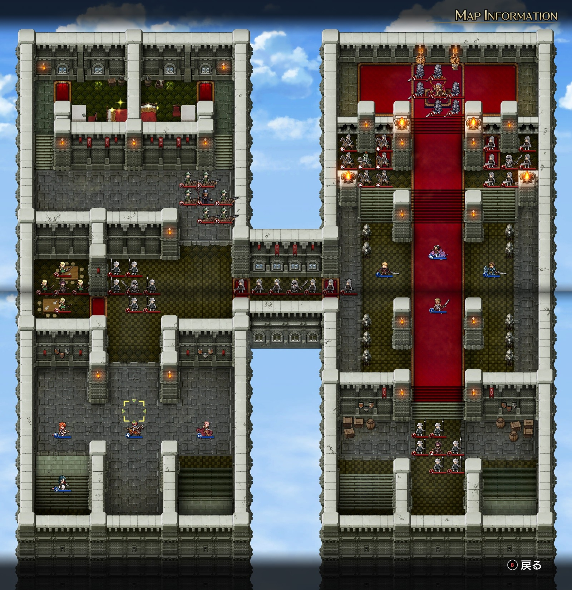

# A ルート 12 章：ツインキャッスル

## マップ

  

光るマス
- 北西の西側
- 北西の東側

## 条件

- 勝利条件
    - ディゴスの撃破
- 敗北条件
    - レディンの死亡

## 敵軍

|指揮官|クラス|兵種|傭兵|傭兵兵種|
|---|---|---|---|---|
|ディゴス|エンペラー|歩兵|グレナディーア|歩兵|
|リスラム|ジェネラル|歩兵|ソルジャー|歩兵|
|アーザム|アークメイジ|魔法使い|パイク|槍兵|
|サー・ガリウス|セージ|僧侶|バリスタ|バリスタ|
|帝国指揮官|メイジ|魔法使い|エルフ|弓兵|
|帝国指揮官|ハイロード|歩兵|パイク|槍兵|
|帝国指揮官|ハイロード|歩兵|ソルジャー|歩兵|
|帝国指揮官|シルバーナイト|騎兵|ランサー|騎兵|

## 増援

なし

## 流れ

ダルシス城の内部に突入し、皇帝ディゴスと決着を付けるマップです。

1 ターン目から攻め寄せてくる敵は、西側では帝国指揮官（ハイロード）、東側では北寄りの帝国指揮官 2 名（シルバーナイトとハイロード）です。その他は近づくまで動きません。

## 攻略メモ

### 出撃指揮官

|指揮官|クラス|傭兵|
|---|---|---|
|レディン|ナイトマスター|ロイヤルランサー|
|クリス|プリースト|モンク|
|ナーム|ドラゴンナイト|エンジェル|
|ジェシカ|メイジ|ファランクス|
|ホーキング|ハイロード|クルセイダー|
|アルバート|ソードマン|バーサーカー|
|ソーン|ハイロード|トルーパー|
|テイラー|サーペンロード|ニクシー|

※指揮官の配置変更不可

### 作戦

西側は、まずは攻め寄せてくる帝国指揮官（ハイロード）隊を片付けます。

次に、帝国指揮官（メイジ）の 4 マスに傭兵を 1 ユニットだけ囮としてブリザードを 2 回打たせた後で片付けます。

次に、サー・ガリウスをメイジ同様に片付けてから、アイテム回収に向かいます。サー・ガリウスは比較的強いですが、その他は弱いです。

渡り廊下のリスラムは地道に削っていきます。

東側は、攻め寄せてくる帝国指揮官 2 名の隊を片付けつつ、南のアーザムも同時に殲滅しますが、特に問題はありません。

渡り廊下のリスラムも東側から削っていきます。

玉座のディゴスは異様に強く、また配下のグレナディーアもかなり強いので、ディゴス隊は慎重に削っていきます。

ディゴスの 4 マスに傭兵（特効の水兵は避ける）を囮としてサンダーストームを打たせつつも、左右も傭兵で固めて囮がグレナディーアに集中攻撃されないようにします。

傷ついた囮を下げて指揮官の隣に置いて回復させつつ、元気な傭兵を交代で前線に出します。前線配備時、自分から攻撃を仕掛けると敵ターンに全滅してしまう恐れがあるため、自分からの攻撃はしません。

ディゴス 1 人になったら、ジェシカやクリスの魔法で攻撃しつつ、傭兵で削っていきます。残念ながら、指揮範囲内でアタック補助ありでもディゴスはほとんど削れません。トルーパーだと兵種相性は良いはずなのに 1 ミリも削れないまであります。しかも傭兵は 1 ターンで倒されてしまうこともザラです。ニクシーは比較的善戦してくれました。

とはいえ物量で押すことである程度削れるので、最後は指揮官でとどめを刺します。

### 反省点

ブレイクでディゴスの DEF を下げるのを忘れていました。

  <a href="../README.md">［ホームへ戻る］</a>

