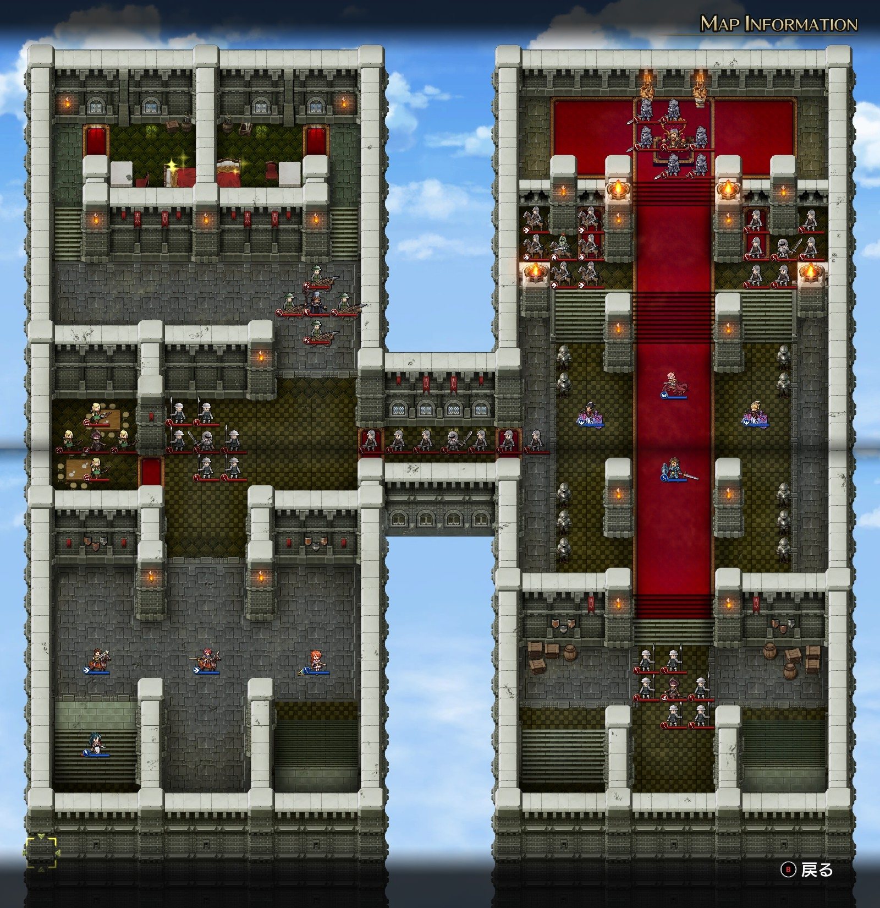
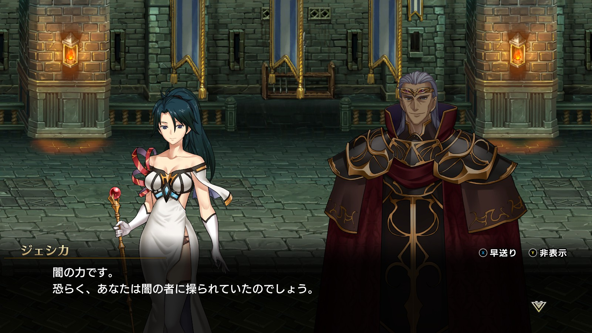
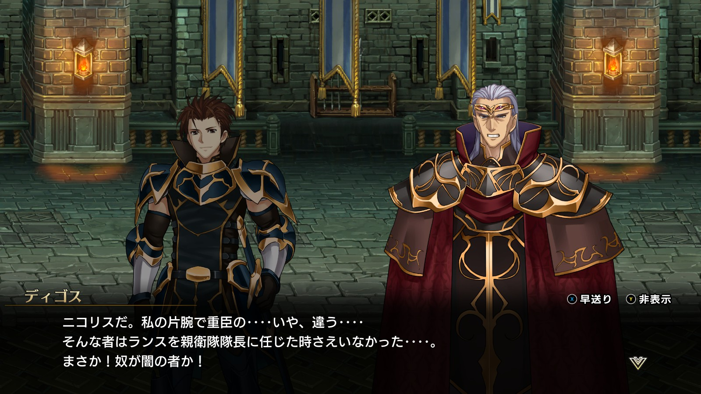

Steam 版ラングリッサーⅠ＆Ⅱリメイク > ラングリッサーⅠ

# C ルート 12 章：ツインキャッスル

## マップ

  

光るマス
- 北西の西側：2,000 G
- 北西の東側：金塊

## 条件

- 勝利条件
    - ディゴスの撃破
- 敗北条件
    - レディンの死亡
- クリアボーナス
    - 6,000 G

## 敵軍

|指揮官|クラス|兵種|傭兵|傭兵兵種|
|---|---|---|---|---|
|ディゴス|エンペラー|歩兵|グレナディーア|歩兵|
|リスラム|ジェネラル|歩兵|ソルジャー|歩兵|
|アーザム|アークメイジ|魔法使い|パイク|槍兵|
|サー・ガリウス|セージ|僧侶|バリスタ|バリスタ|
|帝国指揮官|メイジ|魔法使い|エルフ|弓兵|
|帝国指揮官|ハイロード|歩兵|パイク|槍兵|
|帝国指揮官|ハイロード|歩兵|ソルジャー|歩兵|
|帝国指揮官|シルバーナイト|騎兵|ランサー|騎兵|

## 増援

なし

## 流れ

ダルシス城の内部に突入し、皇帝ディゴスと和解するマップです。

クリアの仕方によってルート分岐があります。
- サー・ガリウスを撃破する → C ルートのまま
- サー・ガリウスを撃破しない → E ルートへ分岐

1 ターン目から攻め寄せてくる敵は、西側では帝国指揮官（ハイロード）、東側では北寄りの帝国指揮官 2 名（シルバーナイトとハイロード）です。その他は近づくまで動きません。

## A ルートとの違い

- 11 章でランスが仲間になっている
- サー・ガリウスの傭兵のバリスタ：6 → 4
- 指揮官の配置入替：不可 → 可
- 会話：正気に戻ったディゴスと和解

  

  

## 攻略メモ

### 出撃指揮官

|指揮官|クラス|傭兵|
|---|---|---|
|レディン|ナイトマスター|－|
|クリス|プリンセス|バリスタエリート|
|ナーム|ドラゴンロード|ファランクス|
|ジェシカ|エージェント|－|
|ホーキング|サーペンロード|ニクシー|
|アルバート|ソードマスター|グレナディーア|
|ソーン|ナイトマスター|ドラグーン|
|ランス|ナイトマスター|ロイヤルランサー|

### 控え指揮官

- テイラー

### 作戦

基本的に [A ルート](Chapter12A.md#作戦)と同じ作戦にしました。

### 反省点

A ルートクリア後の周回プレイで、かつ、B ルートのクリア直前データからシナリオツリーを戻してのプレイなので、キャラのレベルは格段に上がっており、特に苦労はしませんでした。

  <a href="../README.md">［ホームへ戻る］</a>

