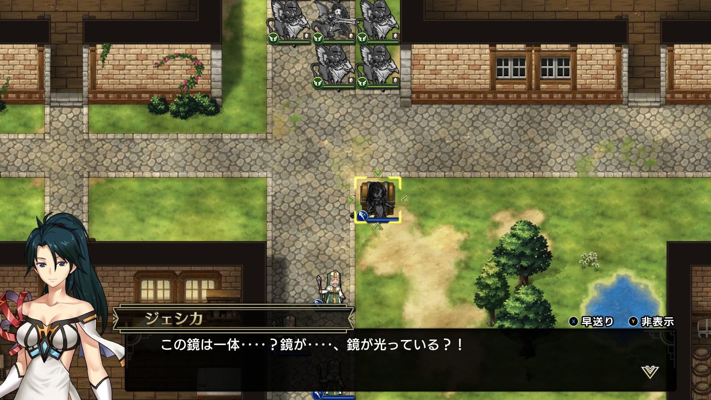

Steam 版ラングリッサーⅠ＆Ⅱリメイク > ラングリッサーⅠ

# A ルート 13 章：石像の町

## マップ

  

光るマス
- 北西の家：黄金の杖
- 北東の家：1,500 G

## 条件

- 勝利条件
    - 敵の全滅
- 敗北条件
    - レディンの死亡
    - 味方全員が行動不能
- クリアボーナス
    - 6,500 G

## 敵軍

|指揮官|クラス|兵種|傭兵|傭兵兵種|
|---|---|---|---|---|
|リビングアーマー|リビングアーマー|不死|ゾンビ|不死|
|クラーケン|クラーケン|怪物水|リヴァイアサン|怪物水|
|クラーケン|クラーケン|怪物水|リヴァイアサン|怪物水|
|ケルベロス|ケルベロス|怪物陸|ヘルハウンド|怪物陸|
|ケルベロス|ケルベロス|怪物陸|ヘルハウンド|怪物陸|
|ゲルギャザー|ゲルギャザー|怪物ゲル|ゲル|怪物ゲル|
|バジリスク|バジリスク|怪物陸|クロウラー|怪物陸|
|バジリスク|バジリスク|怪物陸|クロウラー|怪物陸|

## 増援

なし

## 流れ

封印が解けてしまった邪悪を追い、人の出入りが途絶えた町へと赴くマップです。

ショップでは使いどころを選ぶアーバレスト（ATK+50、DEF-10、MOV-1）が販売されています。

このマップで初めて、全員出撃ができず控えの指揮官を待機させることになります。

北の道端にある宝箱を指揮官で踏むとその時点での石化が解除されます（傭兵ではダメです）。同時に NPC のランス（今まで敵でしたが今回は味方）と村人の石化も解除されます。

  

各モンスターは 1 ターン目から攻め寄せてきます。

クリア後、ランスが仲間になります。

## 攻略メモ

### 出撃指揮官

|指揮官|クラス|傭兵|
|---|---|---|
|レディン|ナイトマスター|トルーパー|
|クリス|プリースト|モンク|
|ナーム|ドラゴンロード|エンジェル|
|ジェシカ|メイジ|ファランクス|
|ホーキング|ハイロード|トルーパー|
|ソーン|ジェネラル|クルセイダー|

### 控え指揮官

- アルバート
- テイラー

### 作戦

クラーケンと配下のリヴァイアサンは MOV 5 で、川（浅瀬）を 10 マス進めるため、飛兵のナーム隊でも無傷での渡河は困難です。

そこで、初期配置位置の内陸寄り（クラーケンを揚陸させる）に全ユニットで防衛陣（外側に傭兵、内側に指揮官）を敷いて数ターンを乗り切りました。

モンスターのうち注意すべきは、攻撃力の高いクラーケンと、石化能力を持つバジリスクです。バジリスクと接近戦をすると高確率で石化になります。弓兵を連れていかなかったので、魔法での間接攻撃と、いくばくかの直接攻撃で傭兵を犠牲にしつつ仕留めました。

逆に、南のリビングアーマーは初期配置のクリスがホーリーブレイズを放つことで一撃全滅です。

途中からナーム隊を北に向かわせ、アイテムを回収します。

ランスに好き勝手暴れられては困るので、宝箱を踏むのは最後にしました。

## 反省点

どのみち戦闘は避けられないので、初手からナーム隊を北に向かわせれば良かったです。北東のアイテム回収に時間がかかり、最後数ターンはケルベロス達との戦闘を手加減して時間稼ぎする羽目になってしまいました。

  <a href="../README.md">［ホームへ戻る］</a>

