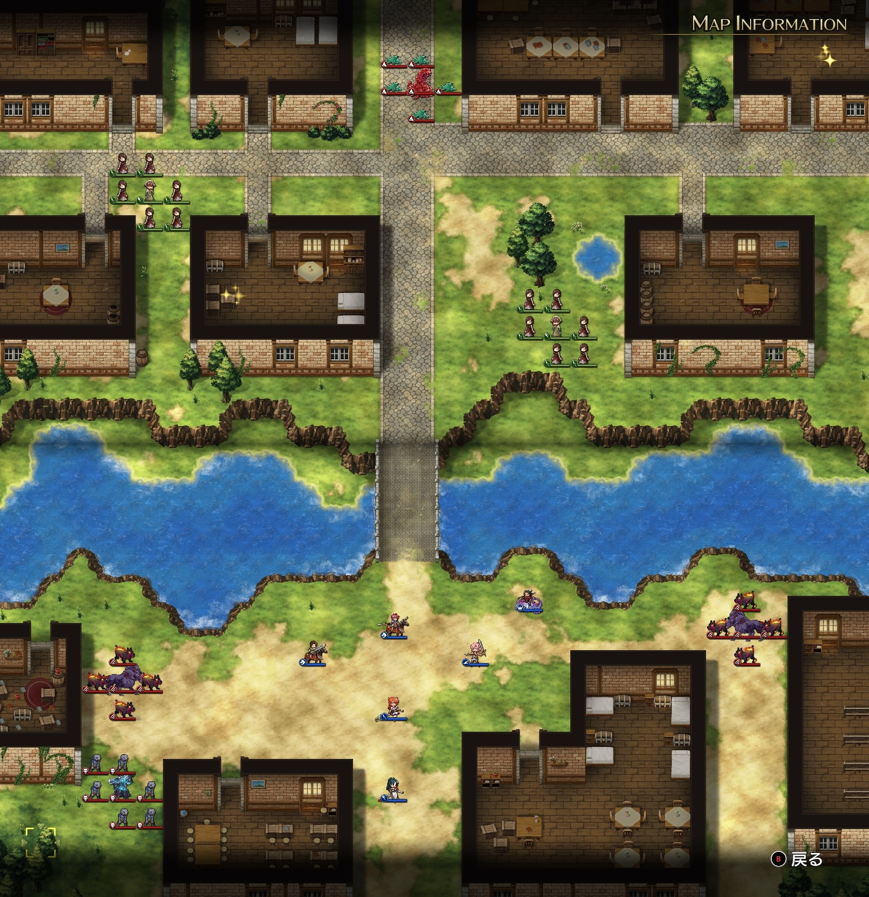

Steam 版ラングリッサーⅠ＆Ⅱリメイク > ラングリッサーⅠ

# C ルート 13 章：現れた闇

## マップ

  

光るマス
- 北西の家：黄金の杖
- 北東の家：1,500 G

## 条件

- 勝利条件
    - 敵の全滅
- 敗北条件
    - レディンの死亡
    - 村人が全滅
- クリアボーナス
    - 6,500 G

## 敵軍

|指揮官|クラス|兵種|傭兵|傭兵兵種|
|---|---|---|---|---|
|リビングアーマー|リビングアーマー|不死|ゾンビ|不死|
|ケルベロス|ケルベロス|怪物陸|ヘルハウンド|怪物陸|
|ケルベロス|ケルベロス|怪物陸|ヘルハウンド|怪物陸|
|ゲルギャザー|ゲルギャザー|怪物ゲル|ゲル|怪物ゲル|

## 増援

|出現ターン|出現位置|指揮官|クラス|兵種|傭兵|傭兵兵種|
|---|---|---|---|---|---|---|
|3 ターン目|川の西端|クラーケン|クラーケン|怪物水|リヴァイアサン|怪物水|
|3 ターン目|川の東端|クラーケン|クラーケン|怪物水|リヴァイアサン|怪物水|
|4 ターン目|南東の路地|ライアス（味方 NPC）|シルバーナイト|騎兵|トルーパー|騎兵|
|4 ターン目|南東の路地|レティシア（味方 NPC）|シルバーナイト|騎兵|トルーパー|騎兵|

## 流れ

街へと押し寄せる闇の軍勢に対し、帝国と協力して当たるマップです。

西側の村人は北西の家へ向かいます。

中央の村人は北へ向かった後、道路を東へ進みます。

北のゲルギャザーは中央の村人を襲います。2 ターン目で接敵しますが、村人の傭兵から襲うこともあり、村人指揮官は 4 ターン持ちこたえます。自軍と接している場合でも、回り込んで村人を優先して襲います。

その他の敵は自軍に攻め寄せてきますが、どちらかというと、村人を襲いに行く通り道に自軍がいるといった感じです。

クリア後、ライアスとレティシアが仲間になります。

## 攻略メモ

### 出撃指揮官

|指揮官|クラス|傭兵|
|---|---|---|
|レディン|ナイトマスター|－|
|クリス|プリンセス|－|
|ナーム|ドラゴンロード|グリフォン|
|ホーキング|サーペンロード|ニクシー|
|ソーン|ナイトマスター|ファランクス|
|ランス|ロイヤルガード|ドラグーン|

  

### 控え指揮官

- ジェシカ
- アルバート
- テイラー

### 作戦

緊急なのは北側なので、ナーム隊を一番右に配置し、隣のランスにアクセル（MOV+2）を掛けてもらってから北に急行します。ゲルギャザーが自軍と接敵していても回り込んで村人を襲うとは思っていなかったので、村人傭兵を 1 ユニット失いましたが、すべてのゲルを倒した上でゲルギャザーを倒しました。その後はアイテム回収です。

南側は、リビングアーマーはクリスで、その他は物理で殴りながら、クラーケンの到着を待ちます。

西側のクラーケンはサーペンロードのホーキングが仕留め、東側のクラーケンは地上部隊との混戦で乗り切りました。

### 反省点

NPC（同盟帝国軍）には敵を倒させず、自軍で敵を全滅させたので、政治的にはどうかと思いますが、ゲーム的には良かったかと思います。

  <a href="../README.md">［ホームへ戻る］</a>

