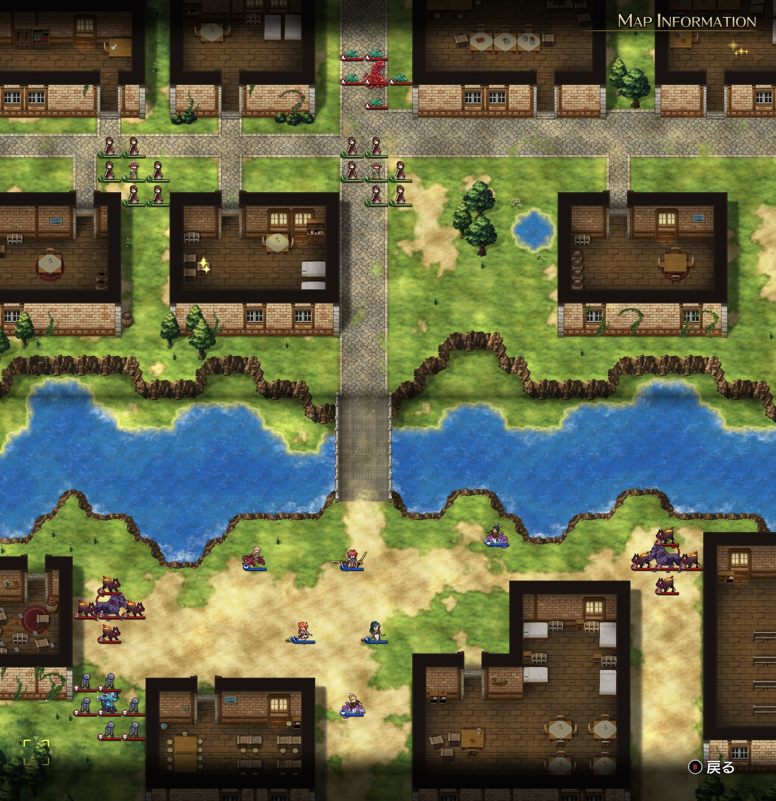
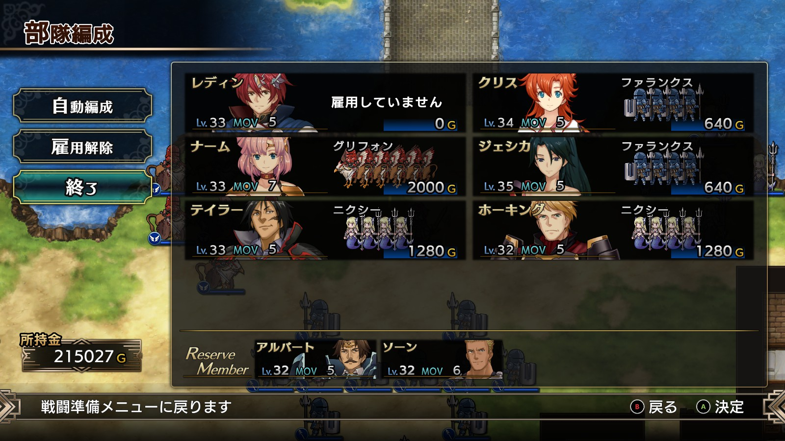
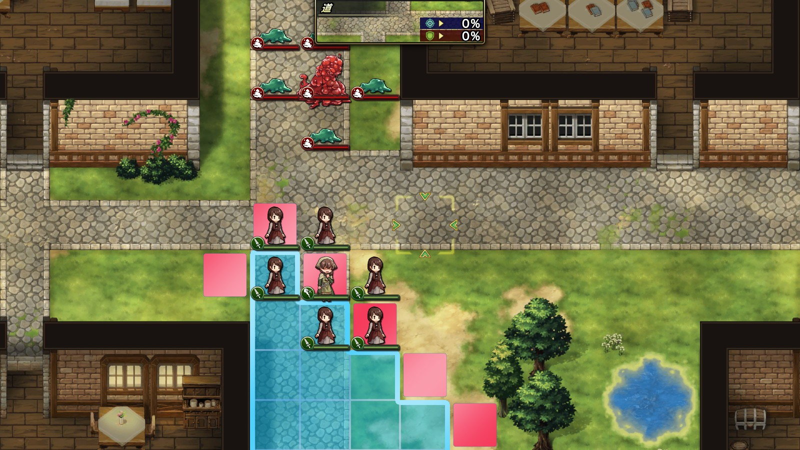

Steam 版ラングリッサーⅠ＆Ⅱリメイク > ラングリッサーⅠ

# E ルート 13 章：現れた闇

## マップ

  

光るマス
- 北西の家：アーバレスト
- 北東の家：1,500 G

## 条件

- 勝利条件
    - 敵の全滅
- 敗北条件
    - レディンの死亡
    - 村人が全滅
- クリアボーナス
    - 6,500 G

## 敵軍

|指揮官|クラス|兵種|傭兵|傭兵兵種|
|---|---|---|---|---|
|リビングアーマー|リビングアーマー|不死|ゾンビ|不死|
|ケルベロス|ケルベロス|怪物陸|ヘルハウンド|怪物陸|
|ケルベロス|ケルベロス|怪物陸|ヘルハウンド|怪物陸|
|ゲルギャザー|ゲルギャザー|怪物ゲル|ゲル|怪物ゲル|

## 増援

|出現ターン|出現位置|指揮官|クラス|兵種|傭兵|傭兵兵種|
|---|---|---|---|---|---|---|
|3 ターン目|川の西端|クラーケン|クラーケン|怪物水|リヴァイアサン|怪物水|
|3 ターン目|川の東端|クラーケン|クラーケン|怪物水|リヴァイアサン|怪物水|

## 流れ

街へと押し寄せる闇の軍勢に対抗するマップです。

西側の村人は北西の家へ向かいます。

中央の村人は道路を東へ進みます。

北のゲルギャザーは中央の村人を襲います。2 ターン目で村人指揮官を撃破します。

その他の敵は自軍に攻め寄せてきます。

クリア後、ライアスとレティシアが仲間になります。

## C ルートとの違い

- 中央の村人がゲルギャザーに近い
- ランス、レティシアの援軍が来ない
- クリア後にランス、レティシアが仲間にならない

## 攻略メモ

### 出撃指揮官

|指揮官|クラス|傭兵|
|---|---|---|
|レディン|キング|－|
|クリス|プリンセス|ファランクス|
|ナーム|ドラゴンロード|グリフォン|
|ジェシカ|エージェント|ファランクス|
|ホーキング|サーペンロード|ニクシー|
|テイラー|サーペンマスター|ニクシー|

  

### 控え指揮官

- アルバート
- ソーン

### 作戦

C ルートよりもさらに北側の緊急性が高まっています。

アクセルを掛けたナーム隊をテレポートで少しでも村人付近に転送させてから移動しましたが、それでも村人とゲルギャザーの間に入ることはできず、村人傭兵 3 ユニットを失いました。ノーデスクリアする方法はあるのでしょうか？

  

ゾンビにはクリスがホーリーブレイズを使いつつ、その他は普通に戦うだけで特に問題ありませんでした。むしろ、アイテム回収するまで時間稼ぎをする必要がありました。

### 反省点

召喚傭兵にノーデスクリアの手がかりがあったりするのかな、とか考えてみましたが今のところ分かりません。

  <a href="../README.md">［ホームへ戻る］</a>

