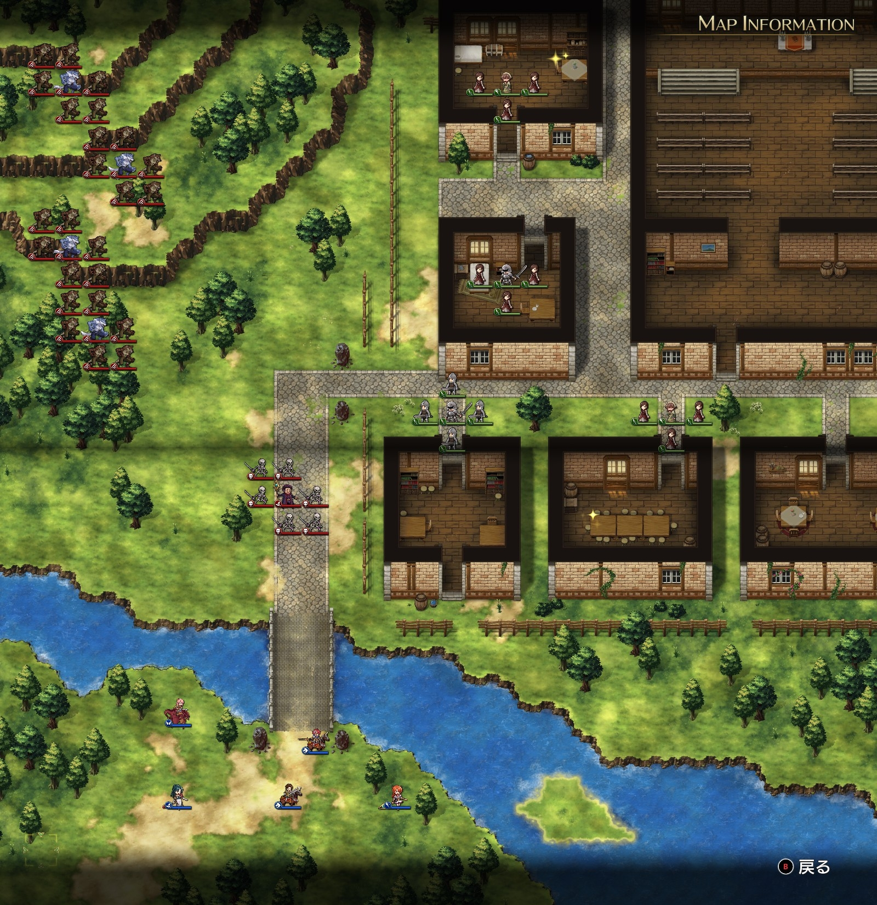

Steam 版ラングリッサーⅠ＆Ⅱリメイク > ラングリッサーⅠ

# A ルート 14 章：ウルフパック

## マップ

  

光るマス
- 北の家：金塊
- 南側、真ん中の家：アイスブレード

## 条件

- 勝利条件
    - 敵の全滅
- 敗北条件
    - レディンの死亡
    - 村人が全滅

## 敵軍

|指揮官|クラス|兵種|傭兵|傭兵兵種|
|---|---|---|---|---|
|ナーギャ|ザーヴェラー|魔法使い|スケルトン|不死|
|ウェアウルフ|ウェアウルフ|怪物陸|ウルフマン|怪物陸|
|ウェアウルフ|ウェアウルフ|怪物陸|ウルフマン|怪物陸|
|ウェアウルフ|ウェアウルフ|怪物陸|ウルフマン|怪物陸|
|ウェアウルフ|ウェアウルフ|怪物陸|ウルフマン|怪物陸|

## 増援

|出現ターン|出現位置|指揮官|クラス|兵種|傭兵|傭兵兵種|
|---|---|---|---|---|---|---|
|1 ターン目|南東|ウェアウルフ|ウェアウルフ|怪物陸|ウルフマン|怪物陸|

## 流れ

ワーウルフの大群に襲われている村人を助けるマップです。

敵は 1 ターン目から村人を襲いに向かいます。

村人は教会に向かって移動します。ルキワードはしばらくは動きませんが、村人の動きに合わせて教会に向かいます。

1 ターン目に早速増援が来ます。初期配置されていないところが嫌らしいところです。

クリア後、ルキワードからクラウンをもらえます。

## 攻略メモ

### 出撃指揮官

|指揮官|クラス|傭兵|
|---|---|---|
|レディン|ナイトマスター|トルーパー|
|クリス|ハイプリースト|モンク|
|ナーム|ドラゴンロード|エンジェル|
|アルバート|ソードマン|バーサーカー|
|テイラー|サーペンロード|リザードマン|

### 控え指揮官

- ジェシカ
- ホーキング
- ソーン
- ランス

### 作戦

ナーギャは広範囲かつ強力な魔法のアースクエイクを使ってきますので、アースクエイク無効のナーム隊でまずナーギャ隊を殲滅します。

テイラーは増援を抑えるために東へ進みます。初期配置を一番東にして、1 ターン目から東へ進んでおけば、水辺を中心に増援と戦うことができます。増援殲滅後は南側のアイテム回収に向かいます。

俊足のレディンは、アースクエイクの範囲（特殊 4 マス）を避けながら民家の間をぬって北上し、ウェアウルフの迎撃に向かいます。

ナームがナーギャを倒した後、ナーム、アルバート、クリスでウェアウルフを追いかけて攻撃します。レディンと挟み撃ちにする格好です。ナームは北のアイテム回収も行います。

## 反省点

狭い路地に複数のウェアウルフ隊が混じってしまったため、ウルフマンを倒さないうちにウェアウルフを倒さざるを得ず、だいぶ経験値を逃してしまいました。

  <a href="../README.md">［ホームへ戻る］</a>

