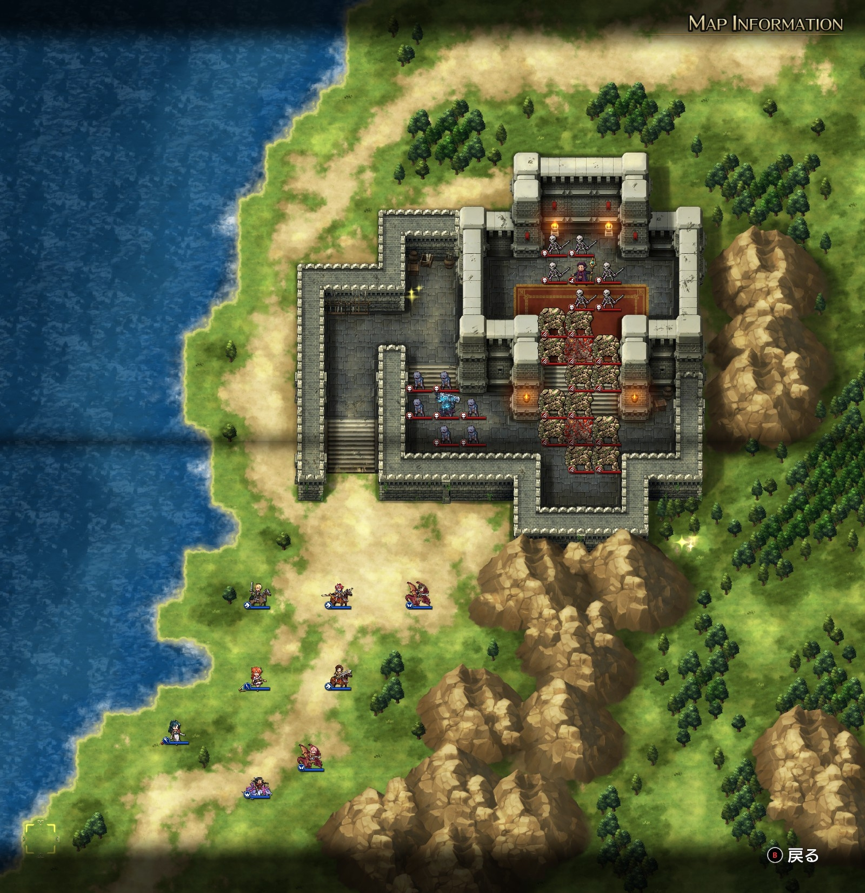
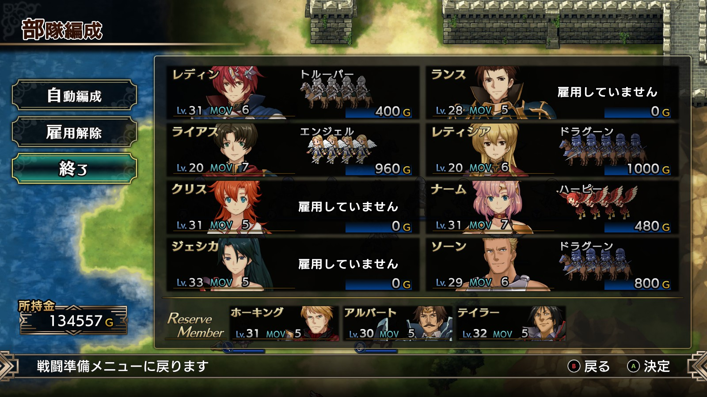
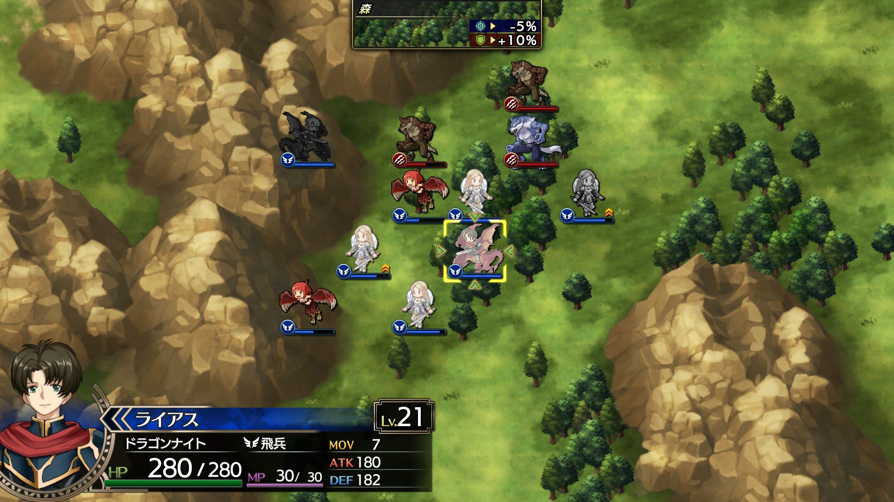
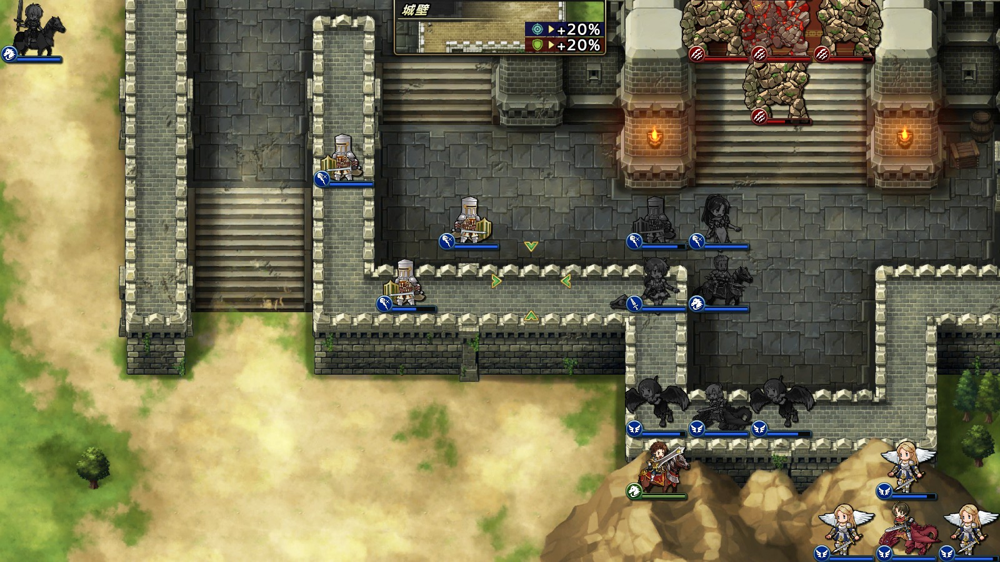
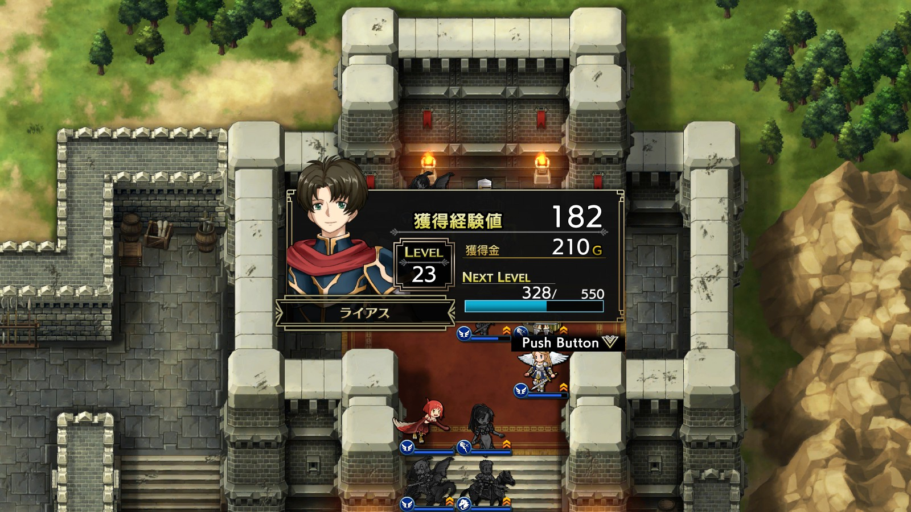

Steam 版ラングリッサーⅠ＆Ⅱリメイク > ラングリッサーⅠ

# C ルート 14 章：闇の砦

## マップ

  

光るマス
- 砦内の北西：金塊
- 砦外の南東：アイスブレード

## 条件

- 勝利条件
    - 敵の全滅
- 敗北条件
    - レディンの死亡
    - ランスの死亡
- クリアボーナス
    - 7,000 G

## 敵軍

|指揮官|クラス|兵種|傭兵|傭兵兵種|
|---|---|---|---|---|
|ナーギャ|ザーヴェラー|魔法使い|スケルトン|不死|
|ストーンゴーレム|ストーンゴーレム|怪物陸|ゴーレム|怪物陸|
|ストーンゴーレム|ストーンゴーレム|怪物陸|ゴーレム|怪物陸|
|リビングアーマー|リビングアーマー|不死|ゾンビ|不死|

## 増援

|出現ターン|出現位置|指揮官|クラス|兵種|傭兵|傭兵兵種|
|---|---|---|---|---|---|---|
|3 ターン目|南西|ケルベロス|ケルベロス|怪物陸|ヘルハウンド|怪物陸|
|3 ターン目|南東|ケルベロス|ケルベロス|怪物陸|ヘルハウンド|怪物陸|
|5 ターン目|北西|ウェアウルフ|ウェアウルフ|怪物陸|ウルフマン|怪物陸|
|5 ターン目|東|ウェアウルフ|ウェアウルフ|怪物陸|ウルフマン|怪物陸|

## 流れ

ラングリッサーが持ち込まれたとされる砦を攻撃するマップです。

敵は近づくまで動きません。

2 ターン目にランスが NPC となり、城壁をよじ登ってナーギャに向かっていくようになります。

増援の各隊は進軍してきます。

クリア後、ランスが再度仲間になります。

## 攻略メモ

### 出撃指揮官

|指揮官|クラス|傭兵|
|---|---|---|
|レディン|ナイトマスター|トルーパー|
|クリス|プリンセス|－|
|ナーム|ドラゴンロード|ハーピー|
|ジェシカ|エージェント|－|
|ソーン|ナイトマスター|クルセイダー|
|ランス|ロイヤルガード|－|
|ライアス|ドラゴンナイト|エンジェル|
|レティシア|ハイランダー|ドラグーン|

  

### 控え指揮官

- ホーキング
- アルバート
- テイラー

### 作戦

NPC になるランスには傭兵を与えず、また、死なれては困るので移動を少しでも制限するために MOV-1 となる不死王の腕輪を装備させておきます。さらに、なるべく砦から遠いところに移動させます。

新しく仲間となったライアスとレティシアはかなりレベルが低いので、ここで集中的に上げることにしました。特に、ライアスは第二の飛兵として育てるべく、ナーム師匠のサポートを受けながら増援を片付けていきます。

  

砦内突入組みは、魔法ノーダメージのジェシカ、クルセイダーを率いるソーン、回復役のクリスとします。城壁を越えようとするランスをブロックしながら地道にゴーレムを削っていきます。

  

ある程度ゴーレムを削ったところで、増援を片付けたライアスも合流し、ナーギャの魔法を被弾しながらも特攻して一気に制圧します。

ライアスはこのマップで一気にレベルが 3 上がりました。

  

### 反省点

ライアスのレベルも上がって良かったのではないかと思います。

  <a href="../README.md">［ホームへ戻る］</a>

