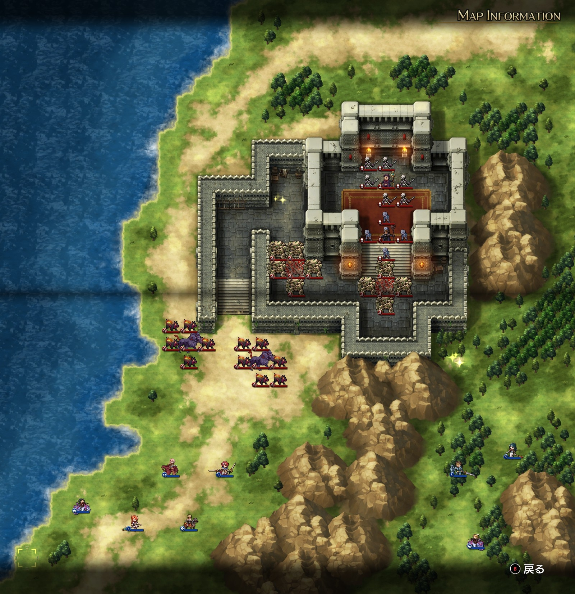
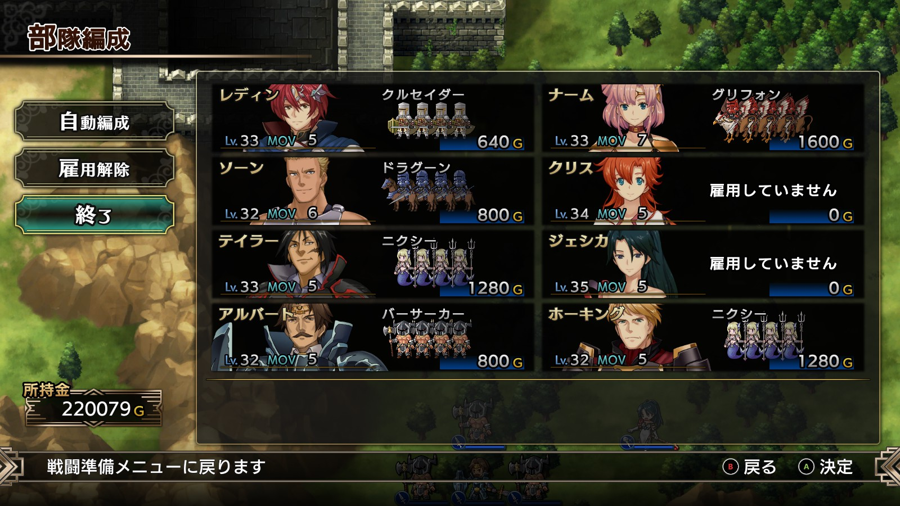
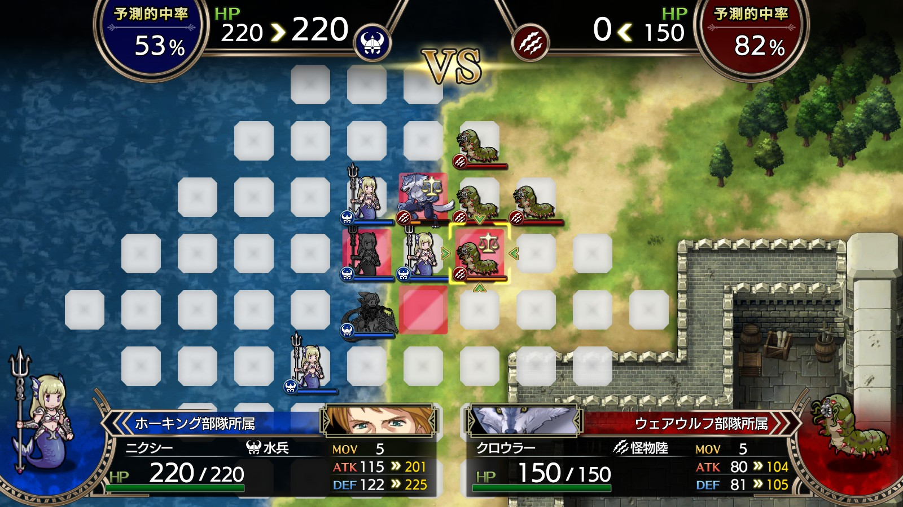
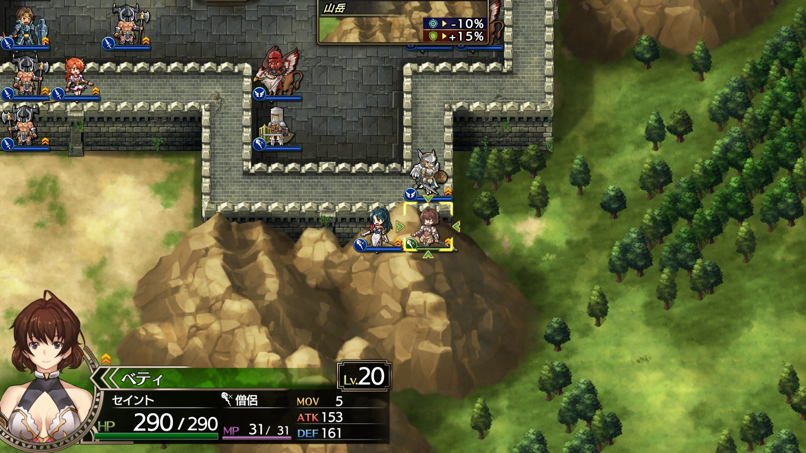

Steam 版ラングリッサーⅠ＆Ⅱリメイク > ラングリッサーⅠ

# E ルート 14 章：闇の砦

## マップ

  

光るマス
- 砦内の北西：金塊
- 砦外の南東：神獣のいななき

## 条件

- 勝利条件
    - 敵の全滅
- 敗北条件
    - レディンの死亡
- クリアボーナス
    - 7,000 G

## 敵軍

|指揮官|クラス|兵種|傭兵|傭兵兵種|
|---|---|---|---|---|
|ナーギャ|ザーヴェラー|魔法使い|スケルトン|不死|
|サー・ガリウス|セージ|僧侶|ゾンビ|不死|
|ストーンゴーレム|ストーンゴーレム|怪物陸|ゴーレム|怪物陸|
|ストーンゴーレム|ストーンゴーレム|怪物陸|ゴーレム|怪物陸|
|ケルベロス|ケルベロス|怪物陸|ヘルハウンド|怪物陸|
|ケルベロス|ケルベロス|怪物陸|ヘルハウンド|怪物陸|

## 増援

|出現ターン|出現位置|指揮官|クラス|兵種|傭兵|傭兵兵種|
|---|---|---|---|---|---|---|
|1 ターン目|北西|ウェアウルフ|ウェアウルフ|怪物陸|ウルフマン|怪物陸|
|2 ターン目|北東の山岳|ベティ（味方 NPC）|セイント|僧侶|－|－|
|2 ターン目|ベティの北側|帝国指揮官|ジェネラル|歩兵|トルーパー|騎兵|
|2 ターン目|北西|ウェアウルフ|ウェアウルフ|怪物陸|クロウラー|怪物陸|

## 流れ

怪しい 2 人組を追いかけて砦を攻撃するマップです。

クリアの仕方によってルート分岐があります。
- ベティの救助に成功 → E ルートのまま
- ベティの救助に失敗 → G ルートへ分岐

ナーギャ以外は 1 ターン目から攻め寄せてきます。

クリア後、ベティが仲間になります。

## 攻略メモ

### 出撃指揮官

|指揮官|クラス|傭兵|
|---|---|---|
|レディン|キング|クルセイダー|
|クリス|プリンセス|－|
|ナーム|ドラゴンロード|グリフォン|
|ジェシカ|エージェント|－|
|ホーキング|サーペンロード|ニクシー|
|アルバート|ソードマスター|バーサーカー|
|ソーン|ナイトマスター|ドラグーン|
|テイラー|サーペンマスター|ニクシー|

  

### 控え指揮官

なし

### 作戦

各隊で並行して敵に当たる作戦にしました。

ナームは、ベティを追っている帝国指揮官を撃破します。

レディンは砦に突入。クルセイダーでスケルトンを相手にします。

ジェシカはその援護。硬いゴーレムを魔法で倒しておきます。

アルバートとソーンは西側のケルベロス対策。

クリスは西側のゴーレムに当たります。

テイラーとホーキングは海沿いに北上してウェアウルフを退治しにいきます。

  

なお、ベティが砦に侵入してナーギャの餌食にならないよう、城壁付近でブロックしておきます。

  

クリア後、ホーキング、アルバート、ソーンが仲間から外れます。

### 反省点

特に問題なくクリアできたと思います。

  <a href="../README.md">［ホームへ戻る］</a>

