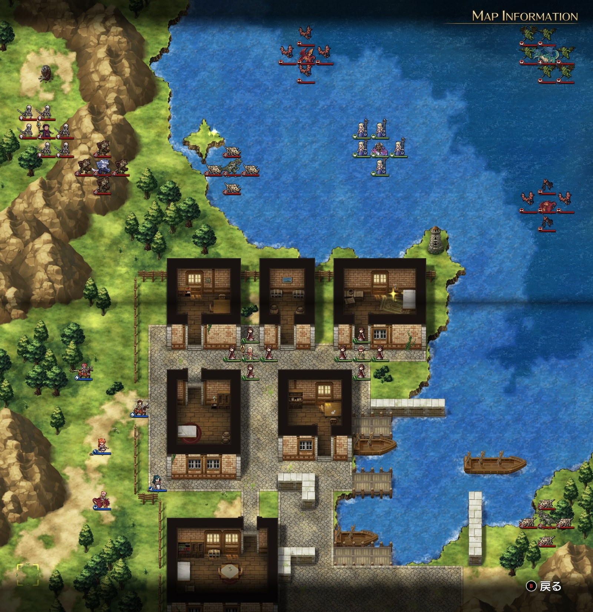

# A ルート 15 章：邪竜の叫び

## マップ

  

光るマス
- 北西の島：ルーンスタッフ
- 中央東の民家：終末の魔狼

## 条件

- 勝利条件
    - グレートドラゴンの撃破
- 敗北条件
    - レディンの死亡
    - 村人とコッセルが死亡

## 敵軍

|指揮官|クラス|兵種|傭兵|傭兵兵種|
|---|---|---|---|---|
|ナーギャ|ザーヴェラー|魔法使い|スケルトン|不死|
|グレートドラゴン|グレートドラゴン|竜|ガーゴイル|飛兵|
|ワイバーン|ワイバーン|怪物飛|バット|怪物飛|
|ワイバーン|ワイバーン|怪物飛|バット|怪物飛|
|ウェアウルフ|ウェアウルフ|怪物陸|ウルフマン|怪物陸|
|マスターディーノ|マスターディーノ|怪物陸|ボーンディーノ|怪物陸|
|マスターディーノ|マスターディーノ|怪物陸|ボーンディーノ|怪物陸|

## 増援

|出現ターン|出現位置|指揮官|クラス|兵種|傭兵|傭兵兵種|
|---|---|---|---|---|---|---|
|ナーギャ撃破後|北西の祠|イフリート（味方 NPC）|イフリート|霊|－|－|

## 流れ

ラングリッサーを狙ってきた邪竜を倒すマップです。

ショップでは魔竜の角笛（指揮修正 ATK+15% 等）、水の羽衣（指揮修正 DEF+15% 等）、勇将の軍配（指揮修正 DEF+15% 等）が販売されています。

1 ターン目、ワイバーン 2 隊と北側のマスターディーノはレーサスを襲いに向かいます。ウェアウルフと南側のマスターディーノは南西付近を目指して進みます。

コッセルは南西の平地、村人は南を目指して進みます。

2 ターン目ではグレートドラゴンもレーサスを襲いに向かいます。

レーサスは周囲に味方を送り込まない状態でも 8 ターン程度は集中攻撃に耐えるようです。

ナーギャを倒すとイフリートが出現し、グレートドラゴンに向かってきます。イフリートは、グレートドラゴン接敵後 2 ターン程度で撃破する強さです。

## 攻略メモ

### 出撃指揮官

|指揮官|クラス|傭兵|
|---|---|---|
|レディン|ナイトマスター|トルーパー|
|ナーム|ドラゴンロード|エンジェル|
|ジェシカ|アークメイジ|モンク|
|アルバート|ソードマン|バーサーカー|
|テイラー|サーペンロード|ニクシー|

### 控え指揮官

- クリス
- ホーキング
- ソーン
- ランス

### 作戦

前章に引き続きアースクエイク使いのナーギャが出てきますので、ナーム隊で全力撃破します。

レディンは南東のマスターディーノを迎撃しますが、強いです。プロテクション 2 を掛けても傭兵はかなり削られてしまいますが、かといってのんびり戦っていると村人が突っ込んでいってしまいますので、難しい戦いでした。レディン隊の傭兵 1 ユニットはアイテム回収をします。

その他の隊はアイテム回収をしつつ北の魔物軍団と戦いますが、ほとんどテイラーの独壇場です。

ナームがナーギャを倒すとイフリートが出現します。かなり早くグレートドラゴンを撃破してしまうので、ナームも掃討戦に参加し、できるだけ味方が敵を多く倒すようにします。

## 反省点

レディンの傭兵は 1 ランク上げておけば苦戦しなかったと思います。

グレートドラゴンをあと一歩というところでイフリートに倒されてしまいました。ナームのバーンタイドをうまく活用すれば倒せたかもしれません。

  <a href="../README.md">［ホームへ戻る］</a>

