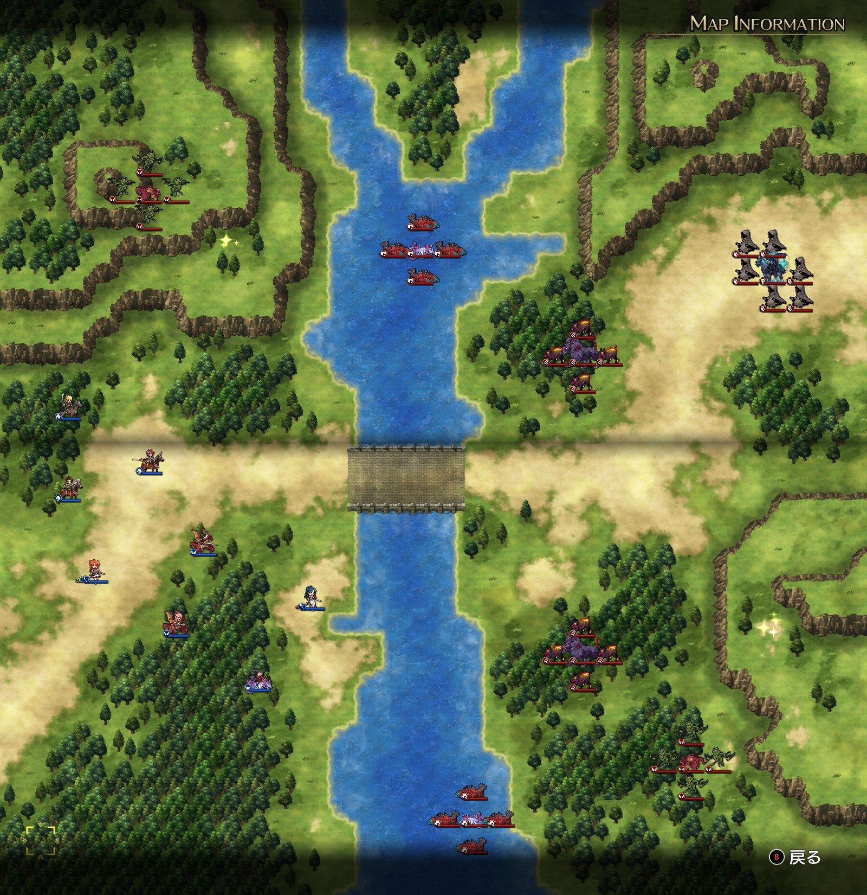
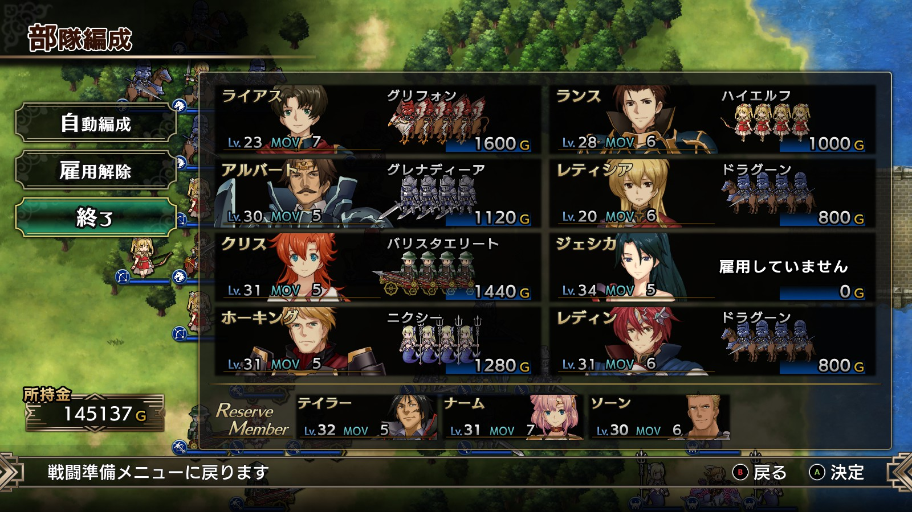

Steam 版ラングリッサーⅠ＆Ⅱリメイク > ラングリッサーⅠ

# C ルート 15 章：闇の大群

## マップ

  

光るマス
- 北西：フレイムランス
- 南東：終末の魔狼

## 条件

- 勝利条件
    - 敵の全滅
- 敗北条件
    - レディンの死亡
- クリアボーナス
    - 7,500 G

## 敵軍

|指揮官|クラス|兵種|傭兵|傭兵兵種|
|---|---|---|---|---|
|デュラハン|デュラハン|不死|スペクター|霊|
|サーペント|サーペント|怪物水|リヴァイアサン|怪物水|
|サーペント|サーペント|怪物水|リヴァイアサン|怪物水|
|ケルベロス|ケルベロス|怪物陸|ヘルハウンド|怪物陸|
|ケルベロス|ケルベロス|怪物陸|ヘルハウンド|怪物陸|
|ワイバーン|ワイバーン|怪物飛|ガーゴイル|飛兵|
|ワイバーン|ワイバーン|怪物飛|ガーゴイル|飛兵|

## 増援

|出現ターン|出現位置|指揮官|クラス|兵種|傭兵|傭兵兵種|
|---|---|---|---|---|---|---|
|1 ターン目|川の北端|サーペント|サーペント|怪物水|リヴァイアサン|怪物水|
|1 ターン目|川の南端|サーペント|サーペント|怪物水|リヴァイアサン|怪物水|
|2 ターン目|北西|ケルベロス|ケルベロス|怪物陸|ヘルハウンド|怪物陸|
|2 ターン目|東|ケルベロス|ケルベロス|怪物陸|ヘルハウンド|怪物陸|
|3 ターン目|北東|ワイバーン|ワイバーン|怪物飛|ガーゴイル|飛兵|
|3 ターン目|南東|ワイバーン|ワイバーン|怪物飛|ガーゴイル|飛兵|
|4 ターン目|南西|ディゴス（味方 NPC）|エンペラー|歩兵|グレナディーア|歩兵|
|4 ターン目|南西|サー・ガリウス（味方 NPC）|セージ|僧侶|クルセイダー|僧侶|

## 流れ

押し寄せる闇の軍勢と対峙するマップです。

敵は 1 ターン目から攻め寄せてきます。対岸の陸上部隊は橋を通るルートを第一候補として攻めてくるようです。

1 ターン～3 ターンまで立て続けに増援が来ます。一方、4 ターン目開始時に味方の増援も来ます。

## 攻略メモ

### 出撃指揮官

|指揮官|クラス|傭兵|
|---|---|---|
|レディン|ナイトマスター|ドラグーン|
|クリス|プリンセス|バリスタエリート|
|ジェシカ|エージェント|－|
|ホーキング|サーペンロード|ニクシー|
|アルバート|ソードマスター|グレナディーア|
|ランス|ロイヤルガード|ハイエルフ|
|ライアス|ドラゴンロード|グリフォン|
|レティシア|ハイランダー|ドラグーン|

※ランス、ライアス、レティシアは強制出撃

  

### 控え指揮官

- ナーム
- ソーン
- テイラー

### 作戦

ランスの装備は元に戻しておきます。

北側の敵には、ランス、ライアス、レティシアのトリオで当たります。レベル低めの彼らですが、ランスの弓兵がワイバーン隊と相性が良いこともあり、多少の損耗で乗り切りました。

橋を渡ってくる敵には、アルバートとクリスで当たります。前衛がグレナディーア、後衛がバリスタエリートです。後詰めのジェシカが密集地にメテオを打てば一気に殲滅できるはずですが、経験値バランス的にそれはやめておきました。

南側の敵には、レディン、ホーキングで当たります。ここが一番攻撃を受けたかもしれません。

このマップで一番大変なのは、終末の魔狼回収かもしれません。敵が多いうちに渡河するのは危険ですし、かといって、NPC 増援が来るので時間稼ぎができず、敵を十分に引き寄せてからだと間に合いません。ジェシカがヴァルキリー（飛兵）を召喚し、まだ多少敵が残っている中をドキドキしながら進みましたが、ギリギリでした。

### 反省点

NPC に経験値を奪われることなく戦えたので、良かったのではないかと思います。

  <a href="../README.md">［ホームへ戻る］</a>

