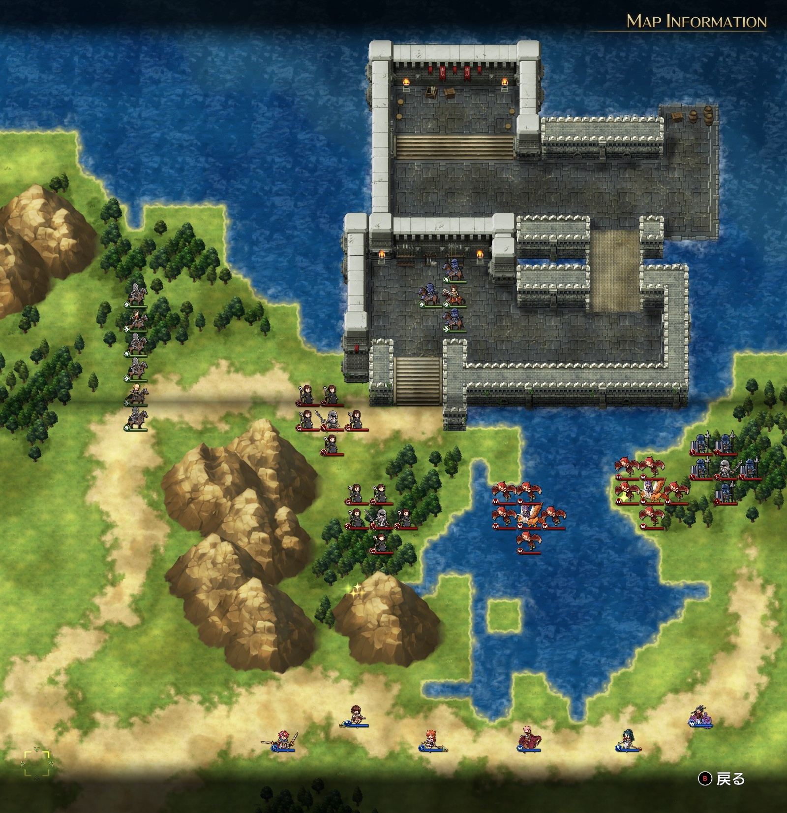
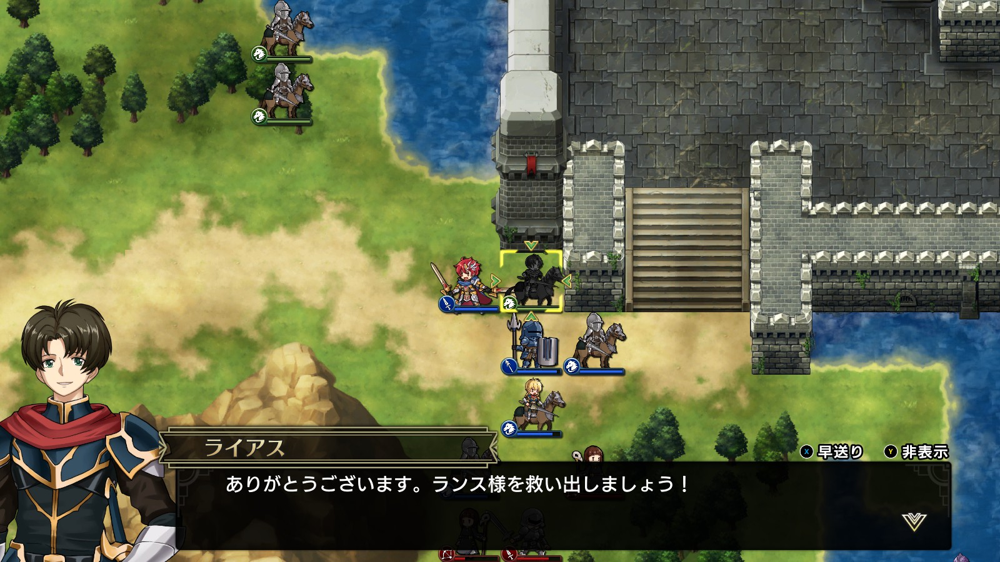
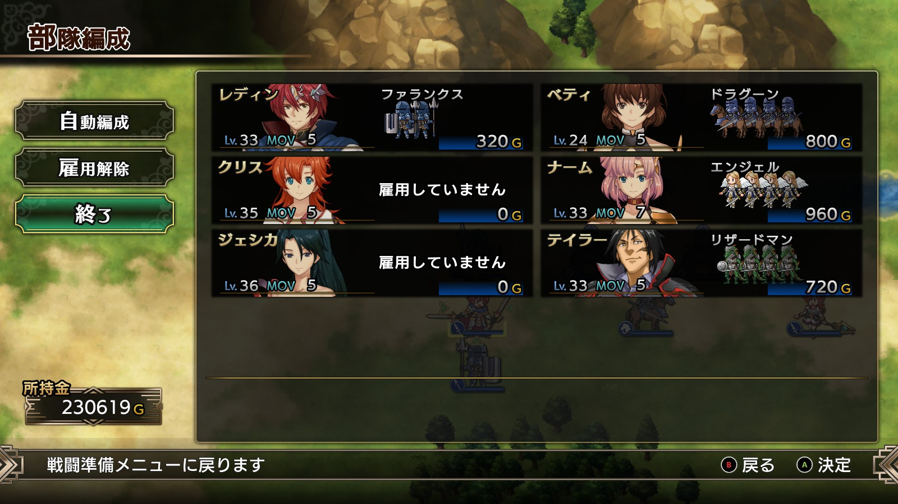

Steam 版ラングリッサーⅠ＆Ⅱリメイク > ラングリッサーⅠ

# E ルート 15 章：混乱の帝国

## マップ

  

光るマス
- 東の海辺：魔竜の角笛
- 南：フレイムランス

## 条件

- 勝利条件
    - 敵の全滅
- 敗北条件
    - レディンの死亡
- クリアボーナス
    - 7,500 G

## 敵軍

|指揮官|クラス|兵種|傭兵|傭兵兵種|
|---|---|---|---|---|
|帝国指揮官|ハイロード|歩兵|ファランクス|槍兵|
|帝国指揮官|ロード|歩兵|ウィッチ|弓兵|
|帝国歩兵|ロード|歩兵|ウィッチ|弓兵|
|帝国指揮官|ホークナイト|飛兵|ハーピー|飛兵|
|帝国指揮官|ホークナイト|飛兵|ハーピー|飛兵|

## 増援

|出現ターン|出現位置|指揮官|クラス|兵種|傭兵|傭兵兵種|
|---|---|---|---|---|---|---|
|2 ターン目|西|帝国指揮官|ロード|歩兵|クルセイダー|僧侶|
|2 ターン目|西|帝国指揮官|ロード|歩兵|クルセイダー|僧侶|
|2 ターン目|西|指揮官|シルバーナイト|騎兵|トルーパー|騎兵|
|2 ターン目|西|指揮官|シルバーナイト|騎兵|トルーパー|騎兵|

## 流れ

混乱する帝国内で窮地に陥っているランスに救援を送るマップです。

ランスは城の北側を目指して動きます。ライアスとレティシアはランスを追いかけ、途中の敵と交戦します。

敵のうち、東の帝国指揮官（ファランクス隊）は動かず、西の帝国指揮官（ウィッチ隊）はレティシアの迎撃をします。それ以外の敵はランスに向かっていきます。

増援もランスに向かっていきます。

ランスは当面の間は持ちこたえます。

レディンがライアスやレティシアに近づくと指揮下におくことができます（他の指揮官ではダメです）。彼らから近づいてきた時も指揮下におけます。

  

クリア後、クリス、ナーム、ジェシカ、テイラーが仲間から外れます。

## 攻略メモ

### 出撃指揮官

|指揮官|クラス|傭兵|
|---|---|---|
|レディン|キング|ファランクス|
|クリス|プリンセス|－|
|ナーム|ドラゴンロード|エンジェル|
|ジェシカ|エージェント|－|
|テイラー|サーペンマスター|リザードマン|
|ベティ|セージ|ドラグーン|

  

### 控え指揮官

なし

### 作戦

急がなくてもランスは死にませんが（そもそも敗北条件になっていません）、経験値をランスに取られるのもよろしくないということで、全力で北上します。

ジェシカのテレポートでテイラーを飛ばし、東のハーピー達と戦います。

ナームは素直に北上してその隣のハーピー達と。

クリスのテレポートでレディンを飛ばし、ライアス達を迎えに行きつつ、増援を片付けます。指揮下に入ったライアスは育ててきたライアスとは異なる固定レベルなので、経験値を与えないように下がらせます。

ベティも北上して増援を片付けます。

  

### 反省点

敵は弱いので特に問題ありませんでした。

  <a href="../README.md">［ホームへ戻る］</a>

