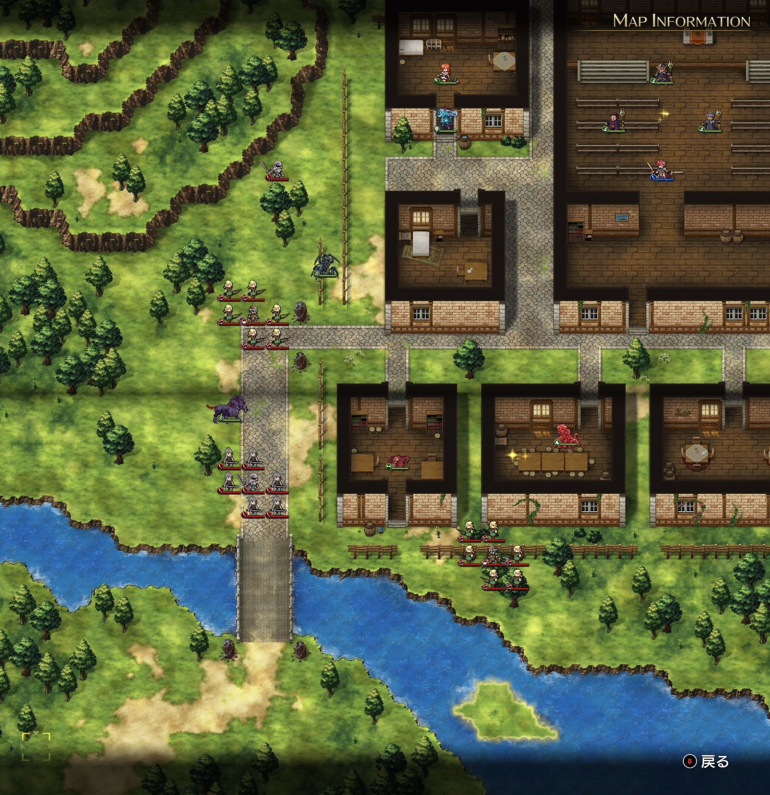
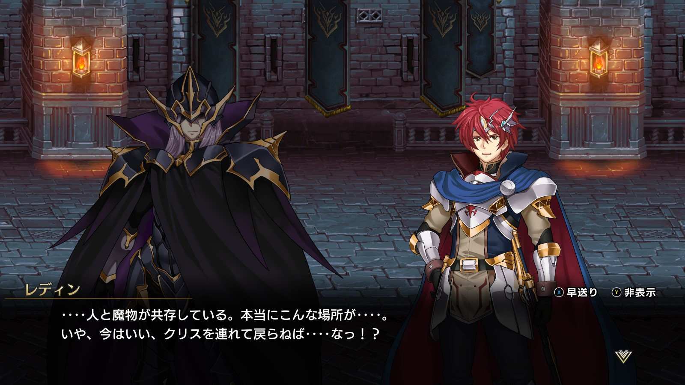
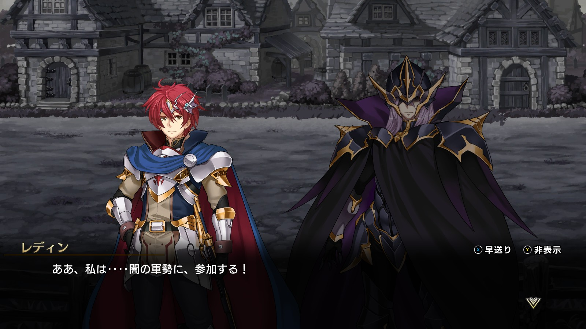
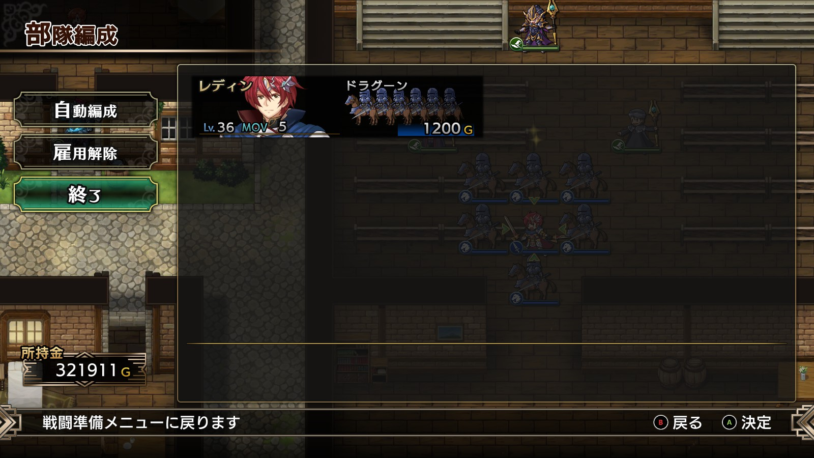

Steam 版ラングリッサーⅠ＆Ⅱリメイク > ラングリッサーⅠ

# G ルート 15 章：共存の街

## マップ

  

光るマス
- 北東教会内：プロテイン
- 南側、三軒並んだ中央の民家：フレイムランス

## 条件

- 勝利条件
    - 敵の全滅
- 敗北条件
    - レディンの死亡
- クリアボーナス
    - 7,500 G

## 敵軍

|指揮官|クラス|兵種|傭兵|傭兵兵種|
|---|---|---|---|---|
|連合軍指揮官|ロード|歩兵|－|－|
|連合軍指揮官|ロード|歩兵|ソルジャー|歩兵|
|連合軍指揮官|キャプテン|水兵|エルフ|弓兵|
|連合軍指揮官|キャプテン|水兵|エルフ|弓兵|

## 増援

なし

## 流れ

単身ヴェルゼリアに赴いたレディンが、闇の王子ボーゼルとの邂逅をはたすマップです。

  

味方 NPC は 1 ターン目では動きません。

敵軍は単騎の連合軍指揮官以外は 1 ターン目から街に攻め寄せてきます。

2 ターン目でイベントが発生し、クリスと単騎の連合軍指揮官が撃破されます。

3 ターン目でボーゼル、ナーギャ、ニコリスも迎撃に動きます。

  

クリア後、ボーゼル、ナーギャ、ニコリスが仲間になります。

## 攻略メモ

### 出撃指揮官

|指揮官|クラス|傭兵|
|---|---|---|
|レディン|キング|ドラグーン|

  

### 控え指揮官

なし

### 作戦

敵軍は歩兵が多いので、騎兵を連れて行きます。

敵軍は弱いので、特段何も考えずに進軍すれば問題無く倒せます。

### 反省点

敵は弱いので特に問題ありませんでした。

  <a href="../README.md">［ホームへ戻る］</a>

