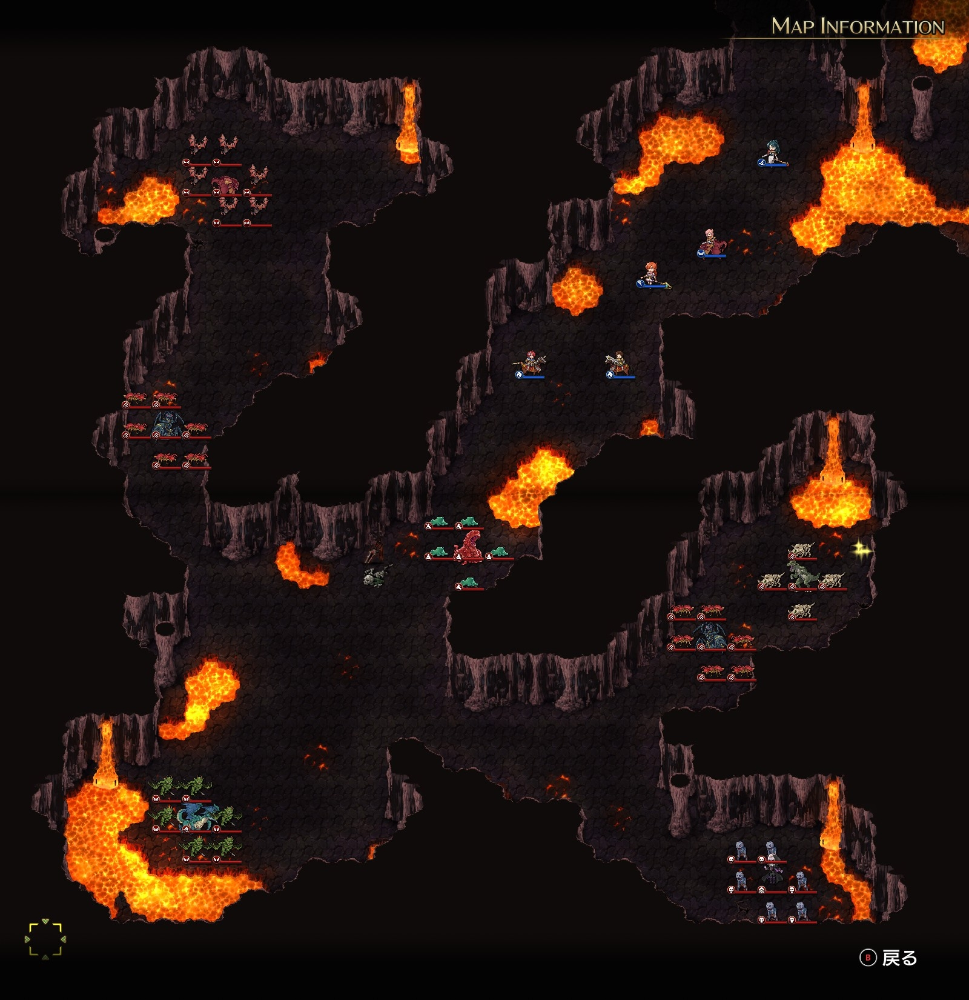
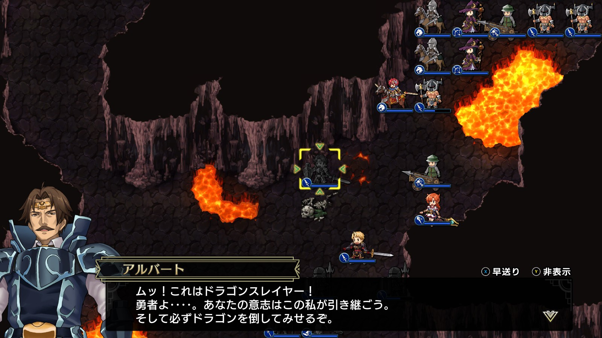
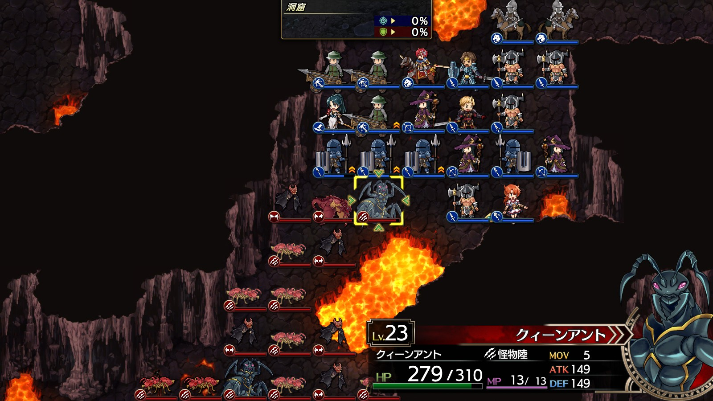
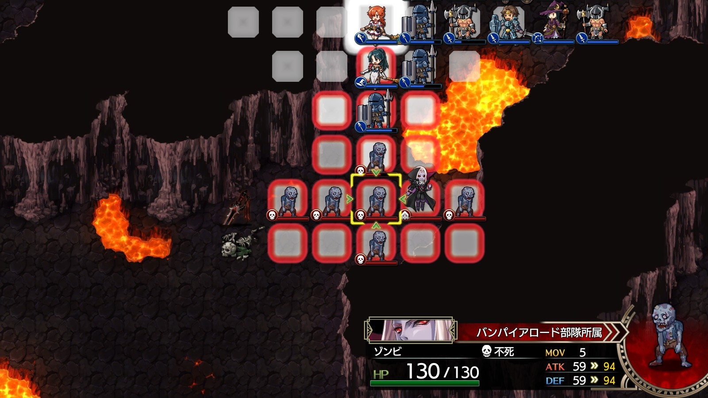
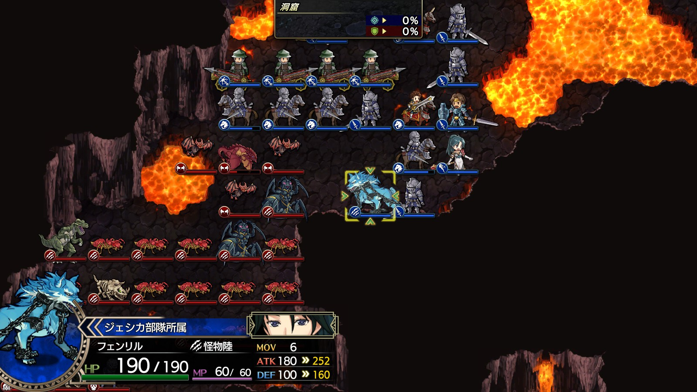

Steam 版ラングリッサーⅠ＆Ⅱリメイク > ラングリッサーⅠ

# A ルート 16 章：暗闇の中で

## マップ

  

光るマス
- 北東（金塊）

## 条件

- 勝利条件
    - グレートドラゴンの撃破
- 敗北条件
    - レディンの死亡
- クリアボーナス
    - 8,000 G

## 敵軍

|指揮官|クラス|兵種|傭兵|傭兵兵種|
|---|---|---|---|---|
|グレートドラゴン|グレートドラゴン|竜|ガーゴイル|飛兵|
|ワイバーン|ワイバーン|怪物飛|バット|怪物飛|
|クィーンアント|クィーンアント|怪物陸|G アント|怪物陸|
|クィーンアント|クィーンアント|怪物陸|G アント|怪物陸|
|マスターディーノ|マスターディーノ|怪物陸|ボーンディーノ|怪物陸|
|ゲルギャザー|ゲルギャザー|怪物ゲル|ゲル|怪物ゲル|
|バンパイアロード|バンパイアロード|高位不死|ゾンビ|不死|

## 増援

なし

## 流れ

弱体化した邪竜にトドメを刺すべく、洞窟に押し入るマップです。

グレートドラゴン以外は、1 ターン目から自軍に向かってきます。

中央にある剣のマス（骸骨のマスのすぐ上）を指揮官で踏むと（傭兵ではダメです）ドラゴンスレイヤーを入手し、当該指揮官と配下傭兵の ATK が 100 上昇します（このマップ限り）。

  

グレートドラゴンは近づくとバーンタイドや配下のガーゴイルで迎撃してきます。

## 攻略メモ

### 出撃指揮官

|指揮官|クラス|傭兵|
|---|---|---|
|レディン|ナイトマスター|トルーパー|
|クリス|ハイプリースト|ハイウィッチ|
|ジェシカ|アークメイジ|ファランクス|
|ホーキング|ジェネラル|バリスタ|
|アルバート|ソードマン|バーサーカー|

### 控え指揮官

- ナーム
- ソーン
- テイラー
- ランス

### 作戦

洞窟が狭く思うように進軍できないため、進軍はあきらめて、押し寄せる魔物を待ち構える作戦としました。

プロテクション 2 を掛けた前衛が防御し、その隙に魔法やバリスタ（射程 3）で攻撃します。弓兵も用意したのですが、射程が 2 ではとどかず活躍できませんでした。

  

最後尾のバンパイアロードは魔法で攻撃してくるため、こちらから打って出ます。

  

魔物を殲滅後、アルバートがドラゴンスレイヤーを拾い、レディンはアイテム回収です。

アルバートが一番レベルが低かったのですが、グレートドラゴンの取り巻きを倒しているうちにレベルが上がったので、グレートドラゴンはジェシカが倒しました。

## 反省点

狭い通路でも魔法とバリスタを駆使して魔物の傭兵を残さず倒せたので、今回は良かったと思います。

ただ、もっと前線を下げて待ち構えていたほうが、よりやりやすかったと思います。

  

  <a href="../README.md">［ホームへ戻る］</a>

