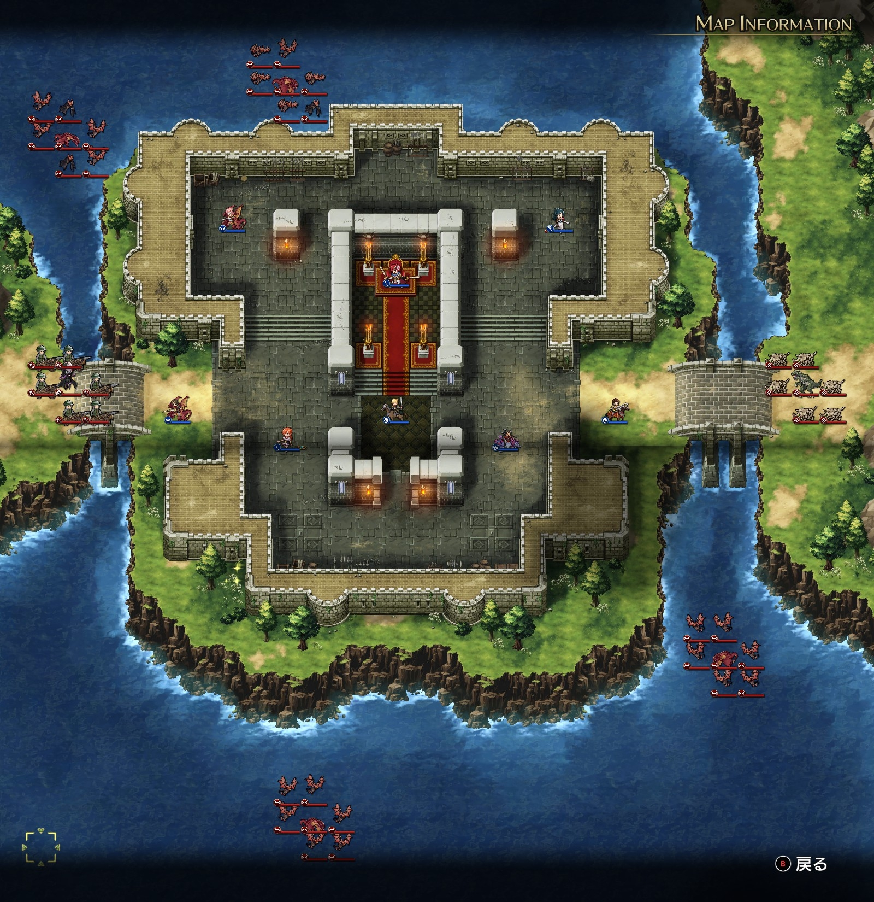
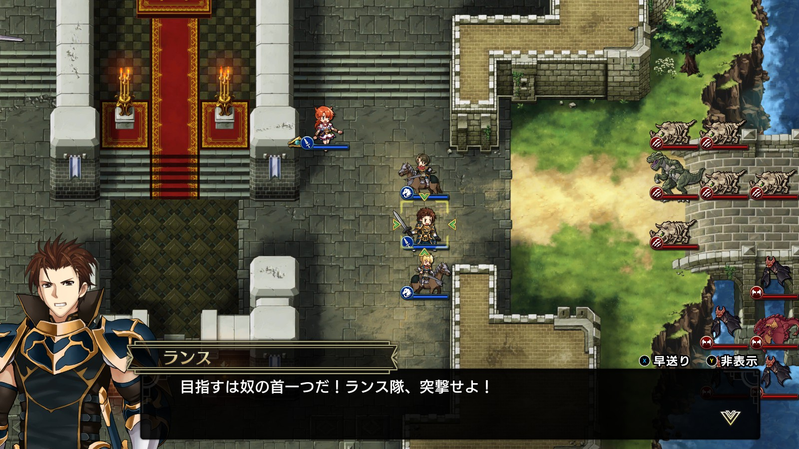
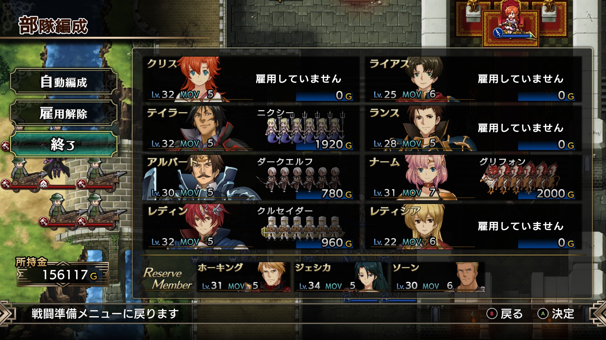

Steam 版ラングリッサーⅠ＆Ⅱリメイク > ラングリッサーⅠ

# C ルート 16 章：闇の恐怖

## マップ

  

光るマス
- 南西：金塊

## 条件

- 勝利条件
    - 敵の全滅
- 敗北条件
    - レディンの死亡
- クリアボーナス
    - 8,000 G

## 敵軍

|指揮官|クラス|兵種|傭兵|傭兵兵種|
|---|---|---|---|---|
|バンパイアロード|バンパイアロード|高位不死|バリスタ|バリスタ|
|ワイバーン|ワイバーン|怪物飛|バット|怪物飛|
|ワイバーン|ワイバーン|怪物飛|バット|怪物飛|
|ワイバーン|ワイバーン|怪物飛|バット|怪物飛|
|ワイバーン|ワイバーン|怪物飛|バット|怪物飛|
|マスターディーノ|マスターディーノ|怪物陸|ボーンディーノ|怪物陸|

## 増援

|出現ターン|出現位置|指揮官|クラス|兵種|傭兵|傭兵兵種|
|---|---|---|---|---|---|---|
|2 ターン目|北東|ナーギャ|ザーヴェラー|魔法使い|デーモン|魔族|
|2 ターン目|北東（海上）|フェニックス|フェニックス|怪物飛|エレメンタル|霊|
|2 ターン目|北東（ナーギャの南）|フェニックス|フェニックス|怪物飛|エレメンタル|霊|
|3 ターン目|北東（海上）|ロック|ロック|怪物飛|ガーゴイル|飛兵|
|3 ターン目|東|デュラハン|デュラハン|不死|スペクター|霊|

## 流れ

バルディア城まで押し込まれたレディンたちが防衛戦を行うマップです。

クリアの仕方によってルート分岐があります。
- ランスが撃破される → C ルートのまま
- ランスが撃破されない → D ルートへ分岐

敵は 1 ターン目から攻め寄せてきます。

2 ターン目で増援が 3 隊到着しますが、そのうちナーギャが動くのは 3 ターン目からです。

3 ターン目ではさらに増援が 2 隊到着します。

また、2 ターン目でランス、ライアス、レティシアが NPC となります。ランスはナーギャを目指し、ライアスとレティシアは付近の敵と戦うようです。

  

クリア後、ライアスとレティシアが再度仲間になります（ランスは戻りません）。

## 攻略メモ

### 出撃指揮官

|指揮官|クラス|傭兵|
|---|---|---|
|レディン|キング|クルセイダー|
|クリス|プリンセス|－|
|ナーム|ドラゴンロード|グリフォン|
|アルバート|ソードマスター|ダークエルフ|
|テイラー|サーペンマスター|ニクシー|
|ランス|ファイター|－|
|ライアス|ナイト|－|
|レティシア|ナイト|－|

※ランス、ライアス、レティシアは強制出撃

  

### 控え指揮官

- ジェシカ
- ホーキング
- ソーン

### 作戦

ランスが撃破される C ルートを目指します。

NPC になるランス、ライアス、レティシアはクラスを最弱にし、アイテムも没収して撃破されやすくしておきます。傭兵も雇いません。3 人まとめて東側の入り口付近に集めておけば、しばらく敵を足止めした後で撃破されます。

出撃 8 隊のうち、彼ら 3 隊を除く 5 隊が実質の戦力です。

北西のワイバーンには、前衛テイラー、後衛アルバートで対応します。ダークエルフの弓で瞬殺です。

西のバリスタにはナームが対応します。

北東は不死や霊が多く集まるので、レディン率いるクルセイダーが前衛、そして玉座からクリスが走ってきて後衛を務めます。クルセイダーはワイバーンに対しては弱いので、北西を片付けたテイラーがワイバーンに当たります。

東からの増援にランスらが撃破される頃には西が片付いているので、西の兵力を東に寄せて殲滅します。

### 反省点

全体的に配置よく戦えたのではないかと思います。

  <a href="../README.md">［ホームへ戻る］</a>

