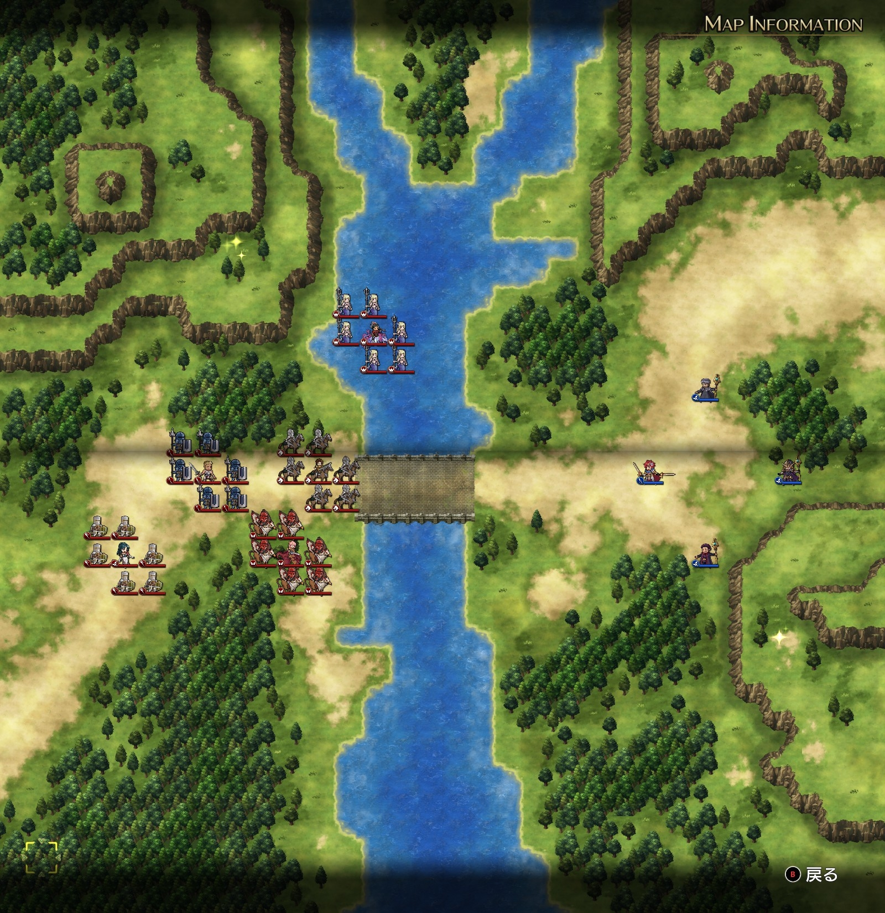
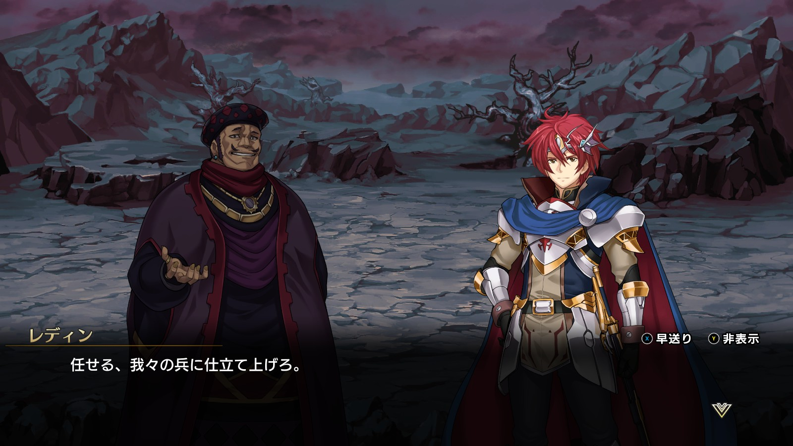
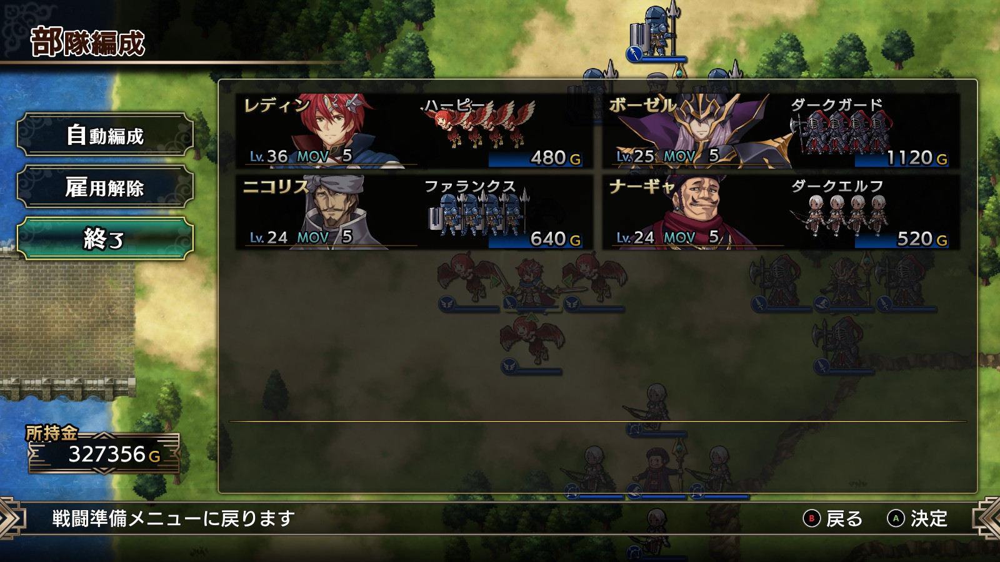
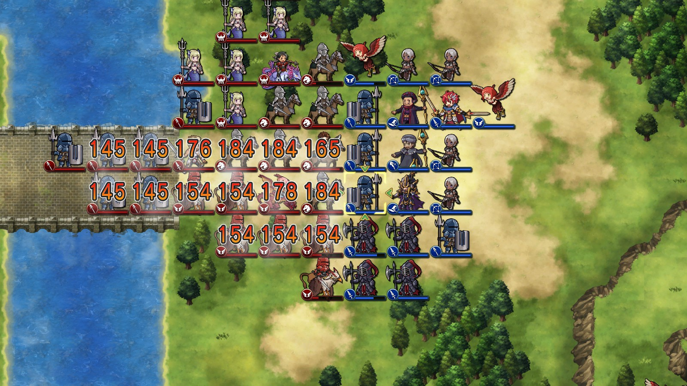

Steam 版ラングリッサーⅠ＆Ⅱリメイク > ラングリッサーⅠ

# G ルート 16 章：かつての仲間

## マップ

  

光るマス
- 北西：金塊
- 南東：鉄アレイ

## 条件

- 勝利条件
    - 敵の全滅
- 敗北条件
    - レディンの死亡
- クリアボーナス
    - 8,000 G

## 敵軍

|指揮官|クラス|兵種|傭兵|傭兵兵種|
|---|---|---|---|---|
|ランス|ハイランダー|騎兵|トルーパー|騎兵|
|ナーム|ドラゴンナイト|飛兵|グリフォン|飛兵|
|ジェシカ|メイジ|魔法使い|クルセイダー|僧侶|
|テイラー|サーペンナイト|水兵|ニクシー|水兵|
|ソーン|ソードマン|歩兵|ファランクス|槍兵|

## 増援

なし

## 流れ

闇の軍勢の将となったレディンが、かつての仲間と戦うマップです。

クリアの仕方によってルート分岐があります。
- ジェシカを味方にしない → G ルートのまま
- ジェシカを味方にする → H ルートへ分岐

敵はジェシカ以外は 1 ターン目から攻め寄せてきます。

クリア後、ナーム、ジェシカ、ソーン、テイラーが仲間になります。

  

## 攻略メモ

### 出撃指揮官

|指揮官|クラス|傭兵|
|---|---|---|
|レディン|キング|ハーピー|
|ボーゼル|ダークマスター|ダークガード|
|ナーギャ|ザーヴェラー|ダークエルフ|
|ニコリス|セージ|ファランクス|

  

### 控え指揮官

なし

### 作戦

レディンだけレベルが高い状態なので、レディン以外で敵を倒すようにします。レディンの傭兵はハーピーにして、アイテム回収を行います。

各指揮官とも、比較的広範囲の魔法を使えるので、魔法で出鼻をくじいてから傭兵を当てれば難しくはありません。レディンが暇なときは、前衛の傭兵にプロテクションを掛けておくようにします。

  

敵の傭兵を倒す前に敵の指揮官を（広範囲魔法で）うっかり倒してしまわないように注意するくらいです。

### 反省点

ナーギャのダークエルフはほとんど戦力になりませんでした。ダークエルフで攻撃する際はアタックが必須かもしれません。

  <a href="../README.md">［ホームへ戻る］</a>

