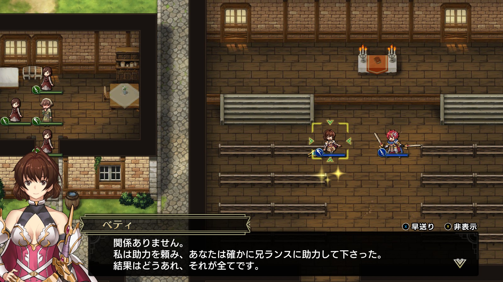
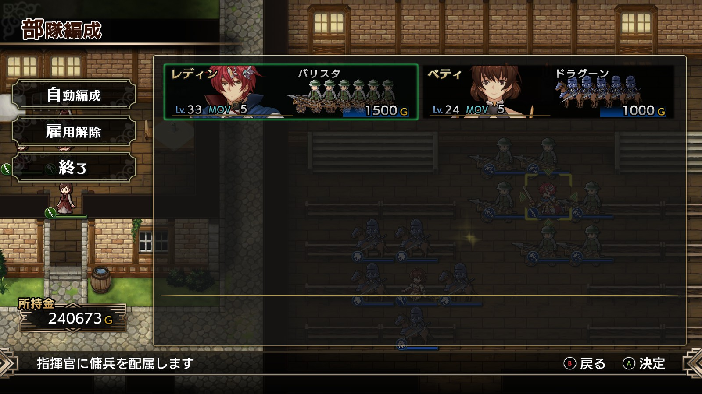
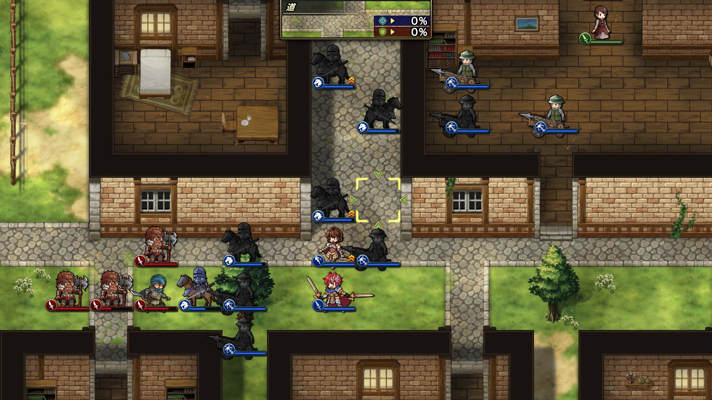
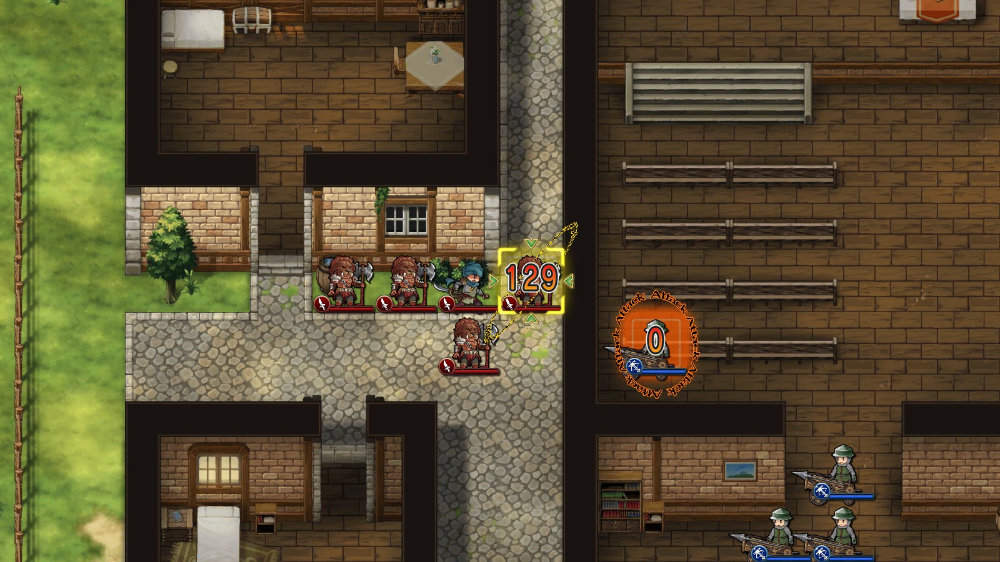

Steam 版ラングリッサーⅠ＆Ⅱリメイク > ラングリッサーⅠ

# G ルート 16 章：かつての仲間

## マップ

  

光るマス
- 北東の教会内：オーディンの盾
- 3 軒並んでいる民家の真ん中：金塊

## 条件

- 勝利条件
    - 敵の全滅
- 敗北条件
    - レディンの死亡
- クリアボーナス
    - 8,000 G

## 敵軍

|指揮官|クラス|兵種|傭兵|傭兵兵種|
|---|---|---|---|---|
|野盗|ハイロード|歩兵|バーサーカー|歩兵|
|野盗|アサシン|盗賊|バンディット|盗賊|
|野盗|アサシン|盗賊|バンディット|盗賊|
|野盗|アサシン|盗賊|バンディット|盗賊|

## 増援

|出現ターン|出現位置|指揮官|クラス|兵種|傭兵|傭兵兵種|
|---|---|---|---|---|---|---|
|3 ターン目|南西|ライアス（味方）|シルバーナイト|騎兵|トルーパー|騎兵|
|3 ターン目|南西|レティシア（味方）|シルバーナイト|騎兵|トルーパー|騎兵|
|8 ターン目|南東|アサシン|盗賊|バンディット|盗賊|
|8 ターン目|南東|アサシン|盗賊|バンディット|盗賊|

## 流れ

動乱の影響により、山間の村が略奪者たちに襲われるマップです。

初期配置の味方はベティのみです。

  

村人は教会を目指して移動します。

ハイロード以外の敵は村人を襲いにいきます。

ハイロードは動きません。

3 ターン目でライアスとレティシアが到着し、ベティの説得により指揮下に入ります。

敵の増援が到着するとハイロードも動きます。

クリア後、ライアスとレティシアが正式に（？）仲間になります。

## 攻略メモ

### 出撃指揮官

|指揮官|クラス|傭兵|
|---|---|---|
|レディン|キング|バリスタ|
|ベティ|セージ|ドラグーン|

※指揮官の配置変更不可

  

### 控え指揮官

なし

### 作戦

ベティのほうがレベルが低いので、なるべくベティで倒すようにします。フレイヤも召喚して戦力を増強します。

  

レディンは後ろからちくちくバリスタで攻撃するのと、ベティの傭兵の回復に努めます。

  

前章同様ライアスたちは経験値をあげず、到着位置で放置です。

### 反省点

全体的に思い通りに戦えたのではないかと思います。

  <a href="../README.md">［ホームへ戻る］</a>

