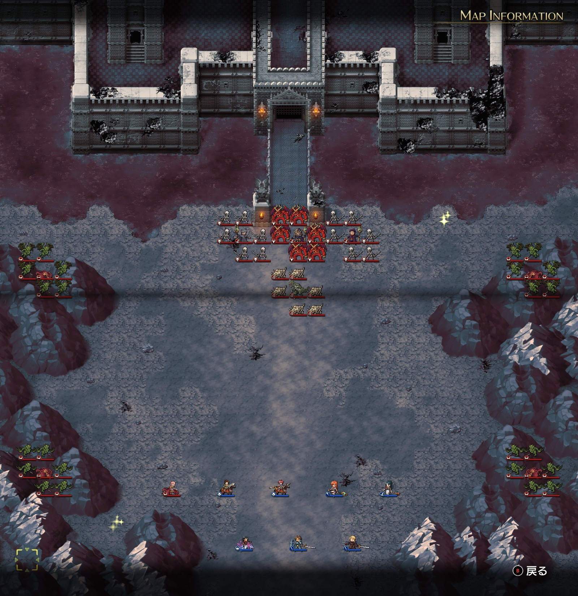

# A ルート 17 章：禁断の地ヴェルゼリア

## マップ

  

光るマス
- 北東
- 南西

## 条件

- 勝利条件
    - ボーゼル以外の敵を撃破
- 敗北条件
    - レディンの死亡

## 敵軍

|指揮官|クラス|兵種|傭兵|傭兵兵種|
|---|---|---|---|---|
|ボーゼル|ダークマスター|魔法使い|アークデーモン|魔族|
|ニコリス|アークメイジ|魔法使い|スケルトン|不死|
|ナーギャ|ザーヴェラー|魔法使い|スケルトン|不死|
|ワイバーン|ワイバーン|怪物飛|ガーゴイル|飛兵|
|ワイバーン|ワイバーン|怪物飛|ガーゴイル|飛兵|
|ワイバーン|ワイバーン|怪物飛|ガーゴイル|飛兵|
|ワイバーン|ワイバーン|怪物飛|ガーゴイル|飛兵|
|マスターディーノ|マスターディーノ|怪物陸|ボーンディーノ|怪物陸|

## 増援

なし

## 流れ

闇を封印すべく禁断の地ヴェルゼリアに向かうマップです。

ショップでは大地の首飾り（指揮修正 ATK+15% 等）、闇の紋章（指揮修正 ATK+15%、指揮修正 DEF+15% 等）が販売されています。

クリアの仕方によってルート分岐があります。
- クリスが撃破される → A ルートのまま
- クリスが撃破されない → B ルートへ分岐

開始前のイベントで、クリスまたはナームが操られ、敵に寝返ります（ニコリスを倒すと元に戻ります）。

従って、原則として、
- A ルートに進みたい → ナームを控えにし、寝返ったクリスを撃破
- B ルートに進みたい → クリスを控えにする
という選択になります。

ボーゼル以外は 1 ターン目から攻め寄せてきます。

## 攻略メモ

### 出撃指揮官

|指揮官|クラス|傭兵|
|---|---|---|
|レディン|ナイトマスター|トルーパー|
|クリス|ハイプリースト|－|
|ジェシカ|アークメイジ|クルセイダー|
|ホーキング|ジェネラル|バリスタ|
|アルバート|ソードマスター|バーサーカー|
|ソーン|ジェネラル|クルセイダー|
|テイラー|サーペンロード|ニクシー|
|ランス|ナイトマスター|ドラグーン|

### 控え指揮官

- ナーム

### 作戦

開幕は、アクセルを掛けたレディンの傭兵がニコリスの 8 マス目、かつ 3 列を避けて（コールドウェイブ回避）囮となり、ニコリスにメテオを打たせます。

右翼はジェシカがトルネードでワイバーン隊を撃墜します。

左翼はアルバートのバーサーカーを前衛にしつつ、ホーキングのバリスタで攻撃します。

中央は、寝返ったクリスを倒しつつ、マスターディーノを迎撃します。

敵の魔法使いは 1 ターンごとに MP を 10 回復します。ニコリスは一度メテオ（消費 MP 60）を打ったらしばらく魔法が使えない一方で、ナーギャはアースクエイク（消費 MP 30）なので断続的に魔法を打ってきます。しかも状況によってはライトニングボルト（消費 MP 20）を打ってくるので、ますます頻度があがります。

中盤以降は魔法を打たれながらの混戦となりました。

終盤はうっかりボーゼルのメテオ範囲に入ってしまい、メテオを打たれてしまったのですが、逆にそれならとアークデーモンを数体狩りました。アークデーモンは経験値を多めです。

## 反省点

ナーギャにはサイレンスを掛けた上で特攻すれば良かったのかもしれません。

バリスタが弓兵扱いではないことに気付かずバリスタを雇ってしまいました。射程は短くても飛兵特効の弓兵のほうが攻略しやすかったかもしれません。

  <a href="../README.md">［ホームへ戻る］</a>

