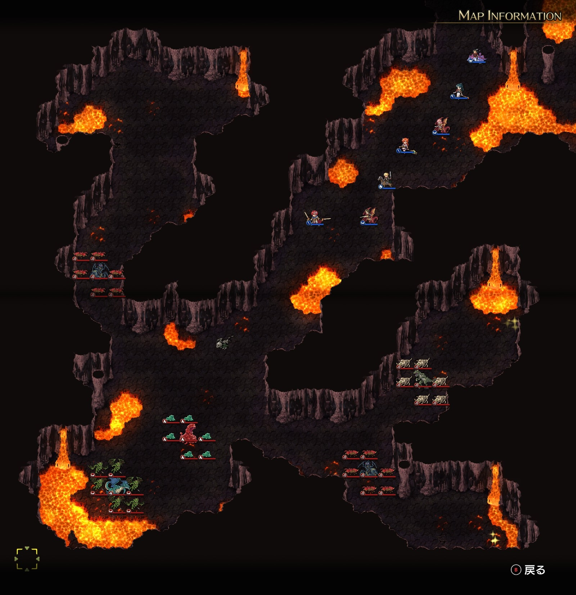
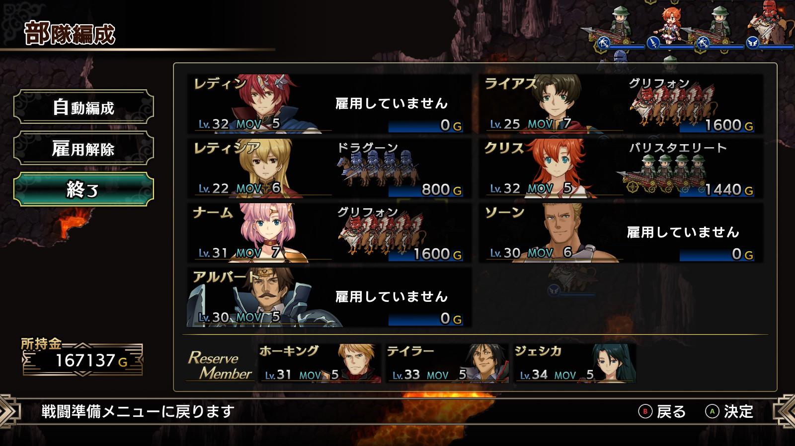
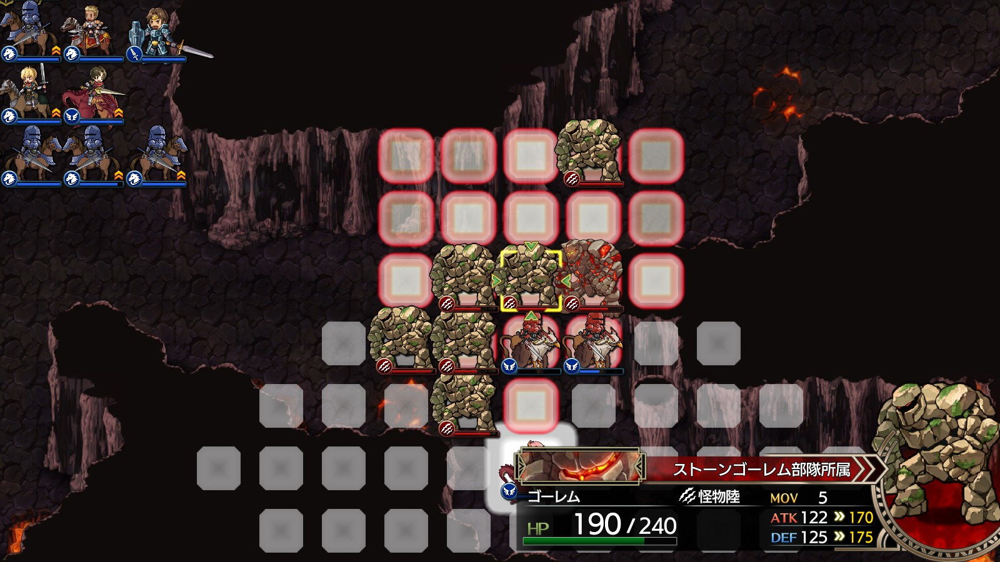
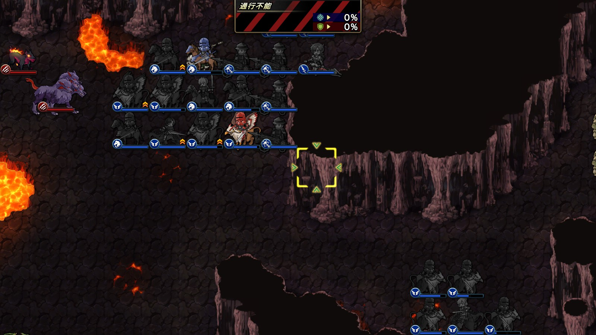
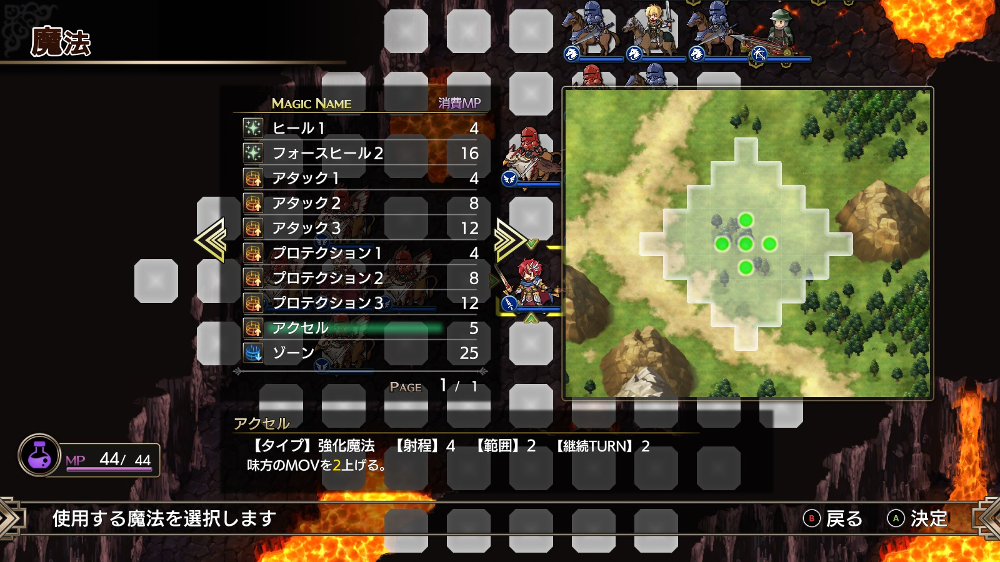

Steam 版ラングリッサーⅠ＆Ⅱリメイク > ラングリッサーⅠ

# C ルート 17 章：反撃の狼煙

## マップ

  

光るマス
- 東：2,000 G
- 南東：タリスマン

## 条件

- 勝利条件
    - 敵の全滅
- 敗北条件
    - レディンの死亡
- クリアボーナス
    - 8,500 G

## 敵軍

|指揮官|クラス|兵種|傭兵|傭兵兵種|
|---|---|---|---|---|
|グレートドラゴン|グレートドラゴン|竜|ガーゴイル|飛兵|
|クィーンアント|クィーンアント|怪物陸|G アント|怪物陸|
|クィーンアント|クィーンアント|怪物陸|G アント|怪物陸|
|マスターディーノ|マスターディーノ|怪物陸|ボーンディーノ|怪物陸|
|ゲルギャザー|ゲルギャザー|怪物ゲル|ゲル|怪物ゲル|

## 増援

|出現ターン|出現位置|指揮官|クラス|兵種|傭兵|傭兵兵種|
|---|---|---|---|---|---|---|
|2 ターン目|西|ケルベロス|ケルベロス|怪物陸|ヘルハウンド|怪物陸|
|2 ターン目|南東|ケルベロス|ケルベロス|怪物陸|ヘルハウンド|怪物陸|
|4 ターン目|北西|ストーンゴーレム|ストーンゴーレム|怪物陸|ゴーレム|怪物陸|
|4 ターン目|東|ストーンゴーレム|ストーンゴーレム|怪物陸|ゴーレム|怪物陸|

## 流れ

闇の軍勢の本拠地ヴェルゼリアへ向かうべく、洞窟に足を踏み入れるマップです。

敵はグレートドラゴン以外は 1 ターン目から攻め寄せてきます。

6 ターン目になるとグレートドラゴンも動きます。

## 攻略メモ

### 出撃指揮官

|指揮官|クラス|傭兵|
|---|---|---|
|レディン|キング|－|
|クリス|プリンセス|バリスタエリート|
|ナーム|ドラゴンロード|グリフォン|
|アルバート|ソードマスター|－|
|ソーン|ナイトマスター|－|
|ライアス|ドラゴンロード|グリフォン|
|レティシア|ハイランダー|ドラグーン|

※ライアス、レティシアは強制出撃

  

### 控え指揮官

- ジェシカ
- ホーキング
- テイラー

### 作戦

グレートドラゴンがどっしりと構えていてくれれば良かったのですが、そうではなかったので、積極策に出ました。

先鋒はナーム。今回の作戦の要です。隣のレディンにアクセル（MOV+2）を掛けてもらってから、2 つのアイテム回収に向かいます。クィーンアント、マスターディーノ、ケルベロス、ストーンゴーレムと 4 連戦なうえ、ストーンゴーレムは物理に対して硬いので、バーンタイドが無かったら危なかったかもしれません。

  

次鋒はライアス。ゲルギャザー以降の敵がナームに向かないよう、急ぎ南下します。十字路付近に陣をしき、敵を迎撃しつつ、後続を待ちます。

  

続くレティシアはライアスと共に前衛、クリスのバリスタエリートが後衛となります。

レディンは初期位置（ナームの隣）からしばらく動かず、通り過ぎる部隊に魔法（アクセルやプロテクション）を掛けてあげる係です。

  

グレートドラゴンは強いので指揮官も交えてボコります。

### 反省点

[A ルート 16 章](Chapter16A.md)同様にグレートドラゴンは動かないものだと思っていたので、いったんきれいさっぱりやり直しました。

  <a href="../README.md">［ホームへ戻る］</a>

