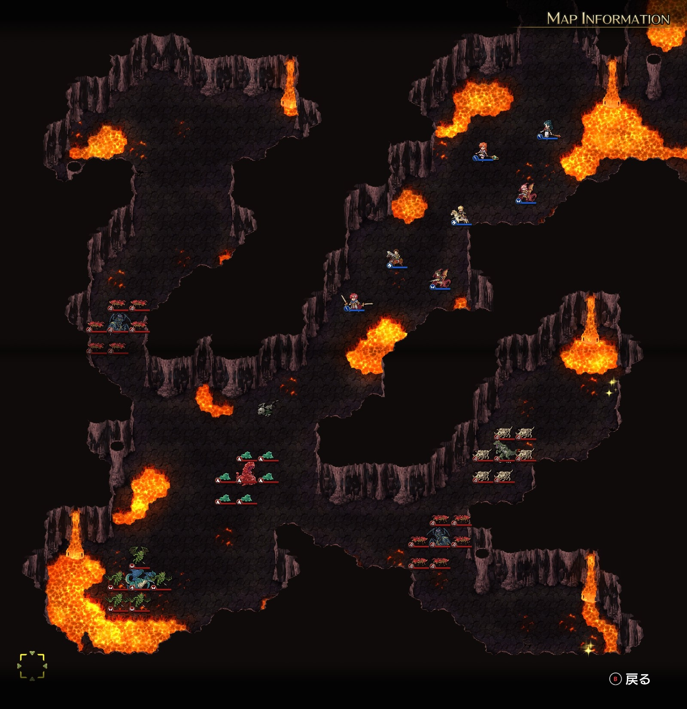
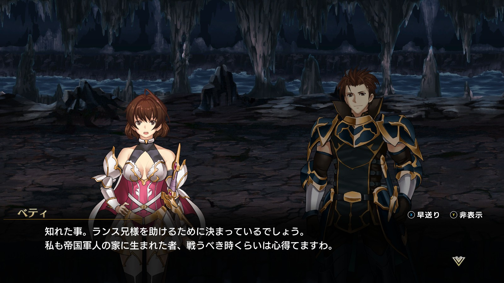

Steam 版ラングリッサーⅠ＆Ⅱリメイク > ラングリッサーⅠ

# D ルート 17 章：反撃の狼煙

## マップ

  

光るマス
- 東：2,000 G
- 南東：終末の魔狼

## 条件

- 勝利条件
    - 敵の全滅
- 敗北条件
    - レディンの死亡
- クリアボーナス
    - 8,500 G

## 敵軍

|指揮官|クラス|兵種|傭兵|傭兵兵種|
|---|---|---|---|---|
|グレートドラゴン|グレートドラゴン|竜|ガーゴイル|飛兵|
|クィーンアント|クィーンアント|怪物陸|G アント|怪物陸|
|クィーンアント|クィーンアント|怪物陸|G アント|怪物陸|
|マスターディーノ|マスターディーノ|怪物陸|ボーンディーノ|怪物陸|
|ゲルギャザー|ゲルギャザー|怪物ゲル|ゲル|怪物ゲル|

## 増援

|出現ターン|出現位置|指揮官|クラス|兵種|傭兵|傭兵兵種|
|---|---|---|---|---|---|---|
|2 ターン目|西|ケルベロス|ケルベロス|怪物陸|ヘルハウンド|怪物陸|
|2 ターン目|南東|ケルベロス|ケルベロス|怪物陸|ヘルハウンド|怪物陸|
|3 ターン目|北|ベティ（味方 NPC）|セイント|僧侶|クルセイダー|僧侶|
|4 ターン目|北西|ストーンゴーレム|ストーンゴーレム|怪物陸|ゴーレム|怪物陸|
|4 ターン目|東|ストーンゴーレム|ストーンゴーレム|怪物陸|ゴーレム|怪物陸|

## 流れ

闇の軍勢の本拠地ヴェルゼリアへ向かうべく、洞窟に足を踏み入れるマップです。

敵はグレートドラゴン以外は 1 ターン目から攻め寄せてきます。

3 ターン目で、ランスの妹ベティが味方 NPC として出現します。

  

6 ターン目になるとグレートドラゴンも動きます。

クリア後、ベティが仲間になります。

## C ルートとの違い

- 前章でランスが仲間になっている
- 南東のアイテム：タリスマン → 終末の魔狼
- グレートドラゴン配下のガーゴイルの数：6 → 5
- ベティの出現
- ベティが仲間になる

## 攻略メモ

### 出撃指揮官

|指揮官|クラス|傭兵|
|---|---|---|
|レディン|キング|－|
|クリス|プリンセス|バリスタエリート|
|ナーム|ドラゴンロード|グリフォン|
|ソーン|ナイトマスター|－|
|ランス|ロイヤルガード|－|
|ライアス|ドラゴンロード|グリフォン|
|レティシア|ナイトマスター|ドラグーン|

※ランス、ライアス、レティシアは強制出撃

### 控え指揮官

- ジェシカ
- ホーキング
- アルバート
- テイラー

### 作戦

基本的には[C ルート 17 章](Chapter17C.md)と同様ですが、ナームの支援を手厚くし、また、さらに積極的な攻勢にでました。

先鋒はナーム。今回の作戦の要です。隣のレディンにアクセル（MOV+2）を掛けてもらってから、2 つのアイテム回収に向かいます。クィーンアント、マスターディーノ、ケルベロス、ストーンゴーレムと 4 連戦ですが、途中からソーン、ランス、クリスにも援護してもらって切り抜けます。

次鋒はライアス。ゲルギャザー以降の敵がナームに向かないよう、急ぎ南下します。次いで、北側のケルベロスとも交戦します。

続くレティシアはライアスと共に前衛、クリスのバリスタエリートが後衛となります。

レディンは初期位置（ナームの隣）からしばらく動かず、通り過ぎる部隊に魔法（アクセル）を掛けてあげる係です。

グレートドラゴンは強いので指揮官も交えてボコります。

### 反省点

グレートドラゴンの被害が少し多かったかもしれません。

  <a href="../README.md">［ホームへ戻る］</a>

