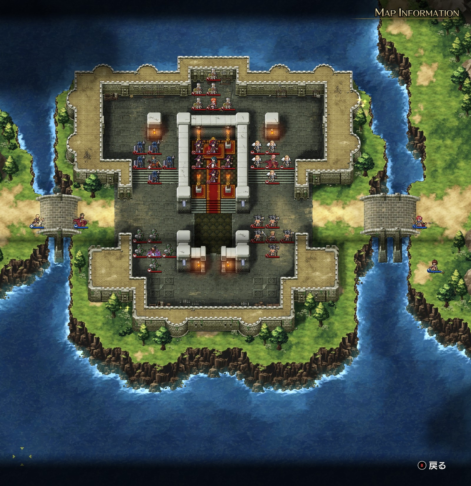
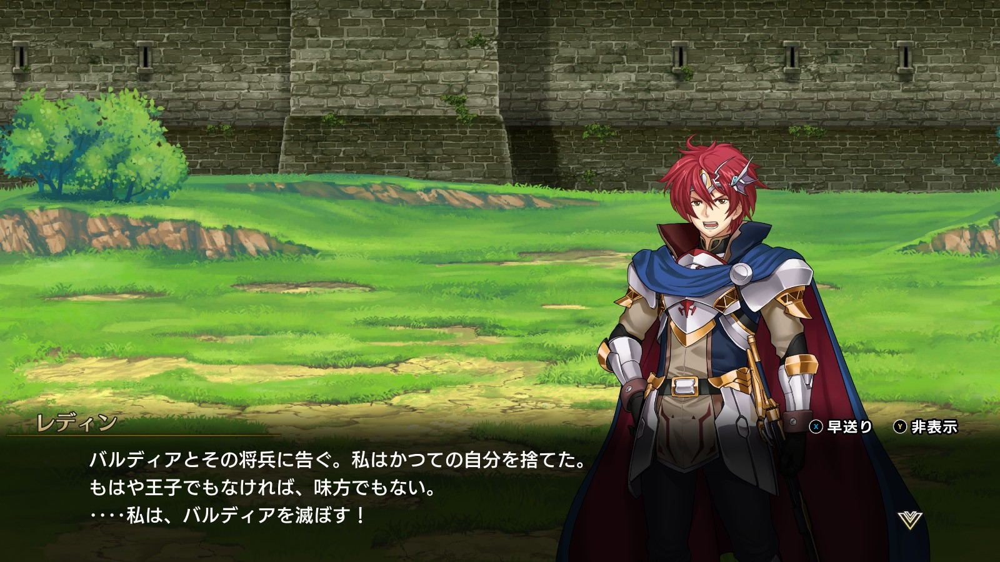
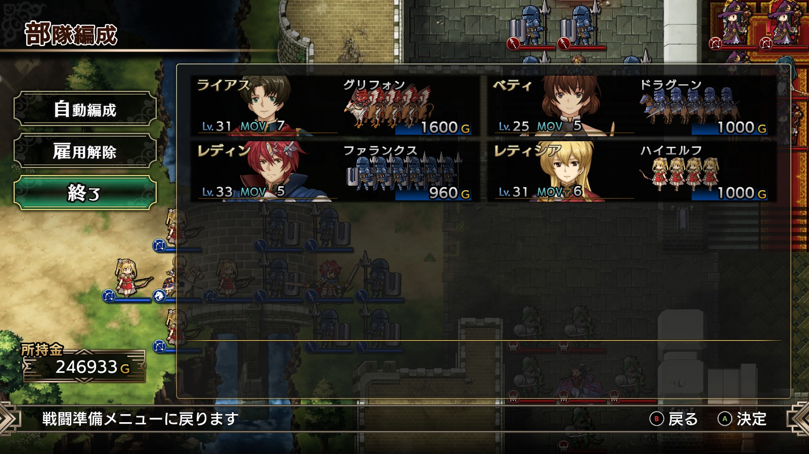

Steam 版ラングリッサーⅠ＆Ⅱリメイク > ラングリッサーⅠ

# E ルート 17 章：定めた道

## マップ

  

光るマス
- 北東の城壁：魔王降臨の書
- 南西の城外：2,000 G

## 条件

- 勝利条件
    - 敵の全滅
- 敗北条件
    - レディンの死亡
- クリアボーナス
    - 8,500 G

## 敵軍

|指揮官|クラス|兵種|傭兵|傭兵兵種|
|---|---|---|---|---|
|ナーム|ドラゴンロード|飛兵|エンジェル|飛兵|
|ジェシカ|セージ|僧侶|ハイウィッチ|弓兵|
|クリス|ハイプリースト|僧侶|クルセイダー|僧侶|
|テイラー|サーペンロード|水兵|リザードマン|水兵|
|ソーン|ソードマスター|歩兵|バーサーカー|歩兵|
|アルバート|ナイトマスター|騎兵|ファランクス|槍兵|

## 増援

|出現ターン|出現位置|指揮官|クラス|兵種|傭兵|傭兵兵種|
|---|---|---|---|---|---|---|
|2 ターン目|北東|シカ族（味方 NPC）|シカゾク|盗賊|バンディット|盗賊|

## 流れ

すべてと決別したレディンが、自身の国の王都バルディアを包囲するマップです。

  

クリアの仕方によってルート分岐があります。
- クリスを撃破しない → E ルートのまま
- クリスを撃破する → F ルートへ分岐

敵（というのも忍びないですが）はジェシカとクリス以外は 1 ターン目から攻め寄せてきます。

## 攻略メモ

### 出撃指揮官

|指揮官|クラス|傭兵|
|---|---|---|
|レディン|キング|ファランクス|
|ベティ|セージ|ドラグーン|
|ライアス|ドラゴンロード|グリフォン|
|レティシア|ナイトマスター|ハイエルフ|

  

### 控え指揮官

なし

### 作戦

東側は、ナームにはドラゴンロードのライアス、ソーンには騎兵を引き連れたベティが当たります。

西側は、レディンが前衛、ハイエルフを引き連れたレティシアが後衛となります。

### 反省点

ナームの魔法で騎兵がかなりダメージを受けてしまいました。

  <a href="../README.md">［ホームへ戻る］</a>

