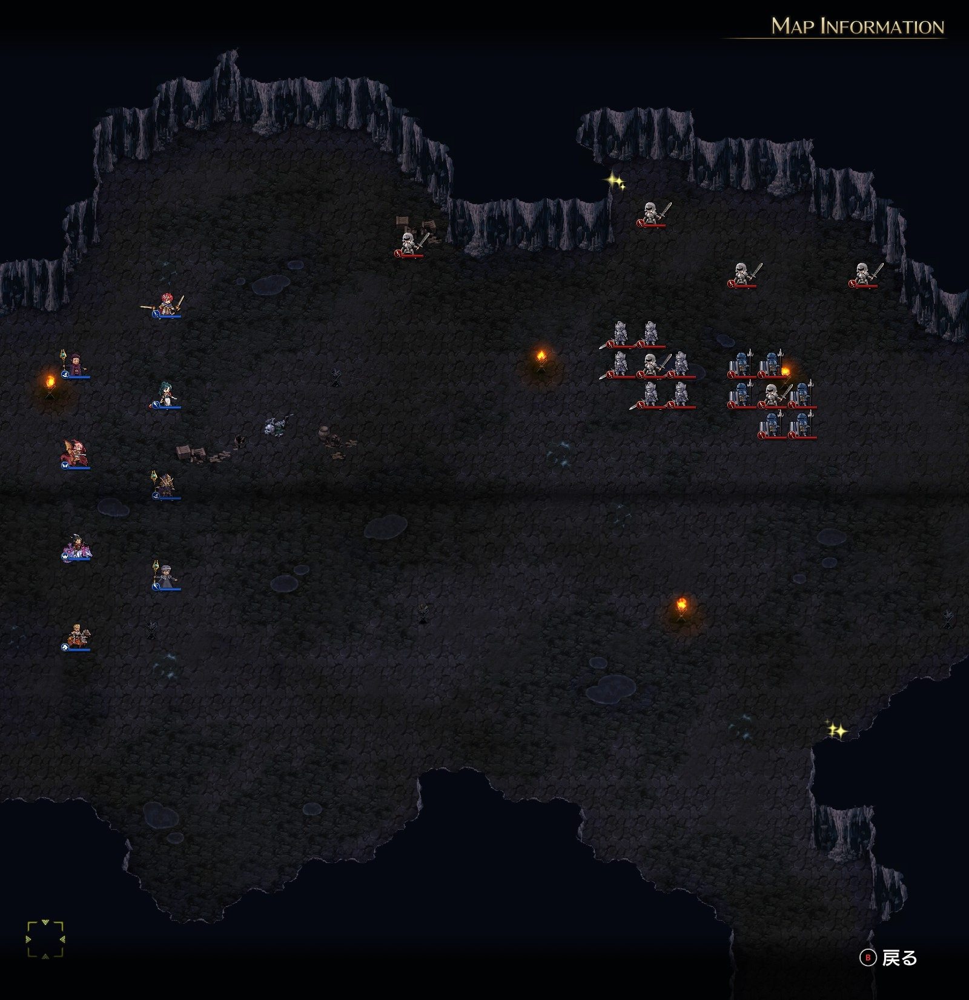
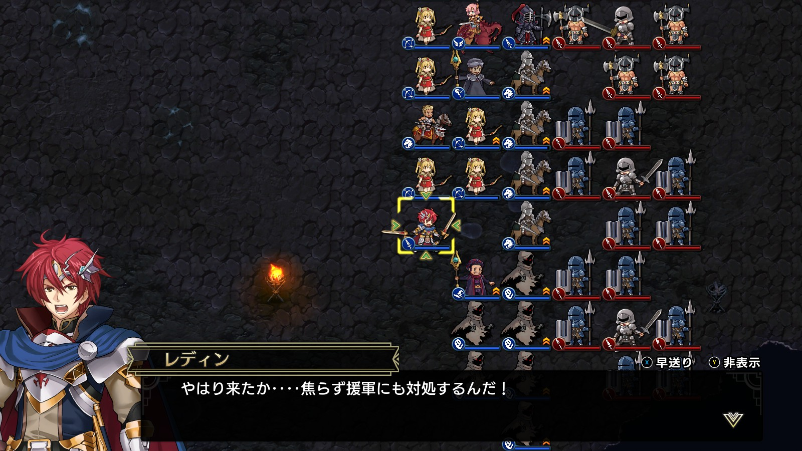
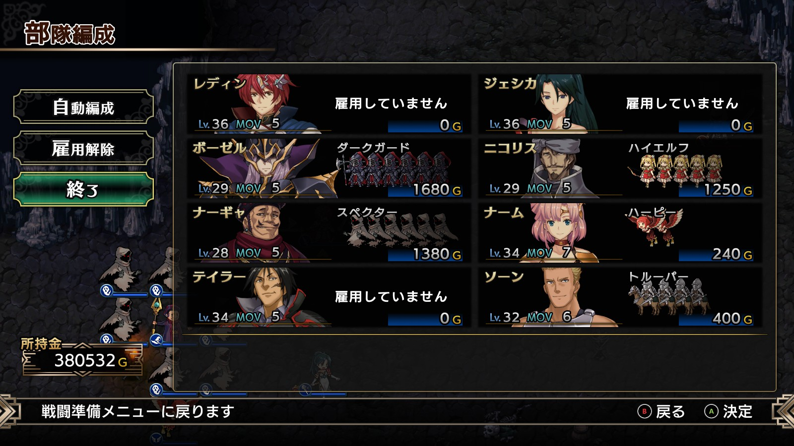
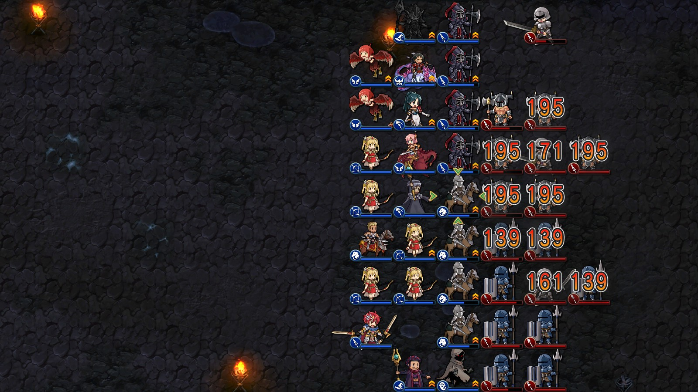

Steam 版ラングリッサーⅠ＆Ⅱリメイク > ラングリッサーⅠ

# H ルート 17 章：洞窟の攻防

## マップ

  

光るマス
- 北東：終末の魔狼
- 南東：2,000 G

## 条件

- 勝利条件
    - 敵の全滅
- 敗北条件
    - レディンの死亡
- クリアボーナス
    - 8,500 G

## 敵軍

|指揮官|クラス|兵種|傭兵|傭兵兵種|
|---|---|---|---|---|
|連合軍指揮官|ジェネラル|歩兵|グレナディーア|歩兵|
|連合軍指揮官|ハイロード|歩兵|ファランクス|槍兵|
|伝令|ロード|歩兵|－|－|
|伝令|ロード|歩兵|－|－|
|伝令|ロード|歩兵|－|－|
|伝令|ロード|歩兵|－|－|

## 増援

|出現ターン|出現位置|指揮官|クラス|兵種|傭兵|傭兵兵種|
|---|---|---|---|---|---|---|
|伝令脱出後|東|連合軍指揮官|ソードマン|歩兵|バーサーカー|歩兵|
|伝令脱出後|東|連合軍指揮官|ソードマン|歩兵|バーサーカー|歩兵|
|伝令脱出後|東|連合軍指揮官|ハイロード|歩兵|ファランクス|槍兵|
|伝令脱出後|東|連合軍指揮官|ハイロード|歩兵|ファランクス|槍兵|

## 流れ

ヴェルゼリアと大陸を繋ぐ秘密の洞窟が敵に発見されたため、大洞窟を封鎖するマップです。

伝令は東側へ移動し、援軍を呼びに南東の通路に向かいます。自軍が伝令の動きを阻害しない場合、それぞれ 5、5、6、8 ターン目にマップ外に脱出します。

伝令以外の敵は攻め寄せてきます。

最後の伝令が脱出すると増援が到着します。到着したターンでは指揮官は動かないようですが、傭兵は迎撃してきます。

  

クリア後、ボーゼル、ナーギャ、ニコリスがいったん仲間から外れます。

## G ルートとの違い

- 北東のアイテム：金塊 → 終末の魔狼
- 敵の初期配置：東寄りになっている

## 攻略メモ

### 出撃指揮官

|指揮官|クラス|傭兵|
|---|---|---|
|レディン|キング|－|
|ナーム|ドラゴンロード|ハーピー|
|ジェシカ|エージェント|－|
|ソーン|ナイトマスター|トルーパー|
|テイラー|サーペンマスター|－|
|ボーゼル|ダークマスター|ダークガード|
|ナーギャ|ダークマスター|スペクター|
|ニコリス|セージ|ハイエルフ|

  

### 控え指揮官

なし

### 作戦

[G ルート 17 章](Chapter17G.md)と同様です。

原則として、レベルの低い 3 人（ボーゼル、ニコリス、ナーギャ）が戦闘をします。プロテクション 3 を使えるレディンとジェシカは彼らの防御を高めて損耗を防ぎます。

ナームはアイテム回収です。

経験値の足しにするため、援軍はすべて呼ばせます。

まずは攻め寄せてくる敵を、魔法＋傭兵で倒します。

8 ターン目までに東に移動し、右 3 マスを空けて増援を待ちます。戦線が長いので、ソーンの傭兵も前衛にします。

増援が来たら、やはり魔法＋傭兵で倒します。

  

### 反省点

特に問題無く進められました。

  <a href="../README.md">［ホームへ戻る］</a>

