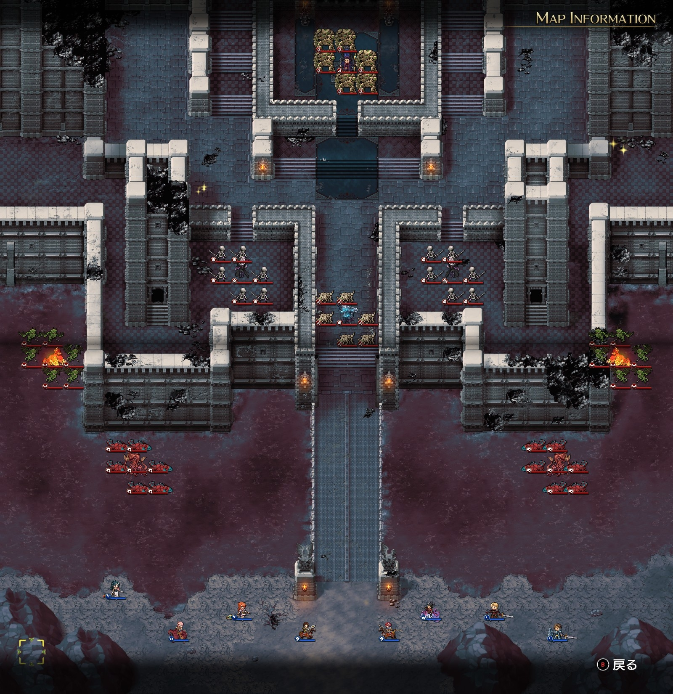
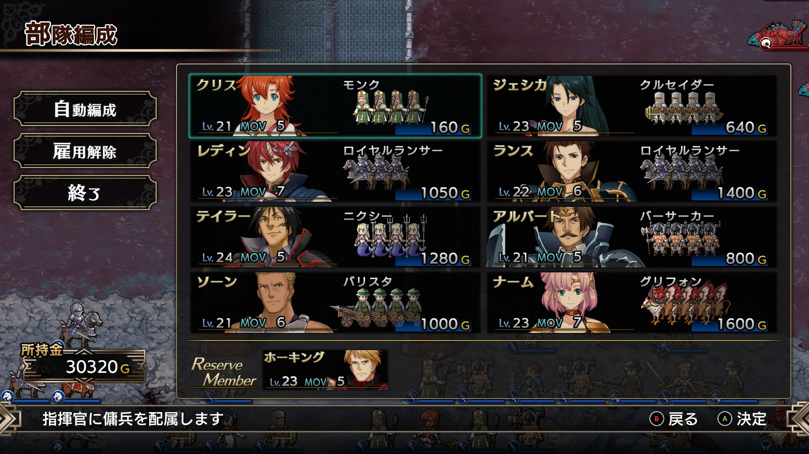

Steam 版ラングリッサーⅠ＆Ⅱリメイク > ラングリッサーⅠ

# A ルート 18 章：廃墟の中で

## マップ

  

光るマス
- 北西：金塊
- 北東：金塊

## 条件

- 勝利条件
    - ナーギャの撃破
- 敗北条件
    - レディンの死亡

## 敵軍

|指揮官|クラス|兵種|傭兵|傭兵兵種|
|---|---|---|---|---|
|ナーギャ|ザーヴェラー|魔法使い|ゴーレム|怪物陸|
|クラーケン|クラーケン|怪物水|リヴァイアサン|怪物水|
|クラーケン|クラーケン|怪物水|リヴァイアサン|怪物水|
|フェニックス|フェニックス|怪物飛|ガーゴイル|飛兵|
|フェニックス|フェニックス|怪物飛|ガーゴイル|飛兵|
|ドラフィ|バンパイアロード|高位不死|スケルトン|不死|
|ヒーディア|バンパイアロード|高位不死|スケルトン|不死|
|リビングアーマー|リビングアーマー|不死|ボーンディーノ|怪物陸|

## 増援

なし

## 流れ

廃墟と化した禁断の地ヴェルゼリアで、三度現れたナーギャと対決するマップです。

城外の敵は 1 ターン目から攻め寄せてきます。城内の敵は近づくまで動きません。

3 ターン目になるとバンパイアロードの 2 隊も攻め寄せてきます。

ナーギャのゴーレムはかなり近づかないと迎撃に来ません。

クリア後、ランスが仲間から外れます。

## 攻略メモ

### 出撃指揮官

|指揮官|クラス|傭兵|
|---|---|---|
|レディン|ナイトマスター|ロイヤルランサー|
|クリス|ハイプリースト|モンク|
|ナーム|ドラゴンロード|グリフォン|
|ジェシカ|ハイプリースト|クルセイダー|
|アルバート|ソードマスター|バーサーカー|
|ソーン|ジェネラル|バリスタ|
|テイラー|サーペンロード|ニクシー|
|ランス|ナイトマスター|ロイヤルランサー|

### 控え指揮官

- ホーキング

### 作戦

装備は MGR（魔法防御）優先のものに切り替えました。ルシリスの法衣（指揮修正 MGR+20%、MGR+40）など。

まずは南側の陸地に寄り、攻め寄せてくる敵軍を撃退します。

バンパイアロード達はメテオを持っているので、囮に打たせたり、8 マス以内には近づかないようにしつつ敵が近づいてきたところを攻撃したりして、一気に片付けます。メテオ回避を重要視したため、配下を倒すよりも先にバンパイアロードを撃破してしまいました。

ここまでは忙しいのですが、ここからはのんびりいけます。

ほとんど動かないリビングアーマー隊は、北からナームの飛兵が、南からアルバートのバーサーカーで挟み撃ちします。

アイテム回収はぼちぼちしておきます。

残ったナーギャにはじわじわと包囲網を敷きつつ、ナーギャ隊がアースクエイクの範囲内に入って 3 発打たせます（ナーギャの MP は 72 ですが、1 ターンに 10 回復するので、3 連続で撃てます）。この時、ライトニングボルトの範囲に多くのナーギャ隊が入ってしまうとライトニングボルトで被弾するので、アースクエイクの範囲（4 マス）に多く入るよう注意します。

その後、こちらから魔法を打ってゴーレムにダメージを与えつつ（ゴーレムには魔法が良く効きます）、機動力のある部隊を中心に一気に突入し、殲滅します。

## 反省点

最初の波を乗り越えれば傭兵が余り気味なので、もう少し傭兵の数をケチっても良かったかもしれません。

  

  <a href="../README.md">［ホームへ戻る］</a>

