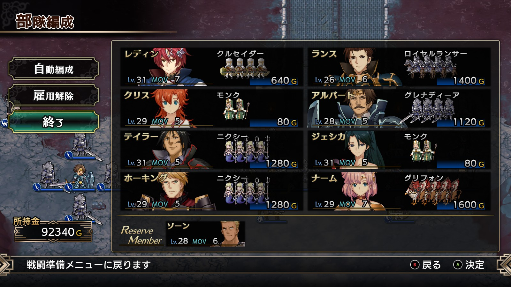

Steam 版ラングリッサーⅠ＆Ⅱリメイク > ラングリッサーⅠ

# B ルート 18 章：廃墟の中で

## マップ

  

光るマス
- 北西：大地の首飾り
- 北東：金塊

## 条件

- 勝利条件
    - ナーギャの撃破
- 敗北条件
    - レディンの死亡
- クリアボーナス
    - 9,000 G

## 敵軍

|指揮官|クラス|兵種|傭兵|傭兵兵種|
|---|---|---|---|---|
|ナーギャ|ザーヴェラー|魔法使い|ゴーレム|怪物陸|
|クラーケン|クラーケン|怪物水|リヴァイアサン|怪物水|
|クラーケン|クラーケン|怪物水|リヴァイアサン|怪物水|
|フェニックス|フェニックス|怪物飛|ガーゴイル|飛兵|
|フェニックス|フェニックス|怪物飛|ガーゴイル|飛兵|
|ドラフィ|バンパイアロード|高位不死|スケルトン|不死|
|ヒーディア|バンパイアロード|高位不死|スケルトン|不死|
|リビングアーマー|リビングアーマー|不死|ボーンディーノ|怪物陸|

## 増援

なし

## 流れ

廃墟と化した禁断の地ヴェルゼリアで、三度現れたナーギャと対決するマップです。

城外の敵は 1 ターン目から攻め寄せてきます。城内の敵は近づくまで動きません。

3 ターン目になるとバンパイアロードの 2 隊も攻め寄せてきます。

ナーギャのゴーレムはかなり近づかないと迎撃に来ません。

クリア後、ランスとナームが仲間から外れます。

## A ルートとの違い

- 北西のアイテム：金塊 → 大地の首飾り
- ドラフィ、ヒーディア：メテオを使えない
- クリア後の仲間外れ：ランスのみ → ランスとナーム

  

## 攻略メモ

### 出撃指揮官

|指揮官|クラス|傭兵|
|---|---|---|
|レディン|ナイトマスター|クルセイダー|
|クリス|プリンセス|モンク|
|ナーム|ドラゴンロード|グリフォン|
|ジェシカ|エージェント|モンク|
|ホーキング|サーペンロード|ニクシー|
|アルバート|ソードマスター|グレナディーア|
|テイラー|サーペンマスター|ニクシー|
|ランス|ナイトマスター|ロイヤルランサー|

### 控え指揮官

- ソーン

### 作戦

B ルートは 2 周目で攻略しているので、全体的に楽になっています。

防具は全員ルシリスの法衣（指揮修正 MGR+20%、MGR+40）なので MGR（魔法防御）も高いです。

水兵が 2 隊になったので左右に配置し、水上を中心に戦います。

右翼は、ホーキングがクラーケンを、ナームがフェニックスを相手します。

左翼は、テイラーとアルバートの混合チームで戦います。

メテオを使えないバンパイアロード達は十分に引きつけてから、逆にジェシカのメテオで殲滅します。

  

後は [A ルート](Chapter18A.md)の時と同様、ナーギャにアースクエイクを無駄打ちさせてから突入して制圧します。ジェシカがレベルアップして再度メテオを打てたのですが、メテオ無双すぎてしまうので普通に倒しました。

## 反省点

A ルートの時に傭兵をケチれば良かったと言っておきながら、今回も後半の傭兵を余らせてしまいました。

A ルートの時より 4 ユニット減らしましたが、もっと減らせたと思います。

  

  <a href="../README.md">［ホームへ戻る］</a>

