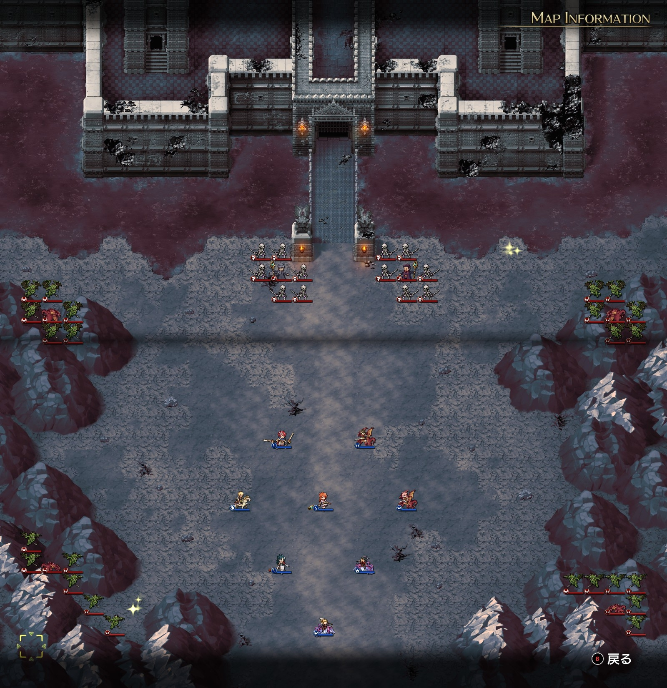

Steam 版ラングリッサーⅠ＆Ⅱリメイク > ラングリッサーⅠ

# C ルート 18 章：禁断の地ヴェルゼリア

## マップ

  

光るマス
- 北東、川の手前：金塊
- 南西：金塊

## 条件

- 勝利条件
    - 敵の全滅
- 敗北条件
    - レディンの死亡
- クリアボーナス
    - 9,000 G

## 敵軍

|指揮官|クラス|兵種|傭兵|傭兵兵種|
|---|---|---|---|---|
|ニコリス|アークメイジ|魔法使い|スケルトン|不死|
|ナーギャ|ザーヴェラー|魔法使い|スケルトン|不死|
|ワイバーン|ワイバーン|怪物飛|ガーゴイル|飛兵|
|ワイバーン|ワイバーン|怪物飛|ガーゴイル|飛兵|
|ワイバーン|ワイバーン|怪物飛|ガーゴイル|飛兵|
|ワイバーン|ワイバーン|怪物飛|ガーゴイル|飛兵|

## 増援

|出現ターン|出現位置|指揮官|クラス|兵種|傭兵|傭兵兵種|
|---|---|---|---|---|---|---|
|2 ターン目（ニコリスがいる場合）|ナーギャの南側|サー・ガリウス|セージ|僧侶|デーモン|魔族|
|3 ターン目|南東|ディゴス（味方 NPC）|エンペラー|歩兵|グレナディーア|歩兵|

## 流れ

ボーゼルと決着をつけようとするものの、ニコリスとナーギャが立ちはだかるマップです。

1 ターン目の敵フェーズで、クリスかナームが寝返ります。[A ルート 17 章](Chapter17A.md)とは異なり開始時ではないため、1 ターン目でニコリスを倒せば寝返りは発生しません。また、2 人とも控えにして出撃させなかった場合も寝返りは発生しません。

ニコリスとナーギャ以外の敵は、1 ターン目から攻め寄せてきます。

増援のサー・ガリウスはニコリスがいる場合のみ出現しますが、「部下の始末を付けるため」に来るディゴスはニコリスがいなくてサー・ガリウスが出現しない場合でも出現します。

クリア後、ディゴスが仲間になります。

  

## 攻略メモ

### 出撃指揮官

|指揮官|クラス|傭兵|
|---|---|---|
|レディン|キング|－|
|ジェシカ|エージェント|ハイエルフ|
|ホーキング|サーペンロード|ニクシー|
|アルバート|ソードマスター|ダークエルフ|
|ソーン|ナイトマスター|クルセイダー|
|テイラー|サーペンマスター|ニクシー|
|ライアス|ドラゴンロード|グリフォン|
|レティシア|ナイトマスター|ハイエルフ|

※ライアス、レティシアは強制出撃

### 控え指揮官

- クリス
- ナーム

### 作戦

経験値を少しでも多く稼ぐため、ニコリスを生き残らせてサー・ガリウスを出現させることにしました。必然的に、寝返るクリスとナームが控えとなります。

東のワイバーンにはジェシカのブリザード＆ハイエルフを中心に対応します。

西のワイバーンにはレティシアとアルバートの弓兵を中心に対応します。

増援のサー・ガリウスはデーモンを率いているので、ソーンのクルセイダーを中心に対応します。

ニコリスは魔法を被弾する 3 列を避けつつ接近します。レティシアがヴァルキリーを召喚したら、寄ってくるスケルトンをばったばったとなぎ倒してくれたので、ニコリス本人を弓兵と指揮官で一気に叩きます。

一番被弾が多かったのはナーギャでした。サー・ガリウスと戦っている時に魔法を被弾し、クルセイダーであっても痛いダメージを被りました。クルセイダーと異なる方向をグリフォンで囲むとアースクエイクを打ってくれたので被害は小さくなりましたが。

### 反省点

対ワイバーン戦において、ハイエルフ（250 G）が活躍したのと比べると、ダークエルフ（130 G）はすぐにやられてしまいました。アルバートの傭兵リストを強化する必要があるかもしれません。

  <a href="../README.md">［ホームへ戻る］</a>

