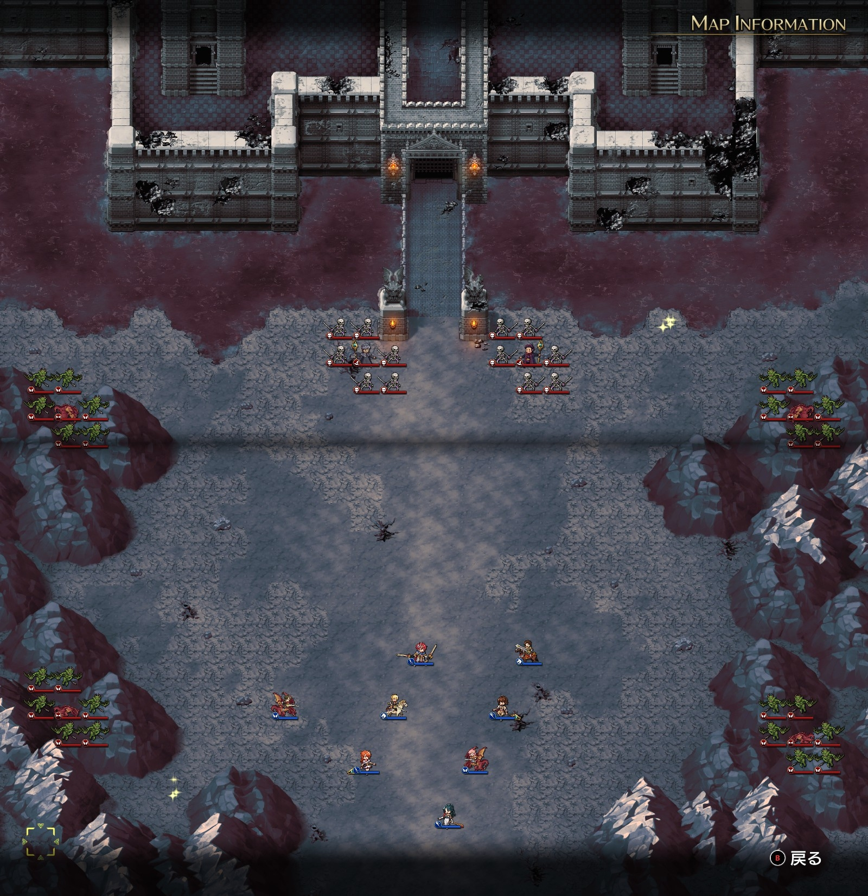
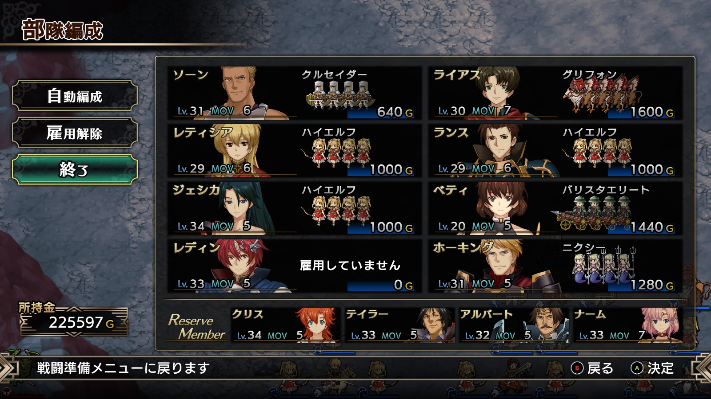

Steam 版ラングリッサーⅠ＆Ⅱリメイク > ラングリッサーⅠ

# D ルート 18 章：禁断の地ヴェルゼリア

## マップ

  

光るマス
- 北東、川の手前：金塊
- 南西：魔王降臨の書

## 条件

- 勝利条件
    - 敵の全滅
- 敗北条件
    - レディンの死亡
- クリアボーナス
    - 9,000 G

## 敵軍

|指揮官|クラス|兵種|傭兵|傭兵兵種|
|---|---|---|---|---|
|ニコリス|アークメイジ|魔法使い|スケルトン|不死|
|ナーギャ|ザーヴェラー|魔法使い|スケルトン|不死|
|ワイバーン|ワイバーン|怪物飛|ガーゴイル|飛兵|
|ワイバーン|ワイバーン|怪物飛|ガーゴイル|飛兵|
|ワイバーン|ワイバーン|怪物飛|ガーゴイル|飛兵|
|ワイバーン|ワイバーン|怪物飛|ガーゴイル|飛兵|

## 増援

|出現ターン|出現位置|指揮官|クラス|兵種|傭兵|傭兵兵種|
|---|---|---|---|---|---|---|
|2 ターン目（ニコリスがいる場合）|ナーギャの南側|サー・ガリウス|セージ|僧侶|デーモン|魔族|
|3 ターン目|南東|ディゴス（味方 NPC）|エンペラー|歩兵|グレナディーア|歩兵|

## 流れ

ボーゼルと決着をつけようとするものの、ニコリスとナーギャが立ちはだかるマップです。

1 ターン目の敵フェーズで、クリスかナームが寝返ります。1 ターン目でニコリスを倒せば寝返りは発生しません。また、2 人とも控えにして出撃させなかった場合も寝返りは発生しません。寝返った場合でもニコリスを倒せば元に戻ります。

ニコリスとナーギャも含め、1 ターン目から攻め寄せてきます。

増援のサー・ガリウスはニコリスがいる場合のみ出現しますが、「部下の始末を付けるため」に来るディゴスはニコリスがいなくてサー・ガリウスが出現しない場合でも出現します。

## C ルートとの違い

- 前章でベティが仲間になっている
- 南西のアイテム：金塊 → 魔王降臨の書
- ニコリスとナーギャも攻めてくる
- クリア後、ディゴスが仲間にならない

## 攻略メモ

### 出撃指揮官

|指揮官|クラス|傭兵|
|---|---|---|
|レディン|キング|－|
|ジェシカ|エージェント|ハイエルフ|
|ホーキング|サーペンロード|ニクシー|
|ソーン|ナイトマスター|クルセイダー|
|ランス|ロイヤルガード|ハイエルフ|
|ベティ|セージ|バリスタエリート|
|ライアス|ドラゴンロード|グリフォン|
|レティシア|ナイトマスター|ハイエルフ|

※ランス、ベティ、ライアス、レティシアは強制出撃

  

### 控え指揮官

- クリス
- ナーム
- アルバート
- テイラー

### 作戦

寝返るクリスとナームは控えです。

東のワイバーンにはジェシカのブリザード＆ハイエルフを中心に対応します。

西のワイバーンにはランスとレティシアの弓兵を中心に対応します。

ニコリスとナーギャも動いてきたので、クルセイダー以外はなるべく魔法範囲に入らないようにしながら戦います。また、グリフォンを 1 ユニットアイテム回収に急行させます。

増援のサー・ガリウスは手近な味方で適宜対応です。

### 反省点

ニコリスとナーギャが動くと思っていなかったので、想定より巻きで攻める必要に迫られました。また、サー・ガリウス本人をディゴスに倒されてしまいました。

  <a href="../README.md">［ホームへ戻る］</a>

