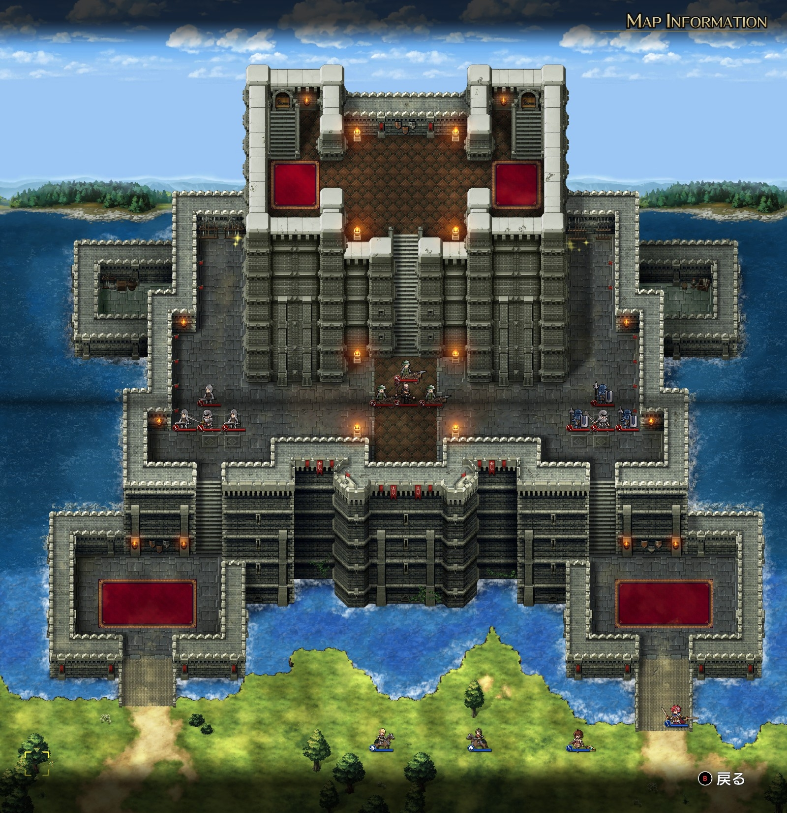
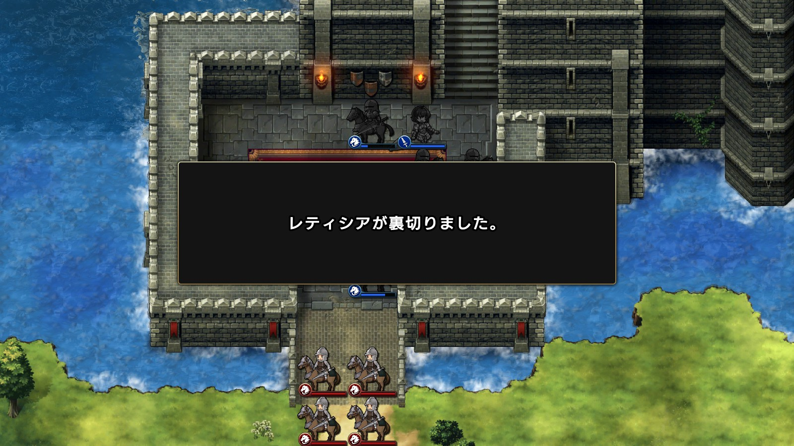
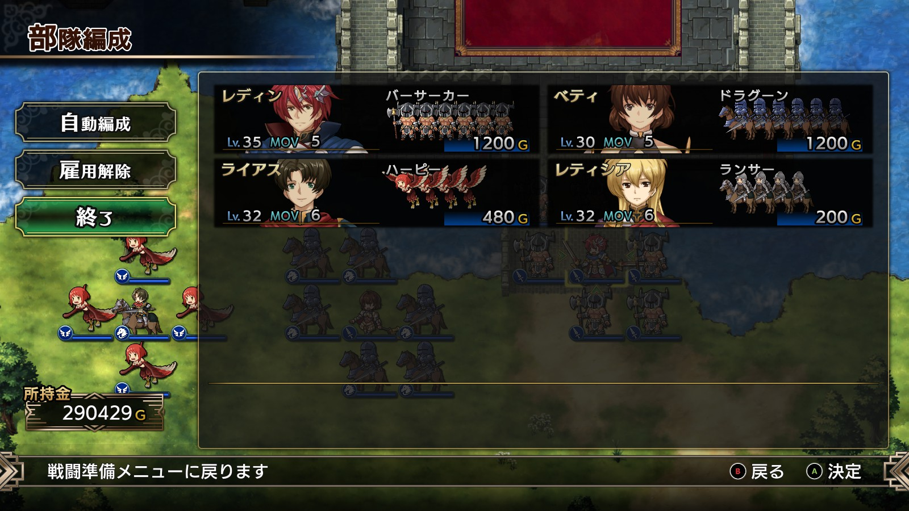

Steam 版ラングリッサーⅠ＆Ⅱリメイク > ラングリッサーⅠ

# F ルート 18 章：帝国の最後

## マップ

  

光るマス
- 北東の城内：神獣のいななき
- 北西の城内：金塊

## 条件

- 勝利条件
    - 敵の全滅
- 敗北条件
    - いずれかの自軍指揮官の死亡
- クリアボーナス
    - 9,000 G

## 敵軍

|指揮官|クラス|兵種|傭兵|傭兵兵種|
|---|---|---|---|---|
|帝国指揮官|ジェネラル|歩兵|ファランクス|槍兵|
|帝国指揮官|ソードマン|歩兵|ソルジャー|歩兵|
|帝国指揮官|サモナー|魔法使い|バリスタ|バリスタ|

## 増援

なし

## 流れ

旧バルディアの領主全員を処刑したレディンが、ダルシスに兵を進めるマップです。

敵は全軍で 1 ターン目から攻め寄せてきます。

敵を全滅させると、ライアスとレティシアが裏切って敵となります。

  

## E ルートとの違い

- 神獣のいななきと金塊の位置が逆

## 攻略メモ

### 出撃指揮官

|指揮官|クラス|傭兵|
|---|---|---|
|レディン|キング|バーサーカー|
|ベティ|セージ|ドラグーン|
|ライアス|ナイト|ハーピー|
|レティシア|ナイト|ランサー|

  

### 控え指揮官

なし

### 作戦

[E ルート 18 章](Chapter18E.md)と同様です。

裏切るライアスとレティシアはクラスを最下位にしたうえで、アイテムを剥奪しておきます。経験値稼ぎのため、傭兵は最下位のものを付けておきます。

開始と同時にハーピーで左右のアイテム回収に向かいます。

帝国指揮官にはレディンとベティで当たり、アイテム回収後に撃破します。撃破直前、ライアスとレティシアはレディンとベティにバフを掛けておきます。

裏切り後、レディンとベティでそれぞれ撃破します。

### 反省点

E ルートの反省を活かしてサモナーの被害も抑え、うまくいったのではないかと思います。

  <a href="../README.md">［ホームへ戻る］</a>

