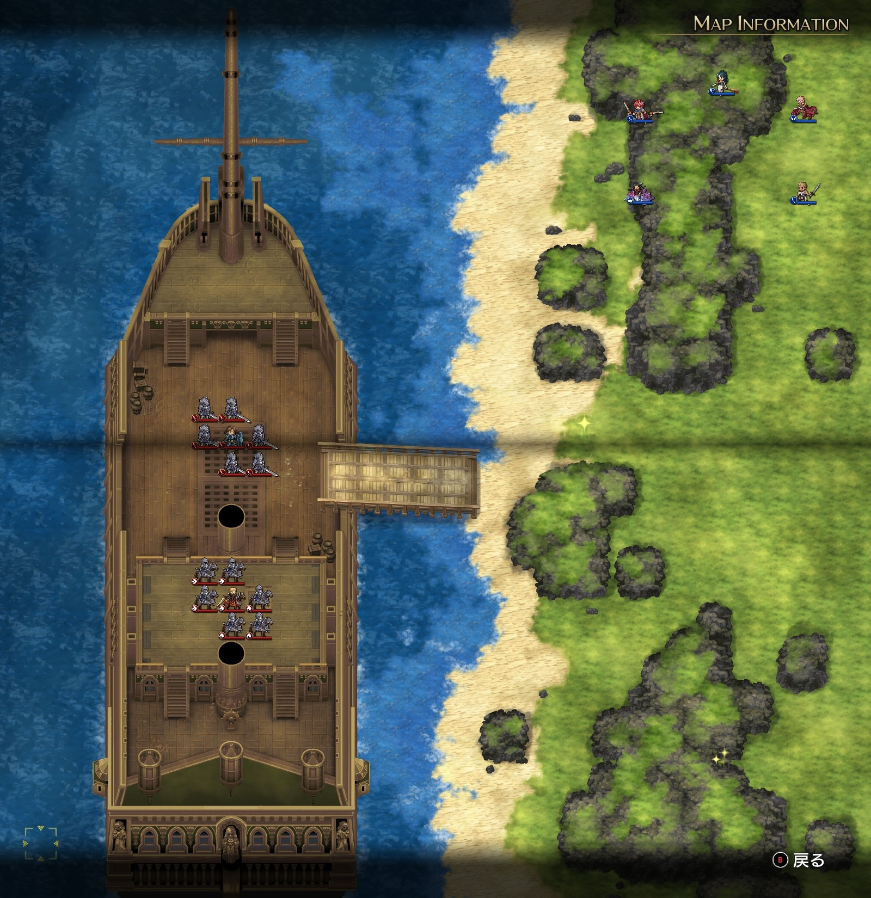
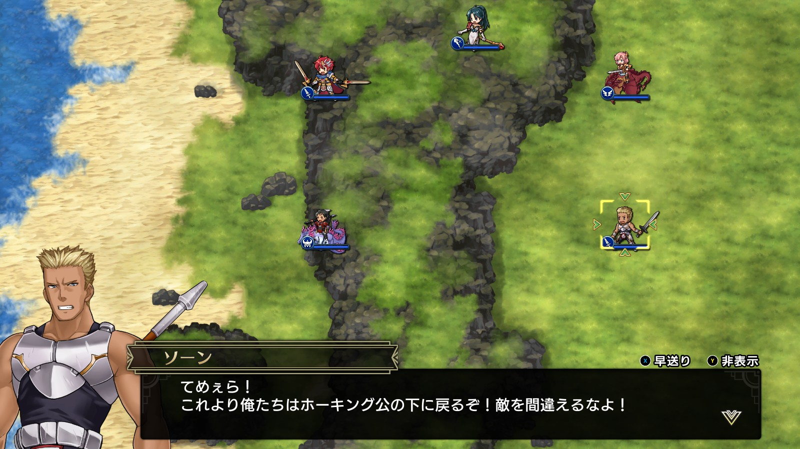
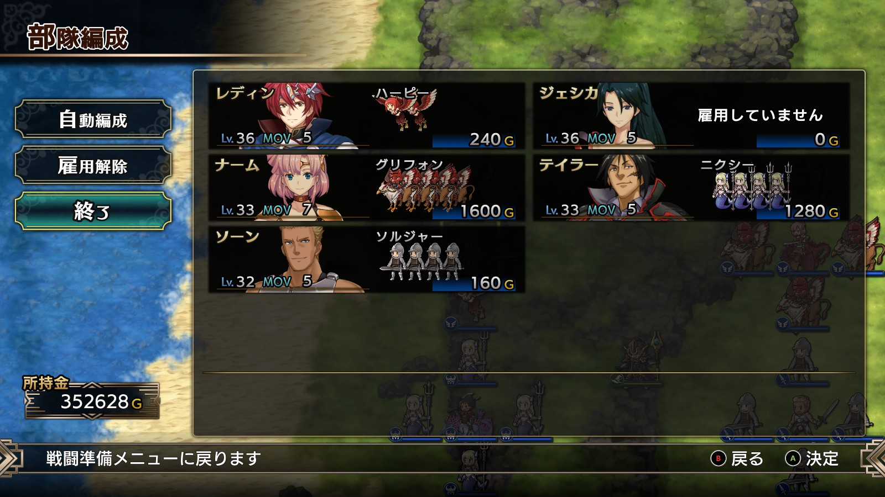
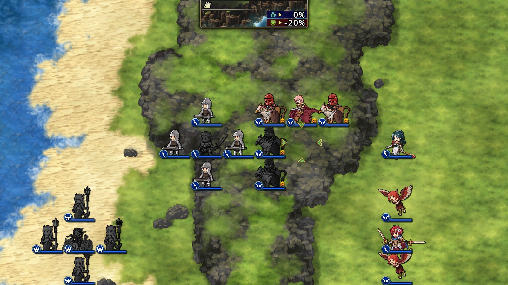
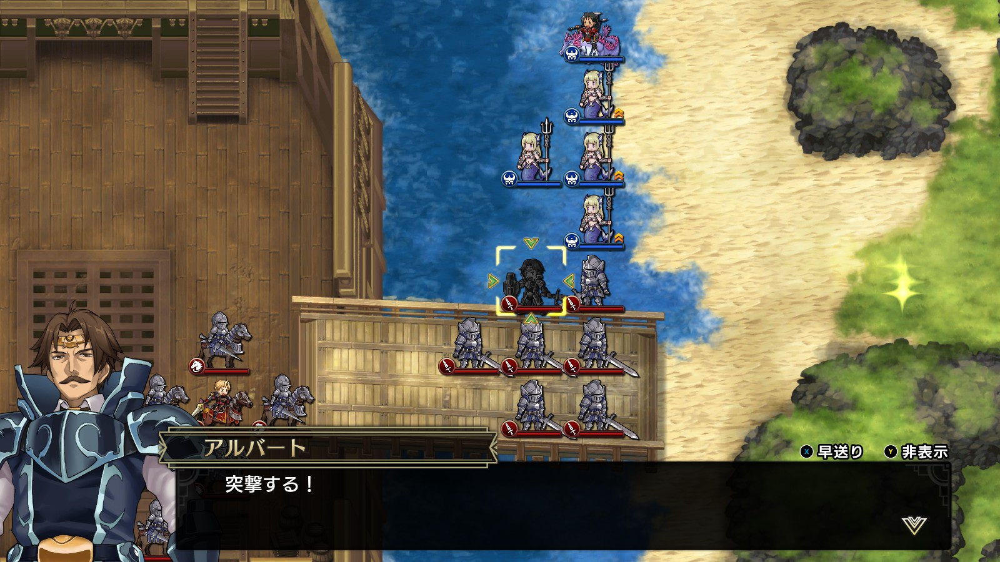

Steam 版ラングリッサーⅠ＆Ⅱリメイク > ラングリッサーⅠ

# G ルート 18 章：上陸妨害戦

## マップ

  

光るマス
- 桟橋の東
- 南東

## 条件

- 勝利条件
    - 敵の全滅
- 敗北条件
    - レディンの死亡
- クリアボーナス
    - 9,000 G

## 敵軍

|指揮官|クラス|兵種|傭兵|傭兵兵種|
|---|---|---|---|---|
|アルバート|ジェネラル|歩兵|グレナディーア|歩兵|
|ホーキング|ナイトマスター|騎兵|ロイヤルランサー|騎兵|

## 増援

なし

## 流れ

海路からの侵攻を阻止するマップです。

敵軍は 1 ターン目から攻め寄せてきます。

1 ターン目の敵フェーズでソーンが敵側に寝返ります。

  

## 攻略メモ

### 出撃指揮官

|指揮官|クラス|傭兵|
|---|---|---|
|レディン|キング|ハーピー|
|ナーム|ドラゴンロード|グリフォン|
|ジェシカ|エージェント|－|
|ソーン|ファイター|ソルジャー|
|テイラー|サーペンマスター|ニクシー|

  

### 控え指揮官

なし

### 作戦

裏切るソーンはクラスを最下位にしたうえで、アイテムを剥奪しておきます。経験値稼ぎのため、傭兵は最下位のものを付けておきます。1 ターン目は操作できるので、隣のナームにプロテクションを掛けておきます。

  

テイラーはアルバート・ホーキング迎撃のため、海路を進みます。こちらは海、敵は砂浜で戦うのを想定していましたが、敵が海に入ってきてくれたので有利になったのではと思います。

  

ナームはソーン撃破後、テイラーと合流します。

レディンのハーピーはアイテム回収です。

### 反省点

特に問題無く進められました。

  <a href="../README.md">［ホームへ戻る］</a>

