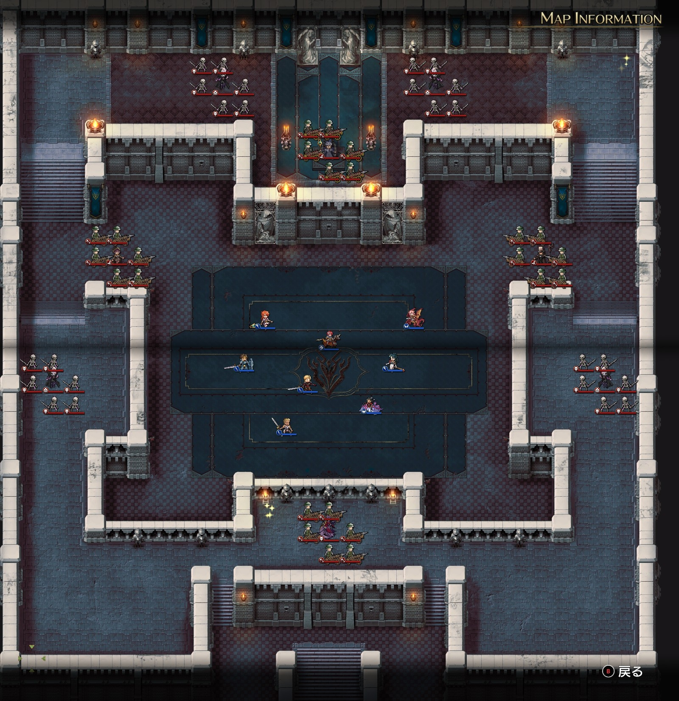
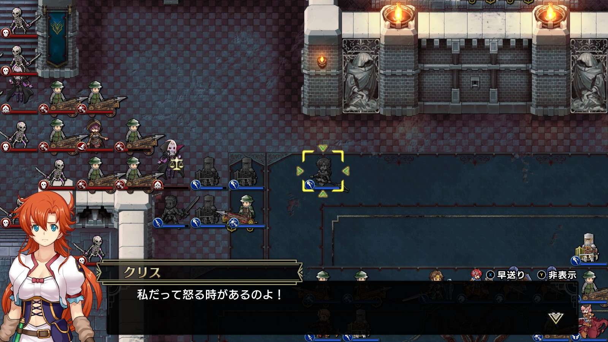
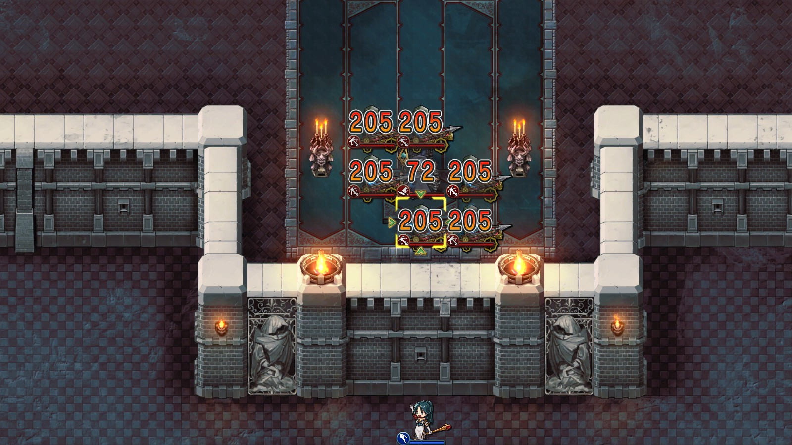

Steam 版ラングリッサーⅠ＆Ⅱリメイク > ラングリッサーⅠ

# A ルート 19 章：地下神殿

## マップ

  

光るマス
- 北東：3,000 G
- 南：金塊

## 条件

- 勝利条件
    - ニコリスの撃破
- 敗北条件
    - レディンの死亡

## 敵軍

|指揮官|クラス|兵種|傭兵|傭兵兵種|
|---|---|---|---|---|
|ニコリス|アークメイジ|魔法使い|バリスタエリート|バリスタ|
|モルガン|アークメイジ|魔法使い|バリスタ|バリスタ|
|リーアップ|ザーヴェラー|魔法使い|バリスタ|バリスタ|
|ラーカス|バンパイアロード|高位不死|スケルトン|不死|
|マツニス|バンパイアロード|高位不死|スケルトン|不死|
|アルファーン|バンパイアロード|高位不死|スケルトン|不死|
|オーザ|バンパイアロード|高位不死|スケルトン|不死|
|ラミスローゼ|リッチ|不死|バリスタ|バリスタ|

## 増援

なし

## 流れ

離脱したランスが敵を足止めしている隙に、地下神殿へと突入するマップです。

バンパイアロードは全員メテオ持ちかつ MP 回復持ちで、1 ターン目から攻め寄せてきます。

その他の敵は近づくまで動きませんが、いずれも広範囲魔法を持っているので距離には注意が必要です。

## 攻略メモ

### 出撃指揮官

|指揮官|クラス|傭兵|
|---|---|---|
|レディン|ナイトマスター|ドラグーン|
|クリス|ハイプリースト|バリスタエリート|
|ナーム|ドラゴンロード|クルセイダー|
|ジェシカ|ハイプリースト|クルセイダー|
|ホーキング|ジェネラル|クルセイダー|
|アルバート|ジェネラル|バリスタ|
|ソーン|ジェネラル|クルセイダー|
|テイラー|サーペンロード|ニクシー|

### 控え指揮官

なし

### 作戦

前章に引き続き、装備は MGR（魔法防御）優先です。

初期配置は四方を魔法に囲まれて動きづらいため、各指揮官の傭兵は 3 ユニットくらいまでが限度だと思います。魔法と不死に強いクルセイダーを中心に編成しました（初めてナームに飛兵以外を持たせました）。

まずはバンパイアロード 4 隊の対処です。

左右それぞれ、南側のバンパイアロードに 1 ターン目にメテオを打たせます。MGR 219 のクリスと MGR 226 のジェシカはバンパイアロードのメテオにノーダメージなので囮になります。3 ターン目に再度メテオを打たせれば、最早魔法の心配はありません。

  

厄介なのは北側のバンパイアロードです。南側のバンパイアロードがちょうどバリスタを越えたあたりで、ほとんど同じ位置に来ます。こちらにもメテオを打たせる必要があるので、南側のバンパイアロードと戦う際に位置取りに気をつける必要があります。また、位置的に、1 度メテオを打たせた次のターンで倒しきる必要があり（2 度目のメテオは恐らく広範囲で被害を被る）、難易度が高めです。

というわけで、メテオの被害はほぼゼロ（位置的に被ってしまったニコリスのメテオはクリスでもちょっとダメージくらいました）でバンパイアロード 4 隊と、混戦になった魔法使いたちを倒しました。

その後は二手に分かれて殲滅戦です。

ジェシカだけは大広間にとどまり、ニコリスの傭兵達をライトニングボルトで倒します。というかニコリスにもかなりダメージが通るのでジェシカでニコリスも倒せたのですが、経験値的にニコリスはテイラーに譲りました。

  

## 反省点

ジェシカが壁越しに北側のニコリスを攻撃したのと同様、クリスも壁越しに南側のラミスローゼを攻撃すれば、よりスマートにアイテム回収できたような気がします。

  <a href="../README.md">［ホームへ戻る］</a>

