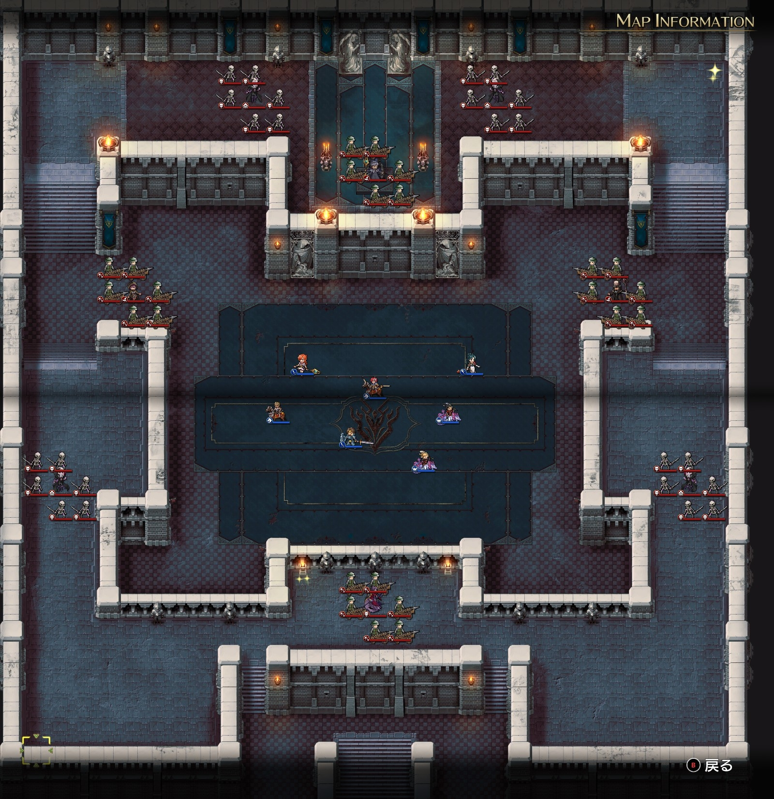

Steam 版ラングリッサーⅠ＆Ⅱリメイク > ラングリッサーⅠ

# B ルート 19 章：地下神殿

## マップ

  

光るマス
- 北東：3,000 G
- 南：光輝の宝珠

## 条件

- 勝利条件
    - ニコリスの撃破
- 敗北条件
    - レディンの死亡
- クリアボーナス
    - 9,500 G

## 敵軍

|指揮官|クラス|兵種|傭兵|傭兵兵種|
|---|---|---|---|---|
|ニコリス|アークメイジ|魔法使い|バリスタ|バリスタ|
|モルガン|アークメイジ|魔法使い|バリスタ|バリスタ|
|リーアップ|ザーヴェラー|魔法使い|バリスタ|バリスタ|
|ラーカス|バンパイアロード|高位不死|スケルトン|不死|
|マツニス|バンパイアロード|高位不死|スケルトン|不死|
|アルファーン|バンパイアロード|高位不死|スケルトン|不死|
|オーザ|バンパイアロード|高位不死|スケルトン|不死|
|ラミスローゼ|リッチ|不死|バリスタ|バリスタ|

## 増援

なし

## 流れ

離脱したランスとナームが敵を足止めしている隙に、地下神殿へと突入するマップです。

ショップでは光輝の宝珠（指揮範囲+1、指揮修正 ATK+20% 等）が販売されています（このマップで拾えますが……）。

バンパイアロードは全員メテオ持ちかつ MP 回復持ちで、1 ターン目から攻め寄せてきます。

その他の敵は近づくまで動きませんが、いずれも広範囲魔法を持っているので距離には注意が必要です。

ラミスローゼとモルガンのコールドウェイブは UI 上は射程 6 に見えますが、実際には射程 8 あります。

## A ルートとの違い

- ショップのラインナップ：光輝の宝珠
- ニコリスの傭兵：バリスタエリート → バリスタ
- 南の光るマス：金塊 → 光輝の宝珠
- 18 章でナームが仲間から外れている

## 攻略メモ

### 出撃指揮官

|指揮官|クラス|傭兵|
|---|---|---|
|レディン|ナイトマスター|ドラグーン|
|クリス|プリンセス|バリスタエリート|
|ジェシカ|エージェント|クルセイダー|
|ホーキング|サーペンロード|クルセイダー|
|アルバート|ソードマスター|バリスタ|
|ソーン|ナイトマスター|クルセイダー|
|テイラー|サーペンマスター|ニクシー|

### 控え指揮官

なし

### 作戦

基本的に [A ルート](Chapter19A.md#作戦)と同じ作戦にしました。

  

各指揮官の傭兵は 3 ユニットとし、バンパイアロードにメテオを無駄打ちさせつつ、傭兵よりもバンパイアロード優先で撃破します。

  

その後は A ルートの反省を活かし、北のジェシカだけではなく南のクリスも魔法でバリスタを片付けてから指揮官を倒します。

### 反省点

今回はなかなかうまくいったのではないかと思います。

  <a href="../README.md">［ホームへ戻る］</a>

