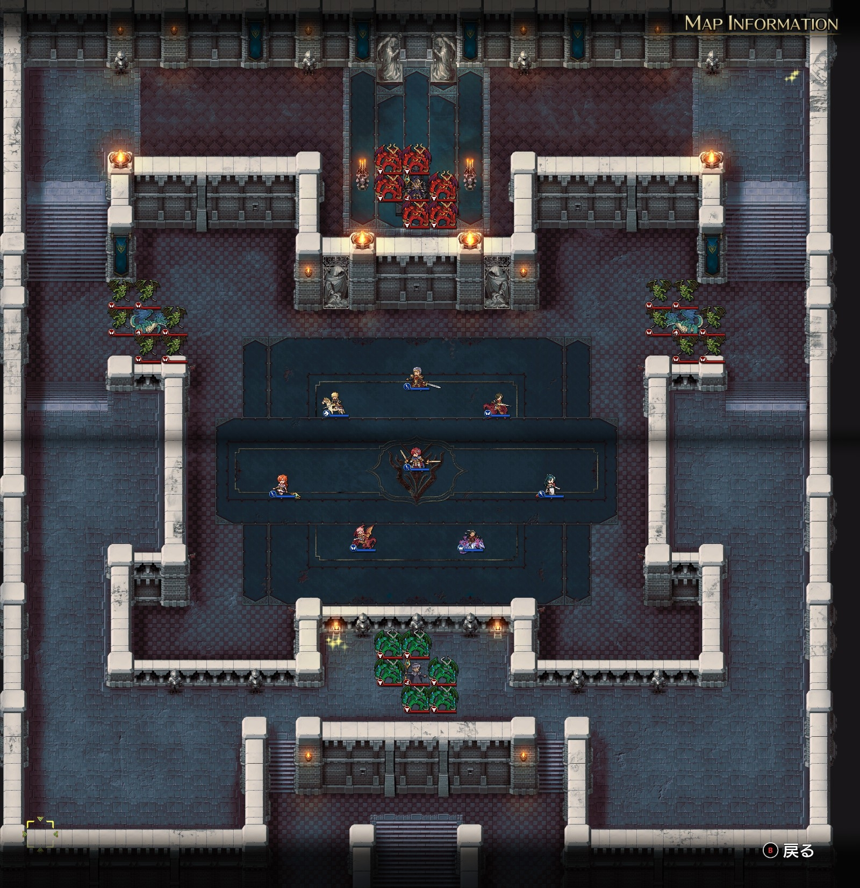
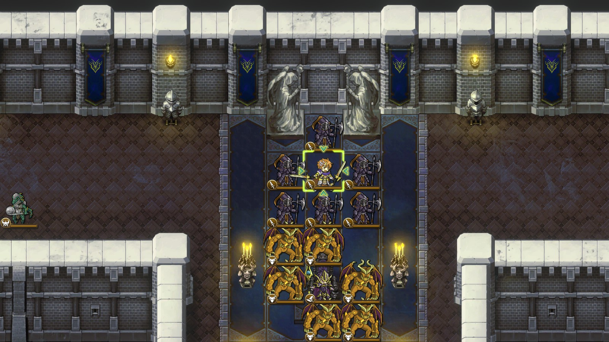
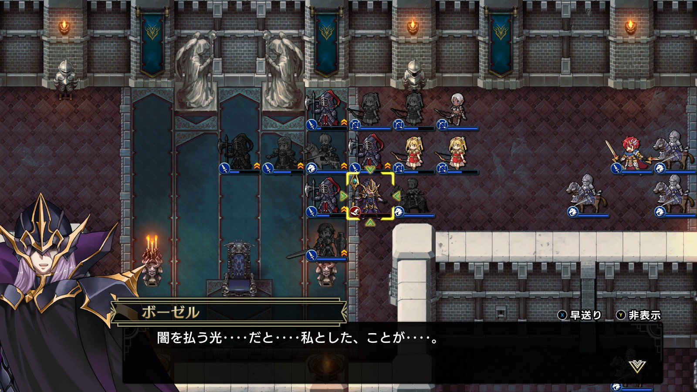

Steam 版ラングリッサーⅠ＆Ⅱリメイク > ラングリッサーⅠ

# C ルート 19 章：地下神殿

## マップ

  

光るマス
- 北東：3,000 G
- 南：闇の紋章

## 条件

- 勝利条件
    - 敵の全滅
- 敗北条件
    - レディンの死亡
- クリアボーナス
    - 9,500 G

## 敵軍

|指揮官|クラス|兵種|傭兵|傭兵兵種|
|---|---|---|---|---|
|ボーゼル|ダークマスター|魔法使い|アークデーモン|魔族|
|ニコリス|アークメイジ|魔法使い|デーモン|魔族|
|グレートドラゴン|グレートドラゴン|竜|ガーゴイル|飛兵|
|グレートドラゴン|グレートドラゴン|竜|ガーゴイル|飛兵|

## 増援

|出現ターン|出現位置|指揮官|クラス|兵種|傭兵|傭兵兵種|
|---|---|---|---|---|---|---|
|1 ターン目（ニコリスがいる場合）|ニコリスの西側|イェルムンガルド|イェルムンガルド|怪物水|リザードマン|水兵|
|1 ターン目（ニコリスがいる場合）|ニコリスの東側|イェルムンガルド|イェルムンガルド|怪物水|リザードマン|水兵|
|2 ターン目（ニコリスがいる場合）|ニコリスの東側|レディン|ソードマスター|歩兵|ダークガード|歩兵|

## 流れ

レディンとディゴスの共同戦線を闇の軍勢が待ち受けているマップです。

敵はボーゼル以外は 1 ターン目から攻め寄せてきます。ニコリスを倒した場合はボーゼルも攻め寄せてきます。

  

ニコリスが生き残っている場合は、1 ターン目にグレートドラゴン、2 ターン目に偽レディンが出現します。

  

## 攻略メモ

### 出撃指揮官

|指揮官|クラス|傭兵|
|---|---|---|
|レディン|キング|－|
|クリス|プリンセス|－|
|ジェシカ|エージェント|－|
|アルバート|ソードマスター|ダークエルフ|
|ソーン|ナイトマスター|ロイヤルランサー|
|ライアス|ドラゴンロード|グリフォン|
|レティシア|ナイトマスター|ハイエルフ|
|ディゴス|エンペラー|ダークガード|

※ライアス、レティシア、ディゴスは強制出撃

  

### 控え指揮官

- ナーム
- ホーキング
- テイラー

### 作戦

テレポートによる派兵でニコリスを 1 ターン目で倒すこともできますが、増援の経験値も欲しいので、ニコリスは生かしておく作戦とします。

クリスは壁越しにニコリス配下の傭兵を片付けておきます。

最初に寄せてくるグレートドラゴン隊に対しては、プロテクション 3 を掛けた弓兵が待ち構えます。ガーゴイルを弓兵で倒し、グレートドラゴンは指揮官で倒します。

  

続くイェルムンガルドが来たら隊列をスイッチ。弓兵は後衛に回って援護します。

右翼に来る偽レディンは騎兵で対応しようと思っていたのですが、左翼の救援に行く羽目になり不在となってしまったので、ディゴスが力押しで頑張ります。

一段落したら、アイテム回収や単騎で動き回るニコリスを仕留めつつ、ボーゼルを目指します。

ジェシカは引きつけ役を兼ねながら、南側から魔法を放ってアークデーモンの HP を削り、タイミングを合わせて他の隊が一気に突入します。一度コールテンペストを被弾しますが、指揮官は耐えるので、集中攻撃で倒しきります。

  

### 反省点

メテオ地獄だった [A ルート 19 章](Chapter19A.md)と比べると、メテオ使用者のいないこのマップは采配しやすいマップでした。

左翼の前衛をケチって 1 隊にしましたが、2 隊にしておけば安定し、偽レディンに騎兵を当ててきれいに戦えたかもしれません。

  <a href="../README.md">［ホームへ戻る］</a>

