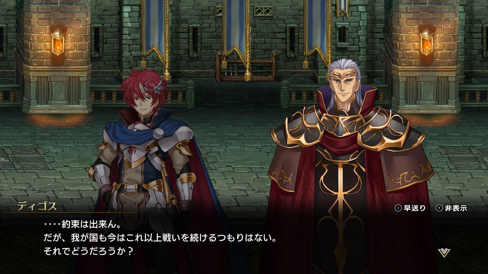

Steam 版ラングリッサーⅠ＆Ⅱリメイク > ラングリッサーⅠ

# D ルート 19 章：地下神殿

## マップ

  

光るマス
- 北東：3,000 G
- 南：金剛石の宝珠

## 条件

- 勝利条件
    - 敵の全滅
- 敗北条件
    - レディンの死亡
- クリアボーナス
    - 9,500 G

## 敵軍

|指揮官|クラス|兵種|傭兵|傭兵兵種|
|---|---|---|---|---|
|ボーゼル|ダークマスター|魔法使い|アークデーモン|魔族|
|ニコリス|アークメイジ|魔法使い|デーモン|魔族|
|グレートドラゴン|グレートドラゴン|竜|ガーゴイル|飛兵|
|グレートドラゴン|グレートドラゴン|竜|ガーゴイル|飛兵|

## 増援

|出現ターン|出現位置|指揮官|クラス|兵種|傭兵|傭兵兵種|
|---|---|---|---|---|---|---|
|1 ターン目（ニコリスがいる場合）|ニコリスの西側|イェルムンガルド|イェルムンガルド|怪物水|リザードマン|水兵|
|1 ターン目（ニコリスがいる場合）|ニコリスの東側|イェルムンガルド|イェルムンガルド|怪物水|リザードマン|水兵|
|2 ターン目（ニコリスがいる場合）|ニコリスの東側|レディン|ソードマスター|歩兵|ダークガード|歩兵|

## 流れ

レディンとディゴスの共同戦線を闇の軍勢が待ち受けているマップです。

敵はボーゼル以外は 1 ターン目から攻め寄せてきます。ニコリスを倒した場合はボーゼルも攻め寄せてきます。

ニコリスが生き残っている場合は、1 ターン目にグレートドラゴン、2 ターン目に偽レディンが出現します。

  

クリア後、ランス、ベティ、ライアス、レティシアが仲間から外れます。

## C ルートとの違い

- ディゴスが NPC として参加
- 南のアイテム：闇の紋章 → 金剛石の宝珠
- クリア後に帝国指揮官たちが仲間から外れる

## 攻略メモ

### 出撃指揮官

|指揮官|クラス|傭兵|
|---|---|---|
|レディン|キング|ロイヤルランサー|
|クリス|プリンセス|－|
|ジェシカ|エージェント|－|
|ソーン|ナイトマスター|ロイヤルランサー|
|ランス|ロイヤルガード|ハイエルフ|
|ベティ|セージ|ドラグーン|
|ライアス|ドラゴンロード|グリフォン|
|レティシア|ナイトマスター|ハイエルフ|

※ランス、ベティ、ライアス、レティシアは強制出撃

  

### 控え指揮官

- ナーム
- ホーキング
- アルバート
- テイラー

### 作戦

基本的に [C ルート 19 章](Chapter19C.md)と同様ですが、のんびりしていると NPC ディゴスに獲物を奪われてしまうため、押せ押せでいきます。

クリスは壁越しにニコリス配下の傭兵を片付けておきます。

最初に寄せてくるグレートドラゴン隊に対しては、プロテクション 3 を掛けた弓兵が待ち構えます。ガーゴイルを弓兵で倒し、グレートドラゴンは指揮官で倒します。

続くイェルムンガルドが来たら前衛部隊が前にでます。

右翼に来る偽レディンは騎兵がさらに前に出て対応します。

隙を見てグリフォンはアイテム回収に向かわせておきます。

ジェシカはボーゼル配下の傭兵を片付けておきます。

単騎でうろつき出すニコリスとボーゼルを魔法範囲の外で待ち構え、近づいてきたところを一気に倒します。

  

### 反省点

ディゴスに敵指揮官を倒されることもなく、うまくいったのではないかと思います。

  <a href="../README.md">［ホームへ戻る］</a>

