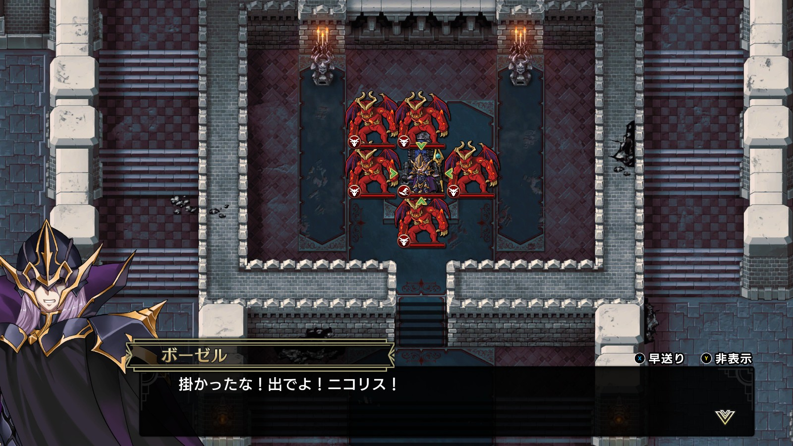
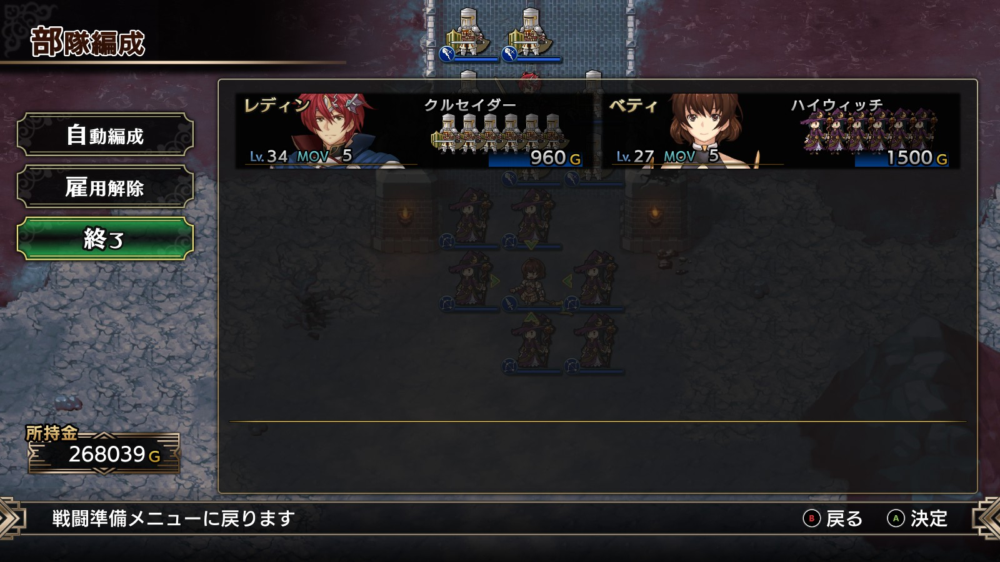
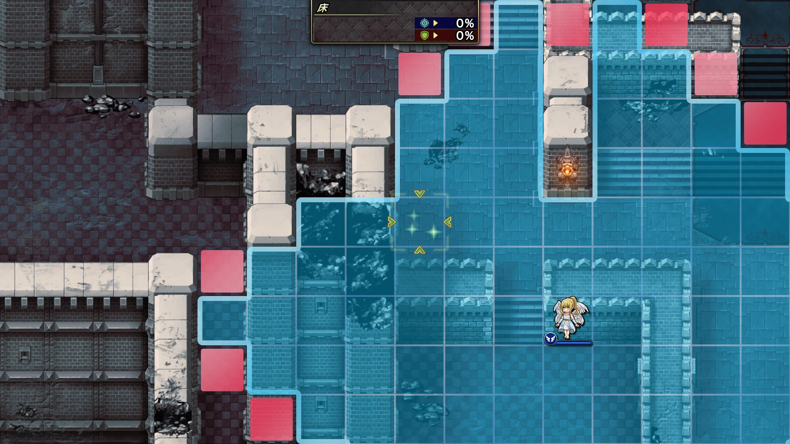

Steam 版ラングリッサーⅠ＆Ⅱリメイク > ラングリッサーⅠ

# E ルート 19 章：堕ちた秘剣

## マップ

  

光るマス
- 北東：3,000 G
- 北西：水の羽衣

## 条件

- 勝利条件
    - 敵の全滅
- 敗北条件
    - レディンの死亡
- クリアボーナス
    - 9,500 G

## 敵軍

|指揮官|クラス|兵種|傭兵|傭兵兵種|
|---|---|---|---|---|
|ボーゼル|ダークマスター|魔法使い|アークデーモン|魔族|
|イェルムンガルド|イェルムンガルド|怪物水|リヴァイアサン|怪物水|
|デュラハン|デュラハン|不死|スペクター|霊|
|ロック|ロック|怪物飛|ガーゴイル|飛兵|

## 増援

|出現ターン|出現位置|指揮官|クラス|兵種|傭兵|傭兵兵種|
|---|---|---|---|---|---|---|
|城侵入時|ボーゼルの南西（光るマス付近）|ニコリス|アークメイジ|魔法使い|スペクター|霊|
|城侵入時|ボーゼルの南東（ニコリスの対称位置）|リッチ|リッチ|不死|スペクター|霊|
|城侵入時|橋の北西の小部屋|バンパイアロード|バンパイアロード|高位不死|スケルトン|不死|
|城侵入時|橋の北東の小部屋|バンパイアロード|バンパイアロード|高位不死|スケルトン|不死|

## 流れ

すべての貴族や領主を処刑したレディンが、闇の王子ボーゼルに迫るマップです。

敵はボーゼル以外は 1 ターン目から攻め寄せてきます。

指揮官（傭兵ではダメです）が橋を渡り階段の北 2 マスまで進むと、増援が現れます。

  

ニコリスを倒すとボーゼルも攻めてきます。

## 攻略メモ

### 出撃指揮官

|指揮官|クラス|傭兵|
|---|---|---|
|レディン|キング|クルセイダー|
|ベティ|クィーン|ハイウィッチ|

  

### 控え指揮官

なし

### 作戦

まずは攻め寄せてくる部隊を南側の陸地で迎撃します。ベティはフレイヤを召喚し、回復要員にします（フォースヒール 2 で範囲回復できます）。

その後、レディン隊が橋を渡り、増援を出現させます。ここからは厳しい戦いなので、原則として傭兵からの撃破は諦め、積極的に指揮官を狙います。

一番厄介なのはメテオを持つニコリスなので、引きつけて一気に叩きます。最優先はニコリスですが、他の増援も適宜倒しておきます。

ニコリスを倒すとボーゼルが動くので、こちらも引きつけて戦います。クルセイダーであればメテオ＋傭兵攻撃をある程度耐えるので、フレイヤで回復しながら戦います。

### 反省点

アイテム回収に行く時間がありませんでした。

レディンが橋を渡る前に、フレイヤがメテオを避けながらアイテム回収すれば良かったのかなと思います。

  

  <a href="../README.md">［ホームへ戻る］</a>

