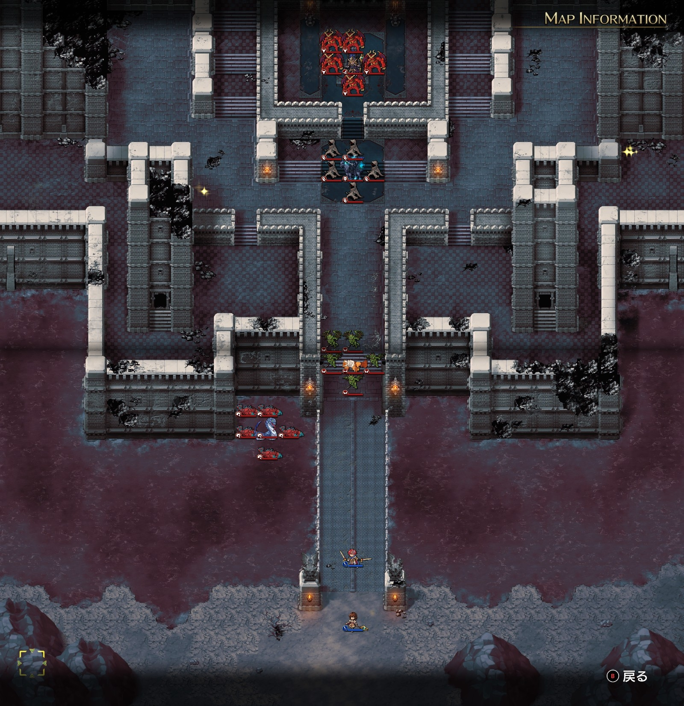
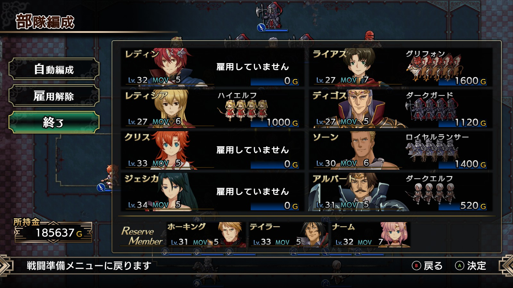

Steam 版ラングリッサーⅠ＆Ⅱリメイク > ラングリッサーⅠ

# E ルート 19 章：堕ちた秘剣

## マップ

  

光るマス
- 北東
- 北西

## 条件

- 勝利条件
    - 敵の全滅
- 敗北条件
    - レディンの死亡

- クリアボーナス
    - 9,500 G

## 敵軍

|指揮官|クラス|兵種|傭兵|傭兵兵種|
|---|---|---|---|---|
|ボーゼル|ダークマスター|魔法使い|アークデーモン|魔族|
|イェルムンガルド|イェルムンガルド|怪物水|リヴァイアサン|怪物水|
|デュラハン|デュラハン|不死|スペクター|霊|
|ロック|ロック|怪物飛|ガーゴイル|飛兵|

## 増援

|出現ターン|出現位置|指揮官|クラス|兵種|傭兵|傭兵兵種|
|---|---|---|---|---|---|---|
|城侵入時|ボーゼルの南西（光るマス付近）|ニコリス|アークメイジ|魔法使い|スペクター|霊|
|城侵入時|ボーゼルの南東（ニコリスの対称位置）|リッチ|リッチ|不死|スペクター|霊|
|城侵入時|橋の北西の小部屋|バンパイアロード|バンパイアロード|高位不死|スケルトン|不死|
|城侵入時|橋の北東の小部屋|バンパイアロード|バンパイアロード|高位不死|スケルトン|不死|

## 流れ

すべての貴族や領主を処刑したレディンが、闇の王子ボーゼルに迫るマップです。

敵はボーゼル以外は 1 ターン目から攻め寄せてきます。

## 攻略メモ

### 出撃指揮官

|指揮官|クラス|傭兵|
|---|---|---|
|レディン|キング|－|
|クリス|プリンセス|－|
|ジェシカ|エージェント|－|
|アルバート|ソードマスター|ダークエルフ|
|ソーン|ナイトマスター|ロイヤルランサー|
|ライアス|ドラゴンロード|グリフォン|
|レティシア|ナイトマスター|ハイエルフ|
|ディゴス|エンペラー|ダークガード|

※ライアス、レティシア、ディゴスは強制出撃

  

### 控え指揮官

- ナーム
- ホーキング
- テイラー

### 作戦

### 反省点

  <a href="../README.md">［ホームへ戻る］</a>

