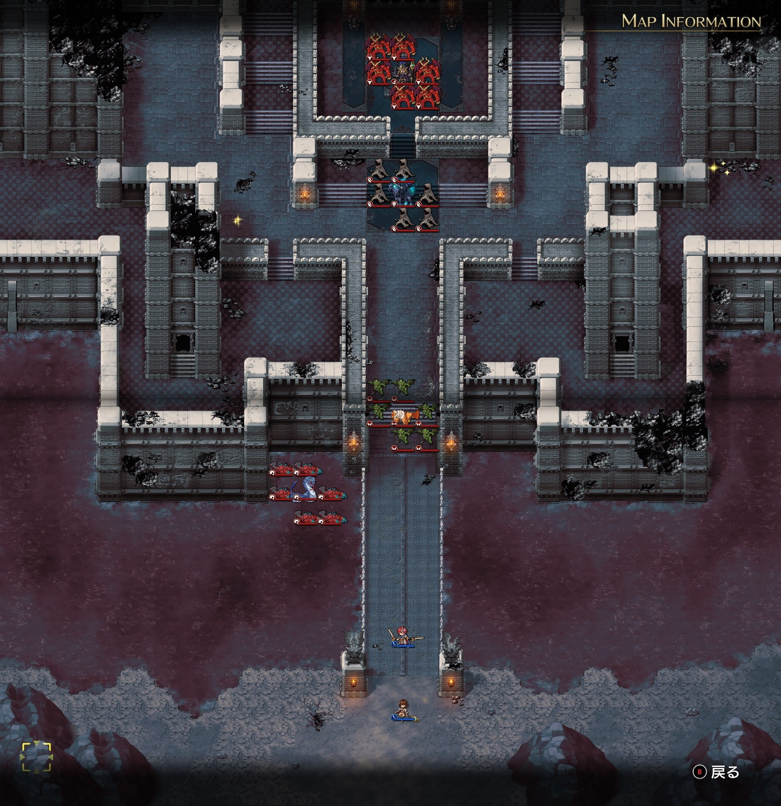
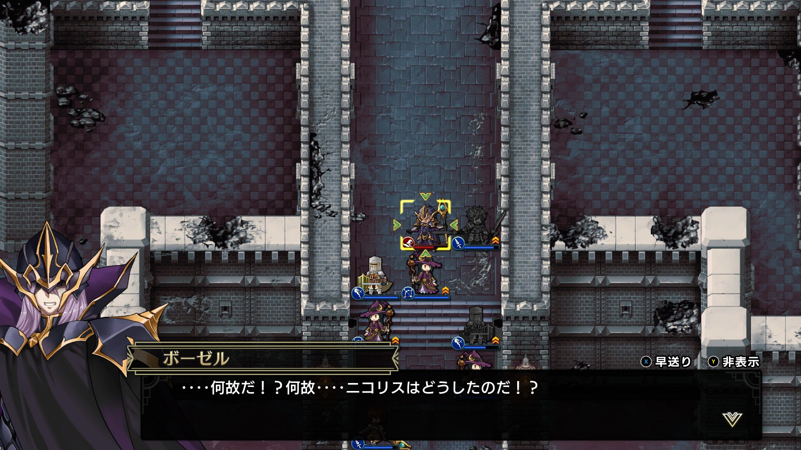
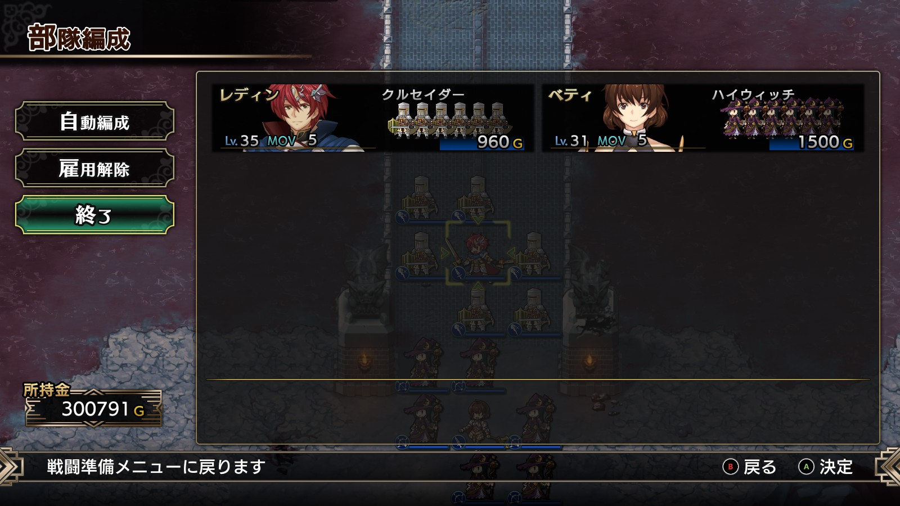
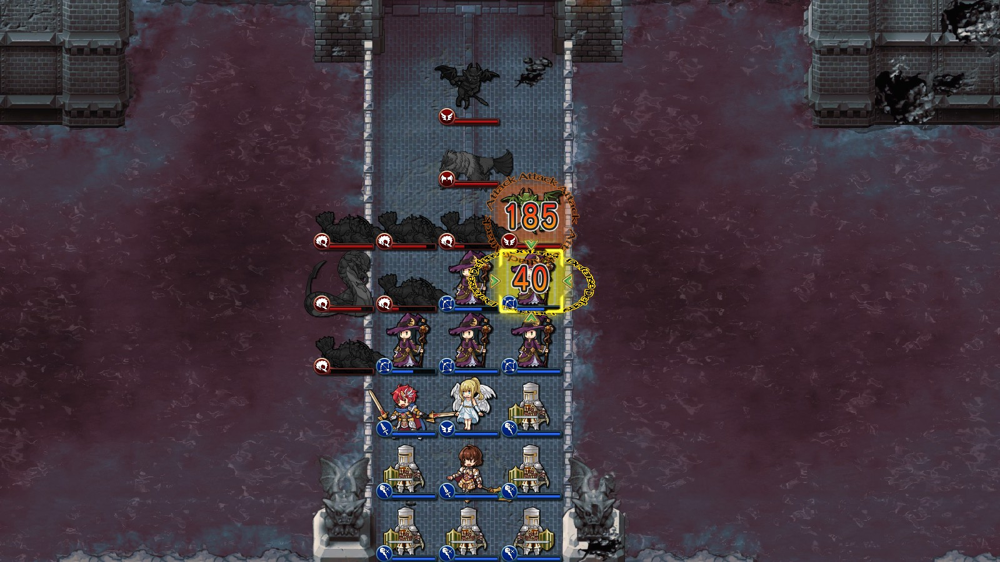

Steam 版ラングリッサーⅠ＆Ⅱリメイク > ラングリッサーⅠ

# F ルート 19 章：堕ちた秘剣

## マップ

  

光るマス
- 北東：3,000 G
- 北西：深淵の宝珠

## 条件

- 勝利条件
    - 敵の全滅
- 敗北条件
    - レディンの死亡
- クリアボーナス
    - 9,500 G

## 敵軍

|指揮官|クラス|兵種|傭兵|傭兵兵種|
|---|---|---|---|---|
|ボーゼル|ダークマスター|魔法使い|アークデーモン|魔族|
|イェルムンガルド|イェルムンガルド|怪物水|リヴァイアサン|怪物水|
|デュラハン|デュラハン|不死|スペクター|霊|
|ロック|ロック|怪物飛|ガーゴイル|飛兵|

## 増援

なし

## 流れ

すべての貴族や領主を処刑したレディンが、闇の王子ボーゼルに迫るマップです。

敵はボーゼル以外は 1 ターン目から攻め寄せてきます。

ボーゼルも 2 ターン目から攻め寄せてきます。

## E ルートとの違い

- ショップで深淵の宝珠を販売している
- 各敵指揮官の傭兵が 1 ユニットずつ多い
- 北西のアイテム：水の羽衣 → 深淵の宝珠
- 増援がない

  

## 攻略メモ

### 出撃指揮官

|指揮官|クラス|傭兵|
|---|---|---|
|レディン|キング|クルセイダー|
|ベティ|クィーン|ハイウィッチ|

  

### 控え指揮官

なし

### 作戦

[E ルート 19 章](Chapter19E.md)とは異なり、増援がなく、ボーゼルが攻めてくるので、こちらも積極的に迎撃にいくこととします。

ベティのハイウィッチを前衛とし、飛兵と怪物水を迎撃します。案外怪物水ともそこそこ戦えます。ベティ自身はフレイヤを召喚し、回復要員を確保します。

  

不死などが来たらクルセイダーの出番です。損耗もありますが、6 ユニットいるので力押しです。

ボーゼルが迫って来たら囮を残していったん下がり、メテオを打たせます。その後、アークデーモンから倒しつつ、飛兵のフレイヤは北西にある深淵の宝珠を回収します。北東の 3,000G は諦めました。

アイテム回収後、孤軍となったボーゼルを袋だたきにします。

### 反省点

果敢に攻めたので損耗も大きく、12 ユニットいた傭兵が 5 ユニットまで減ってしまいましたが、深淵の宝珠回収のためにはやむを得なかったと思うことにします。

  <a href="../README.md">［ホームへ戻る］</a>

