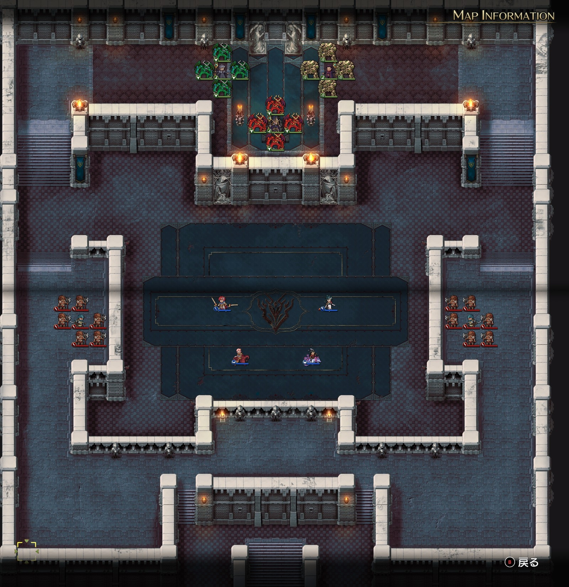

Steam 版ラングリッサーⅠ＆Ⅱリメイク > ラングリッサーⅠ

# H ルート 19 章：暗殺強襲

## マップ

  

光るマス
- 北東：G ルートで拾っていない場合は 3,000 G（？）
- 南：G ルートで拾っていない場合は不死王の腕輪（？）

## 条件

- 勝利条件
    - 敵の全滅
- 敗北条件
    - レディンの死亡
- クリアボーナス
    - 9,500 G

## 敵軍

|指揮官|クラス|兵種|傭兵|傭兵兵種|
|---|---|---|---|---|
|暗殺者|アサシン|盗賊|バンディット|盗賊|
|暗殺者|アサシン|盗賊|バンディット|盗賊|

## 増援

|出現ターン|出現位置|指揮官|クラス|兵種|傭兵|傭兵兵種|
|---|---|---|---|---|---|---|
|1 ターン目|北西|暗殺者|アサシン|盗賊|バーサーカー|歩兵|
|1 ターン目|北東|暗殺者|アサシン|盗賊|バーサーカー|歩兵|

## 流れ

ボーゼルの暗殺に気付いたレディンが救援に向かうマップです。

1 ターン目で増援が 2 隊現れ、ボーゼルに向かいますが、増援だけであれば NPC は自力で対処します。

初期配置の敵もボーゼルに向かいます。

クリア後、ナーギャとニコリスが再び仲間になります。

## G ルートとの違い

- ボーゼルが移動しない

## 攻略メモ

### 出撃指揮官

|指揮官|クラス|傭兵|
|---|---|---|
|レディン|キング|－|
|ナーム|ドラゴンロード|グリフォン|
|ジェシカ|エージェント|－|
|テイラー|サーペンマスター|ニクシー|

### 控え指揮官

なし

### 作戦

ナームが東側の敵に、テイラーが西側の初期配置の敵に当たります。

増援は NPC に任せる予定だったのですが、ニコリスが死にそうになったので、テイラーは途中で増援のほうに向かい、増援を倒してから初期配置の敵を倒しました。

### 反省点

レディンとジェシカは暇していたのですが、西側の増援に送ったほうが良かったのかなと思います。

  <a href="../README.md">［ホームへ戻る］</a>

