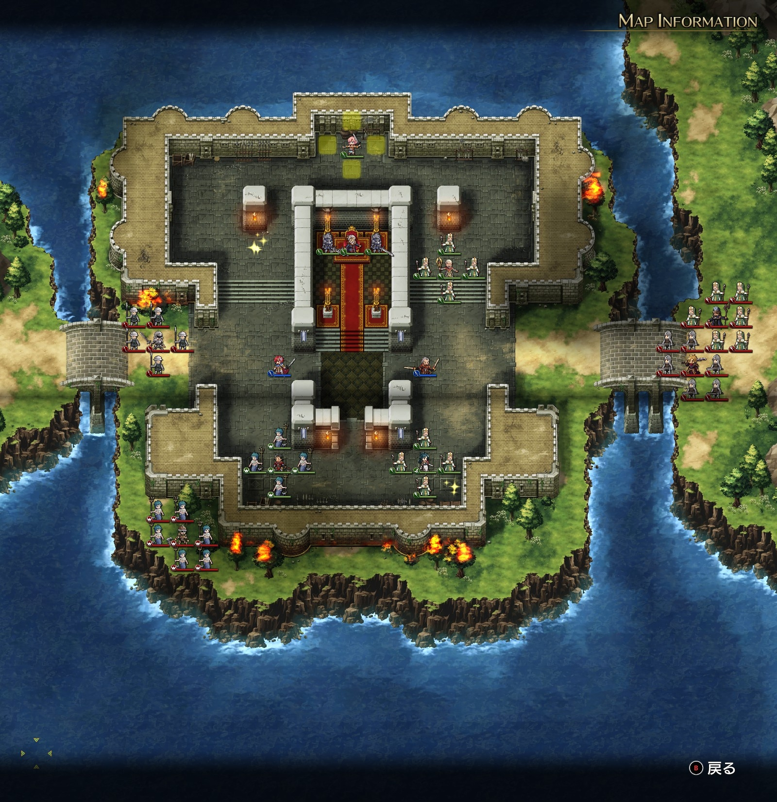
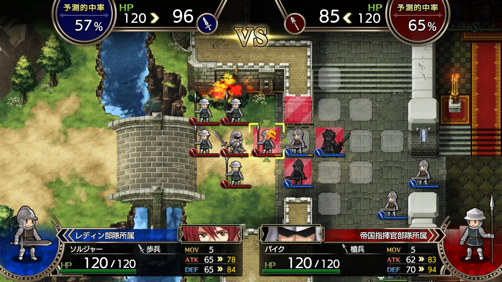

# A ルート 1 章：王城脱出

## マップ

  

光るマス
- 城内北西（1,000 G）
- 城内南東（ラージシールド）

## 条件

- 勝利条件
    - 敵の全滅
    - レディンがナームと合流
- 敗北条件
    - レディンの死亡
    - ナームの死亡

## 敵軍

|指揮官|クラス|兵種|傭兵|傭兵兵種|
|---|---|---|---|---|
|ゼルド|ジェネラル|歩兵|ソルジャー|歩兵|
|サー・ガリウス|セージ|僧侶|モンク|僧侶|
|帝国指揮官|ロード|歩兵|パイク|槍兵|
|帝国指揮官|パイレーツ|水兵|マーマン|水兵|

## 増援

|出現ターン|出現位置|指揮官|クラス|兵種|傭兵|傭兵兵種|
|---|---|---|---|---|---|---|
|8 ターン目|東|ディゴス|エンペラー|歩兵|グレナディーア|歩兵|

## 流れ

ダルシス帝国軍に包囲されたバルディア城から脱出するマップです。

1 ターン目から敵軍は全軍で攻め寄せてきます。一方、味方 NPC が迎撃に出て、敵軍を足止めしてくれます。

あまり長引かせると、やたらと強力で到底勝てないディゴスが到着してしまいます。

## 攻略メモ

### 出撃指揮官

|指揮官|クラス|傭兵|
|---|---|---|
|レディン|ファイター|ソルジャー|
|ヴォルコフ|ソードマスター|ランサー|

※指揮官の配置変更不可

### 作戦

出撃前の準備画面で、ヴォルコフをロードにクラスチェンジ（退化）させ、ヒール 1 を覚えさせます。さらに個人的には、スキルは、本人が強くなる剣神の咆哮よりも、指揮範囲内の配下傭兵が底上げ（指揮修正 ATK+5%、指揮修正 DEF+5%）される君主の素養のほうが好みです。

ヴォルコフは熟練の将で成長は見込めないため、CP を使い切ってしまうほうが良いと思います。退化させると当然ステータスが下がってしまうため、すぐにソードマスターに再進化させます。

アイテムは最初の質問によって所持内容が異なると思いますが、より良いアイテムをヴォルコフからレディンに譲る方が良いでしょう。私の場合は、指揮修正 DEF+10% のあるハルバードをレディンに譲りました。

戦闘開始後は、ナームの叫びは無視してレディンのレベル上げに努めます。西側の帝国指揮官（ロード）隊と戦います。

一人が集中攻撃を食らわないよう、入り口に並ぶと戦いやすいです（壁や城壁からも侵入してきますが、一人で突出するよりはマシです）。傭兵は指揮官の指揮範囲内（白く点滅する範囲、レディンの場合は 2 マス以内）にいると能力があがるため、最初にレディンを入り口より一歩後ろに配置してから、傭兵を入り口に並べて戦わせます。

  

ターン開始時に傭兵が指揮官と隣接していると HP が 20% 回復します。HP が少なくなってきた傭兵は後方に下げ（レディンに隣接するように）、後方に控えている傭兵を前線に出すことで、長く戦えます。

敵の指揮官を倒してしまうと傭兵も消えてしまい経験値が稼げないため、なるべく傭兵から倒して指揮官は最後にします。

一方のヴォルコフは、成長が望めない上に 5 章終了後に死亡してしまうため、育てる必要はありません。南東にある光るマスを踏んでアイテムを回収した後は暇しててもゲーム上は問題ありませんが、気分的な問題で、NPC を差し置いてゼルド達を迎撃しました。

レディンはロード隊を全滅させたら、アイテム回収しつつ、ナームと合流してクリアしてしまって問題無いと思います。

頑張って、南から攻め上げてくる（ロード隊よりは）強めのマーマンや、さらには東側の敵をいくらか討ち取るのもアリですが、増援のディゴスが来たら逃げるのみです。

なお、指示は防御にしておくほうが安心だと思います。ターン終了後に行動可能である場合、指揮官の周りに集まるだけになります。指示が攻撃のままだと、付近に敵がいる場合に勝手に攻撃してしまうので、命を落としかねません。

### 反省点

ヴォルコフを退化させればいいことに気付いたのは実はクリア後だったので、この時点ではヒール 1 を覚えさせられていませんでした。1 章ではヒール 1 が無くても困りませんが……。

  <a href="../README.md">［ホームへ戻る］</a>

