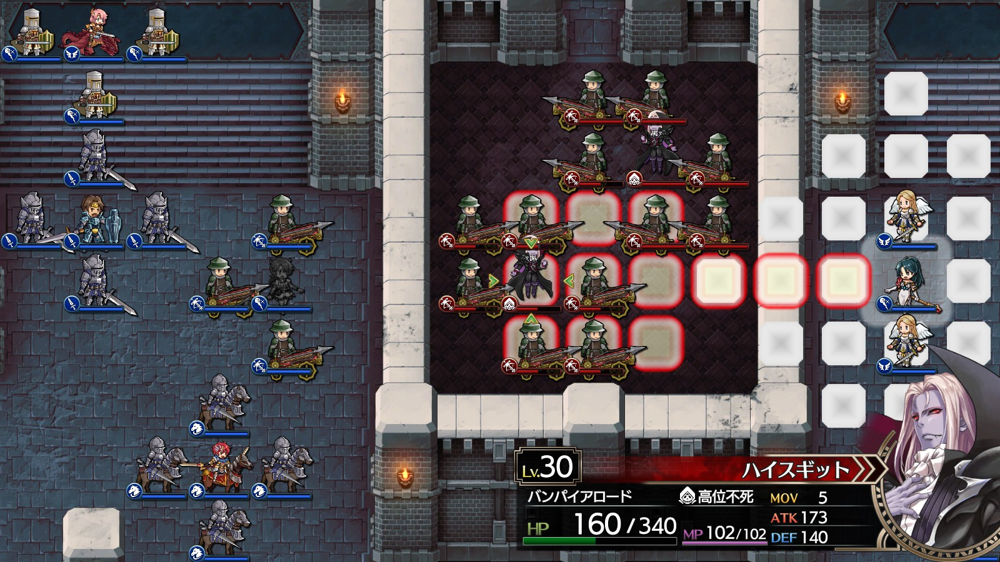

Steam 版ラングリッサーⅠ＆Ⅱリメイク > ラングリッサーⅠ

# A ルート 20 章：闇の封印

## マップ

  

光るマス無し

## 条件

- 勝利条件
    - ボーゼルの撃破 → カオスの撃破
- 敗北条件
    - レディンの死亡

## 敵軍

|指揮官|クラス|兵種|傭兵|傭兵兵種|
|---|---|---|---|---|
|ボーゼル|ダークマスター|魔法使い|アークデーモン|魔族|
|アクトラクト|バンパイアロード|高位不死|スケルトン|不死|
|オーギタンス|バンパイアロード|高位不死|スケルトン|不死|
|ハイスギット|バンパイアロード|高位不死|バリスタエリート|バリスタ|
|ツダーク|バンパイアロード|高位不死|バリスタエリート|バリスタ|
|ゼルヴィス|ザーヴェラー|魔法使い|バリスタエリート|バリスタ|
|テールホーン|ザーヴェラー|魔法使い|バリスタエリート|バリスタ|

## 増援

|出現ターン|出現位置|指揮官|クラス|兵種|傭兵|傭兵兵種|
|---|---|---|---|---|---|---|
|ボーゼル撃破時|ボーゼルの北側|カオス|カオス|魔族|アークデーモン|魔族|

## 流れ

ラストダンジョン、ボーゼルそしてカオスと戦うマップです。

北側のバンパイアロード 2 隊は 1 ターン目から攻め寄せてきます。

その他は迎撃型ですが、初期配置で中央のバンパイアロードのメテオ範囲なのでメテオを放ってきます。

ボーゼルを撃破するとカオスが出現します。

## 攻略メモ

### 出撃指揮官

|指揮官|クラス|傭兵|
|---|---|---|
|レディン|ナイトマスター|ロイヤルランサー|
|クリス|ハイプリースト|バリスタエリート|
|ナーム|ドラゴンロード|クルセイダー|
|ジェシカ|ハイプリースト|エンジェル|
|ホーキング|ジェネラル|クルセイダー|
|アルバート|ジェネラル|グレナディーア|
|ソーン|ナイトマスター|ロイヤルランサー|
|テイラー|サーペンマスター|ニクシー|

### 控え指揮官

なし

### 作戦

前章に引き続き、装備は MGR（魔法防御）優先です。

北側から攻め寄せてくるバンパイアロード 2 隊に対しては、クルセイダーで対応します。1 ターン目にメテオを打たせた後に接近すれば、あとは威力の弱い魔法しか使えませんので、被弾しながらでも戦えます。

中央のバンパイアロード 2 隊のうち、まずはハイスギットを集中攻撃して 1 ターン目で倒します。西からクリスの魔法と傭兵のバリスタエリート、東からジェシカの魔法で倒せました。これで西側が安全地帯になります。

  

その後は残るもう 1 隊をジェシカで数ターンかけて倒します。東側は 1 ターン目はメテオを打たれるので、テイラー配下の傭兵が数ユニット被弾しますが、さほど大きな被害にはなりませんでした。

南側の魔法使いとバリスタエリートのコンビは騎兵で対応しましたが、ここが一番苦戦しました。1 ターン目の魔法でかなりのダメージを受けてしまいましたが、ギリギリ倒しました。

周辺の掃除を終えたら、本丸ボーゼルに向かいます。

ジェシカがメテオの囮になりつつ（かすり傷で済みます）、プロテクションを掛けてボーゼルの正面 5 マスの位置に単騎で移動します。アークデーモンが 1 ユニットだけ移動してきて攻撃されますが、構わず魔法で応戦すれば、その後のアークデーモン退治が格段に楽になります。

  

ボーゼルは 1 ターンで HP を 100 近く回復してしまうので、アタックを掛けて攻撃力の高いユニットで一気に撃破します。

ボーゼルを倒すとカオスが出現するので、まずは配下のアークデーモンを倒します。

カオスの魔法は単体攻撃ですが攻撃力は高いので、魔法を被弾しながら傭兵でアークデーモンを倒します。魔法封じのサイレンスを試みたもののミスとなったので、封じることができないか、封じにくいものと思われます。

カオスは 1 ターンで HP を 100 以上回復してしまうので、アタックを掛けて攻撃力の高いユニットで一気に撃破します。

### 反省点

騎兵を率いるレディンとソーンのアクセサリをスピードブーツのままにしていたので、指揮修正 MGR のものにすればもっと南側の戦いが安定したかと思います。

ジェシカは本人無双だったので、傭兵は不要でした。

  <a href="../README.md">［ホームへ戻る］</a>

