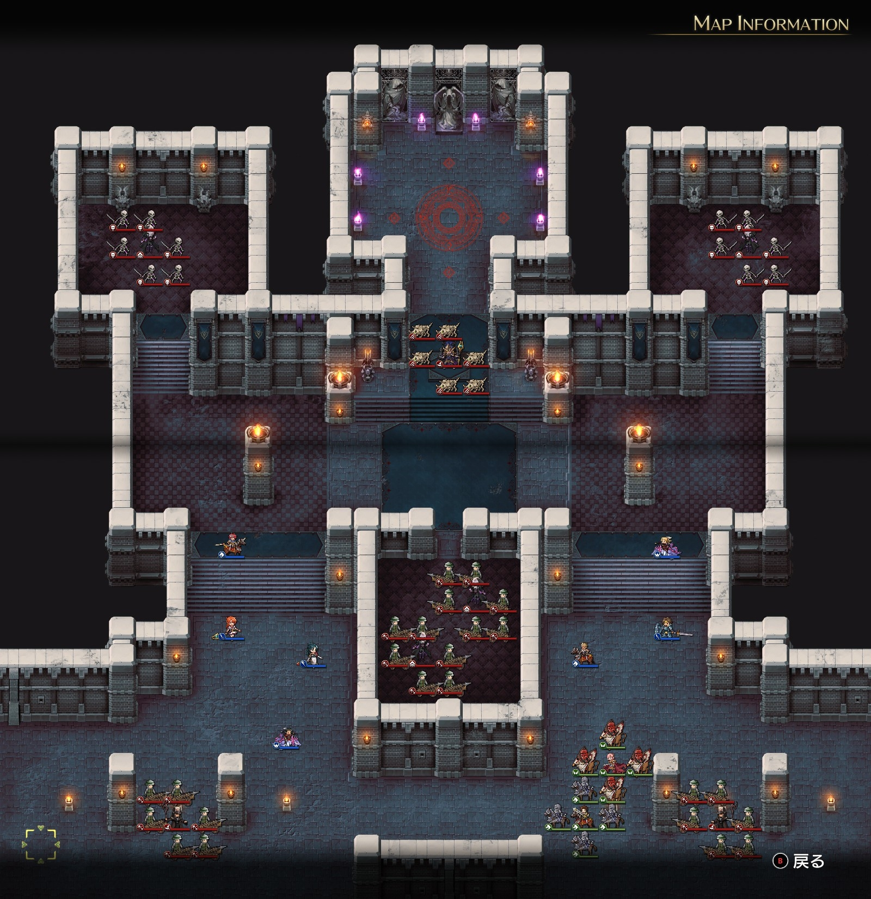
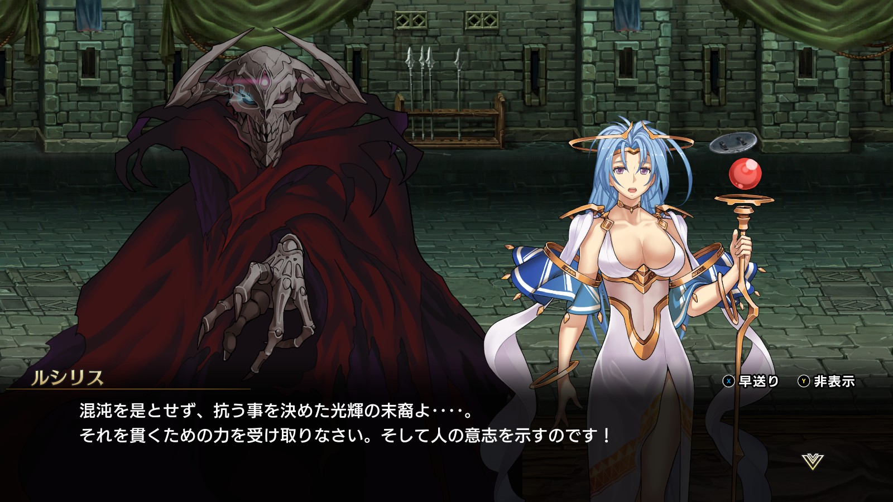

Steam 版ラングリッサーⅠ＆Ⅱリメイク > ラングリッサーⅠ

# B ルート 20 章：闇の封印

## マップ

  

光るマス無し

## 条件

- 勝利条件
    - ボーゼルの撃破 → カオスの撃破
- 敗北条件
    - レディンの死亡

## 敵軍

|指揮官|クラス|兵種|傭兵|傭兵兵種|
|---|---|---|---|---|
|ボーゼル|ダークマスター|魔法使い|ボーンディーノ|怪物陸|
|アクトラクト|バンパイアロード|高位不死|スケルトン|不死|
|オーギタンス|バンパイアロード|高位不死|スケルトン|不死|
|ハイスギット|バンパイアロード|高位不死|バリスタ|バリスタ|
|ツダーク|バンパイアロード|高位不死|バリスタ|バリスタ|
|ゼルヴィス|ザーヴェラー|魔法使い|バリスタ|バリスタ|
|テールホーン|ザーヴェラー|魔法使い|バリスタ|バリスタ|

## 増援

|出現ターン|出現位置|指揮官|クラス|兵種|傭兵|傭兵兵種|
|---|---|---|---|---|---|---|
|ボーゼル撃破時|ボーゼルの北側|カオス|カオス|魔族|アークデーモン|魔族|

## 流れ

ラストダンジョン、ボーゼルそしてカオスと戦うマップです。

北側のバンパイアロード 2 隊は 1 ターン目から攻め寄せてきます。

その他は迎撃型ですが、初期配置で中央のバンパイアロードのメテオ範囲なのでメテオを放ってきます。

ボーゼルを撃破するとカオスが出現します。

NPC のランスとナームは 2 ターンでゼルヴィスを撃破し、その後はボーゼル、カオスに向かいます。

## A ルートとの違い

- ランス、ナームが NPC として参戦（ゼルヴィス付近）
- ボーゼルの傭兵：アークデーモン → ボーンディーノ
- ハイスギット、ツダーク、ゼルヴィス、テールホーンの傭兵：バリスタエリート → バリスタ
- カオスの傭兵アークデーモン：数が違う？（B ルートは 6）
- 会話：光の女神ルシリスがラングリッサーに力を与えてくれる

  

## 攻略メモ

### 出撃指揮官

|指揮官|クラス|傭兵|
|---|---|---|
|レディン|ナイトマスター|クルセイダー|
|クリス|プリンセス|バリスタエリート|
|ジェシカ|エージェント|－|
|ホーキング|サーペンロード|ニクシー|
|アルバート|ソードマスター|バリスタ|
|ソーン|ナイトマスター|クルセイダー|
|テイラー|サーペンマスター|ニクシー|

### 控え指揮官

なし

### 作戦

基本的には [A ルート](Chapter20A.md#作戦)と同じ作戦ですが、戦力が異なる分、一部変えています。

北側から攻め寄せてくるバンパイアロード 2 隊に対しては、クルセイダーで対応します。1 ターン目にメテオを打たせた後に接近すれば、あとは威力の弱い魔法しか使えませんので、被弾しながらでも戦えます。

中央のバンパイアロード 2 隊のうち、まずはハイスギットを集中攻撃して 1 ターン目で倒します。西からクリスのホーリーブレイズ、東からジェシカのメテオで倒せました。これで西側が安全地帯になります。クリスが少し移動して再度ホーリーブレイズを放てばツダークも倒せ、3 ターンで東側も安全地帯になります。

南東は NPC に任せ、南西をレディンとホーキングで殲滅します。

その後は本丸ボーゼルですが、ランスとナームが急行しているので、あまりのんびりはしていられません。

A ルートの時と同様、ジェシカがメテオの囮になりつつ（もはやかすり傷すら負わなくなりました）、プロテクションも不要でボーゼルの正面 5 マスの位置に単騎で移動します。ボーンディーノが 1 ユニットだけ移動してきて攻撃されますが、構わず魔法で応戦すれば、その後のボーンディーノ退治が格段に楽になります。

ボーゼルは 1 ターンで HP を 100 近く回復してしまうので、アタックを掛けて攻撃力の高いユニットで一気に撃破します。この時、NPC のランスとナームが突っ込んでいくので、彼らにトドメを刺されないように注意が必要です。ボーゼルにもサイレンスが効きませんでした。

ボーゼルを倒すとカオスが出現するので、まずは配下のアークデーモンを倒します。

カオスの魔法は単体攻撃ですが攻撃力は高いので、魔法を被弾しながら傭兵を中心にアークデーモンを倒します。

カオスは 1 ターンで HP を 100 以上回復してしまうので、アタックを掛けた攻撃力の高い指揮官ユニットと魔法で一気に撃破します。ランスの傭兵がカオスの隣に陣取ってしまい、2～3 ターンかかりました。

### 反省点

多少ランスとの競合があったものの、全体としてはうまくいったのではないかと思います。

  <a href="../README.md">［ホームへ戻る］</a>

