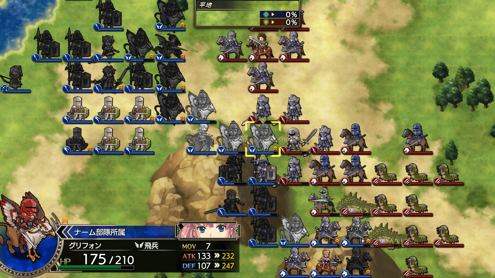

Steam 版ラングリッサーⅠ＆Ⅱリメイク > ラングリッサーⅠ

# C ルート 20 章：最後の敵

## マップ

  

光るマス無し

## 条件

- 勝利条件
    - 敵の全滅
- 敗北条件
    - レディンの死亡

- クリアボーナス
    - 9,500 G

## 敵軍

|指揮官|クラス|兵種|傭兵|傭兵兵種|
|---|---|---|---|---|
|ボーゼル|ダークマスター|魔法使い|アークデーモン|魔族|
|ランス|ナイトマスター|騎兵|ロイヤルランサー|騎兵|
|デュラハン|デュラハン|不死|スペクター|霊|
|ロック|ロック|怪物飛|ガーゴイル|飛兵|
|ロック|ロック|怪物飛|ガーゴイル|飛兵|
|バジリスク|バジリスク|怪物陸|クロウラー|怪物陸|
|バジリスク|バジリスク|怪物陸|クロウラー|怪物陸|
|帝国指揮官|ハイロード|歩兵|グレナディーア|歩兵|
|帝国指揮官|ハイランダー|騎兵|ドラグーン|騎兵|
|帝国指揮官|ハイランダー|騎兵|ドラグーン|騎兵|

## 増援

なし

## 流れ

倒したはずのボーゼルが再度立ちはだかるマップです。ランスは敵として出現します。

  

ショップでは神獣のいななき（スレイプニル習得）が販売されています。

ボーゼルとデュラハン以外は 1 ターン目から攻め寄せてきます。バジリスクと接近戦をすると高確率で石化になります。

ランスはレディンに向かってくるようです。

4 ターン目になるとボーゼルとデュラハンも動きます。

## 攻略メモ

### 出撃指揮官

|指揮官|クラス|傭兵|
|---|---|---|
|レディン|キング|クルセイダー|
|クリス|プリンセス|カルカスピデス|
|ナーム|ドラゴンロード|グリフォン|
|ジェシカ|エージェント|－|
|ソーン|ナイトマスター|ロイヤルランサー|
|ライアス|ドラゴンロード|グリフォン|
|レティシア|ナイトマスター|ハイエルフ|
|ディゴス|エンペラー|カルカスピデス|

※ライアス、レティシア、ディゴスは強制出撃

  

### 控え指揮官

- ホーキング
- アルバート
- テイラー

### 作戦

ジェシカのメテオは封印し、各個撃破する作戦とします。

対騎兵のカルカスピデスと、足の速いソーン隊が山岳地帯で陣を張り、敵の地上部隊を待ち構えます。石化のバジリスクがいるので、指揮官では戦わないように注意します。

  

ハイエルフを率いるレティシアと機動力の高いライアスは、ロック 2 隊を迎撃します。

レディンとクリスはボーゼルの迎撃に向かいます。レティシア、ライアスの後ろについて北上し、ランスをカルカスピデスで躱しながら進軍します。

  

アークデーモンをクルセイダーで倒してから（有利兵種ですがアークデーモンは強いので被害も甚大）、ボーゼルを倒します。

  

### 反省点

メテオをクリスで受けようと思っていたものの、デュラハン隊が接近してきたのでクルセイダーで受けるというハプニングはありましたが、概ねうまく動けたと思います。

  <a href="../README.md">［ホームへ戻る］</a>

