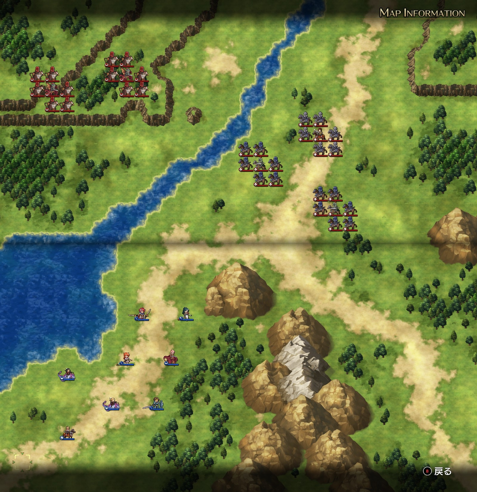
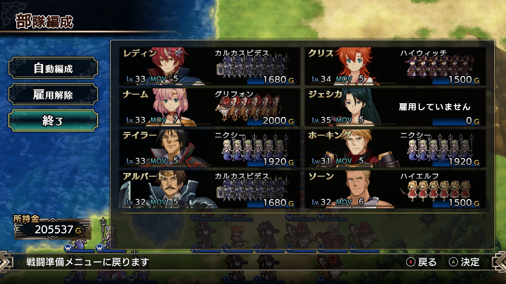
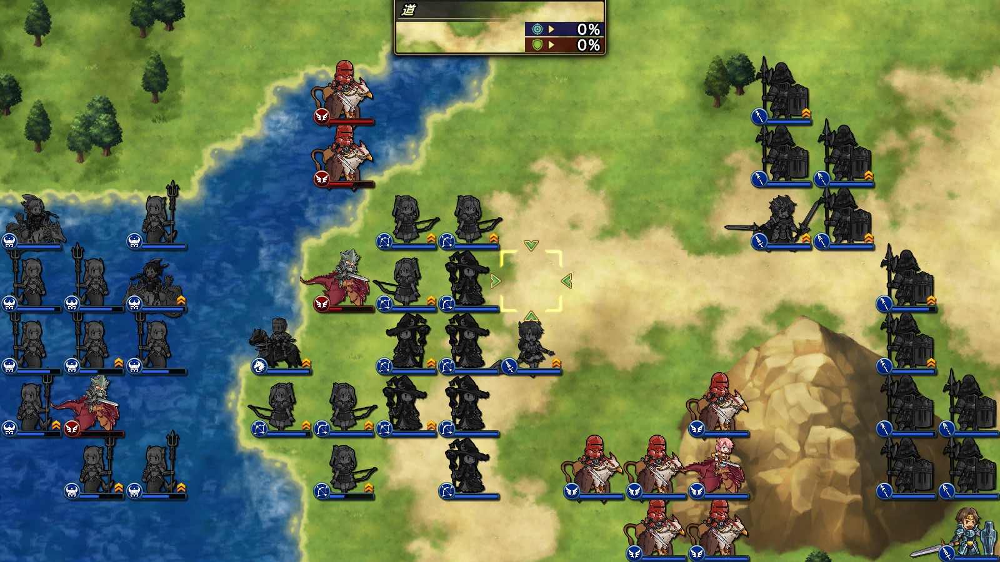
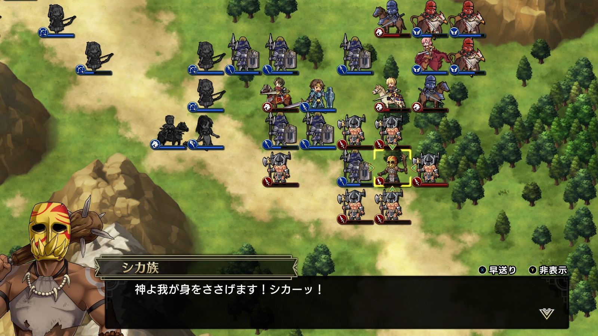

Steam 版ラングリッサーⅠ＆Ⅱリメイク > ラングリッサーⅠ

# D ルート 20 章：最後の敵

## マップ

  

光るマス無し

## 条件

- 勝利条件
    - 敵の全滅
- 敗北条件
    - レディンの死亡
- クリアボーナス
    - なし

## 敵軍

|指揮官|クラス|兵種|傭兵|傭兵兵種|
|---|---|---|---|---|
|ランス|ロイヤルガード|騎兵|ロイヤルランサー|騎兵|
|帝国指揮官|ハイランダー|騎兵|ドラグーン|騎兵|
|帝国指揮官|ハイランダー|騎兵|ドラグーン|騎兵|
|帝国指揮官|ドラゴンロード|飛兵|グリフォン|飛兵|
|帝国指揮官|ドラゴンロード|飛兵|グリフォン|飛兵|

## 増援

|出現ターン|出現位置|指揮官|クラス|兵種|傭兵|傭兵兵種|
|---|---|---|---|---|---|---|
|2 ターン目|ランスの東側|ライアス|ナイトマスター|騎兵|ドラグーン|騎兵|
|2 ターン目|ランスの東側|バンパイアロード|バンパイアロード|高位不死|デーモン|魔族|
|4 ターン目|南東|レティシア|ナイトマスター|騎兵|ドラグーン|騎兵|
|4 ターン目|南東|シカ族|シカゾク|盗賊|バーサーカー|歩兵|
|6 ターン目|ランスの北側|ベティ|セイント|僧侶|クルセイダー|僧侶|
|6 ターン目|ランスの北側|帝国指揮官|ジェネラル|歩兵|グレナディーア|歩兵|

## 流れ

ディゴスを討ったランスがレディンに戦いを挑んでくるマップです。

ランス以外は 1 ターン目から攻め寄せてきます。

増援のシカ族は山越えをしてきます。

ベティの到着と共にランスも攻め寄せてきます。

## 攻略メモ

### 出撃指揮官

|指揮官|クラス|傭兵|
|---|---|---|
|レディン|キング|カルカスピデス|
|クリス|プリンセス|ハイウィッチ|
|ナーム|ドラゴンロード|グリフォン|
|ジェシカ|エージェント|－|
|ホーキング|サーペンロード|ニクシー|
|アルバート|ソードマスター|カルカスピデス|
|ソーン|ナイトマスター|ハイエルフ|
|テイラー|サーペンマスター|ニクシー|

  

### 控え指揮官

なし

### 作戦

続々と敵の増援が来るので、こちらから打って出て先手を取る作戦とします。

飛兵に対しては弓兵とニクシーで対応します。

  

カルカスピデスは山岳地帯を中心に陣取り、騎兵に備えます。

バンパイアロードはメテオを持っているので、1 度無駄打ちさせた後で、ジェシカのテレポートで少しでも距離を詰めたナーム隊が一気に攻めます。

全体的にどんどん前線を押し上げる形で戦いました。ジェシカのメテオは封印しておきました。

### 反省点

バンパイアロードを制したナーム隊ですが、増援のレティシアに苦しめられてしまいました。海側の飛兵はテイラーだけで対応し、ホーキングはナームの後詰めにしたほうが良かった気がします。

  

クリスのハイウィッチは活躍の機会がありませんでした……。

  <a href="../README.md">［ホームへ戻る］</a>

