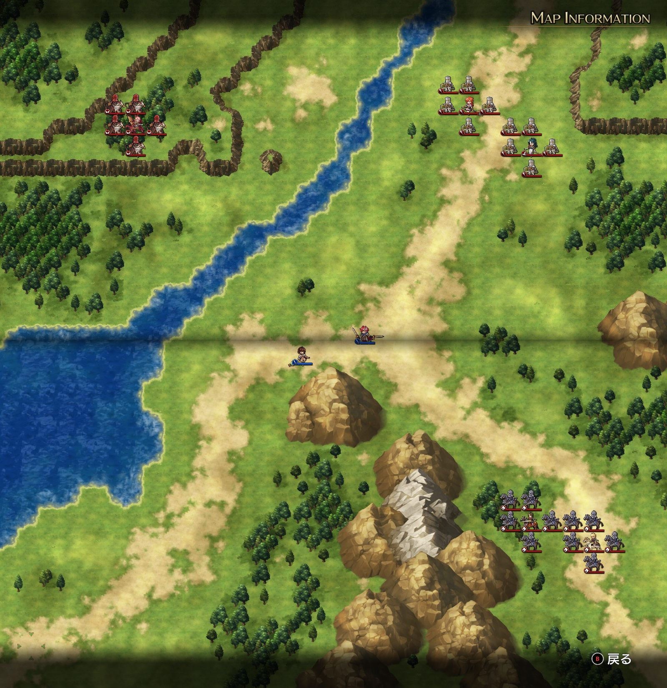

Steam 版ラングリッサーⅠ＆Ⅱリメイク > ラングリッサーⅠ

# E ルート 20 章：生きとし生けるものの敵

## マップ

  

光るマス無し

## 条件

- 勝利条件
    - 敵の全滅
- 敗北条件
    - レディンの死亡
- クリアボーナス
    - なし

## 敵軍

|指揮官|クラス|兵種|傭兵|傭兵兵種|
|---|---|---|---|---|
|ナーム|ドラゴンロード|飛兵|グリフォン|飛兵|
|クリス|ハイプリースト|僧侶|クルセイダー|僧侶|
|ジェシカ|アークメイジ|魔法使い|クルセイダー|僧侶|
|ライアス|ナイトマスター|騎兵|ロイヤルランサー|騎兵|
|レティシア|ナイトマスター|騎兵|ロイヤルランサー|騎兵|

## 増援

|出現ターン|出現位置|指揮官|クラス|兵種|傭兵|傭兵兵種|
|---|---|---|---|---|---|---|
|1 ターン目|南西の海|テイラー|サーペンロード|水兵|ニクシー|水兵|
|1 ターン目|南西の陸|シカ族|シカゾク|盗賊|バーサーカー|歩兵|
|2 ターン目|東|帝国指揮官|ジェネラル|歩兵|グレナディーア|歩兵|
|2 ターン目|東|帝国指揮官|ジェネラル|歩兵|グレナディーア|歩兵|

## 流れ

レディンを倒すためにかつての仲間たちが蜂起するマップです。

敵は 1 ターン目から全軍で攻め寄せてきます。

## 攻略メモ

### 出撃指揮官

|指揮官|クラス|傭兵|
|---|---|---|
|レディン|キング|カルカスピデス|
|ベティ|クィーン|ドラグーン|

  

### 控え指揮官

なし

### 作戦

レディンには魔王降臨の書を与えておき、デーモンロードを召喚できるようにしておきます。

味方の数に対し敵が多すぎるので、指揮官を中心に撃破する作戦にします。

ベティは早々にフレイヤを召喚して回復要員としつつ、テイラー＆シカ族に当たります。とはいえニクシーが強く、ドラグーンがどんどんやられていくので、ベティ自身もテイラーに切り込みます。

レディンは山岳地帯に陣取り、ライアスとレティシアを撃破します。こちらは兵種相性が良く瞬殺です。

隙を見てデーモンロードを召喚し、メテオで被害を与えておきます（残念ながらあまり撃破はできませんでしたが……）。

  

ジェシカはメテオを持っていますが、範囲内の自軍が 1 ユニットだとコールドウェイブを使ってくるようです（デーモンロードはノーダメージ）。図らずもコールドウェイブ連打で足止め状態になっていたので、その間にクリスや帝国指揮官を撃破します。

最後に残ったジェシカはレディンでトドメをさしました。

  

### 反省点

フレイヤの回復が大活躍でした。

  <a href="../README.md">［ホームへ戻る］</a>

