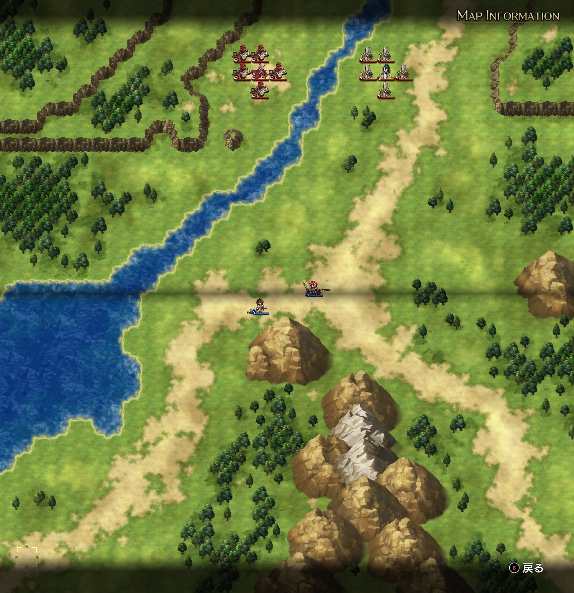
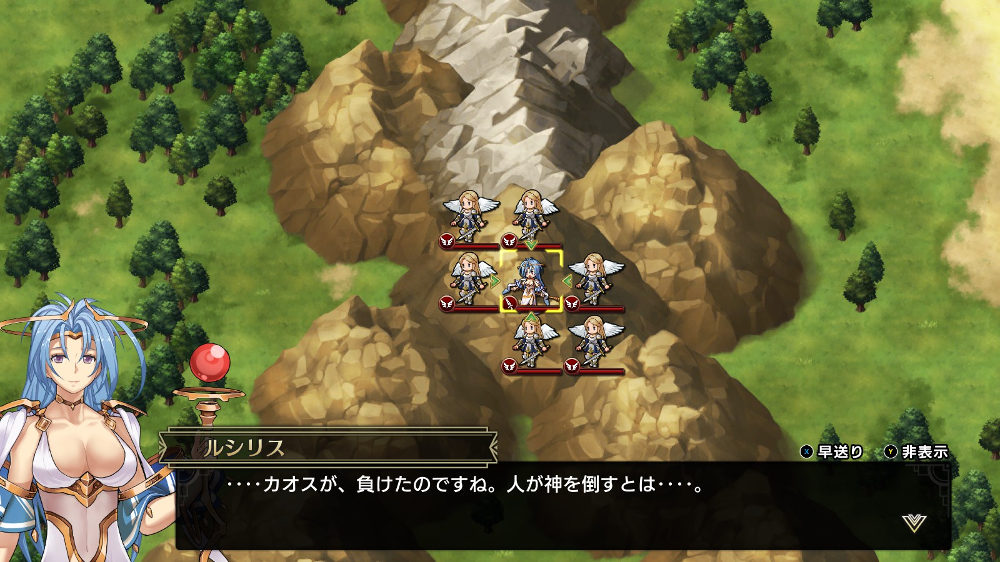
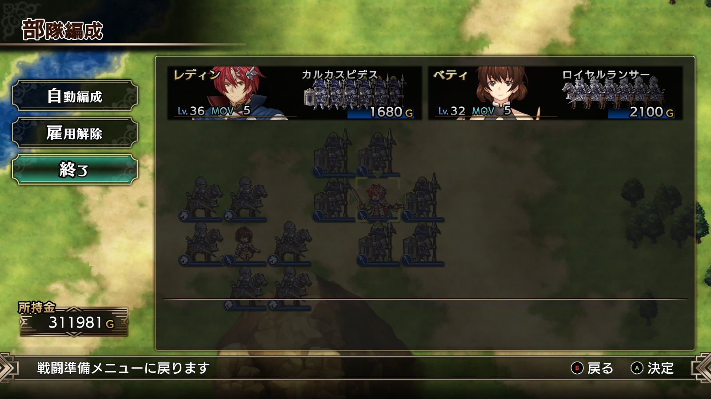
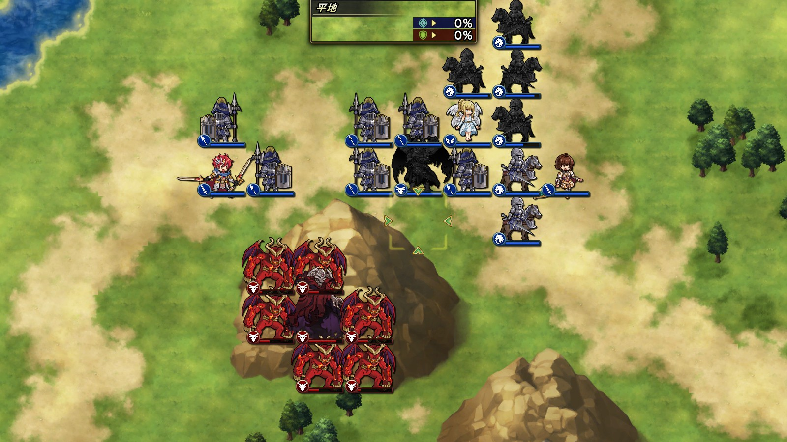
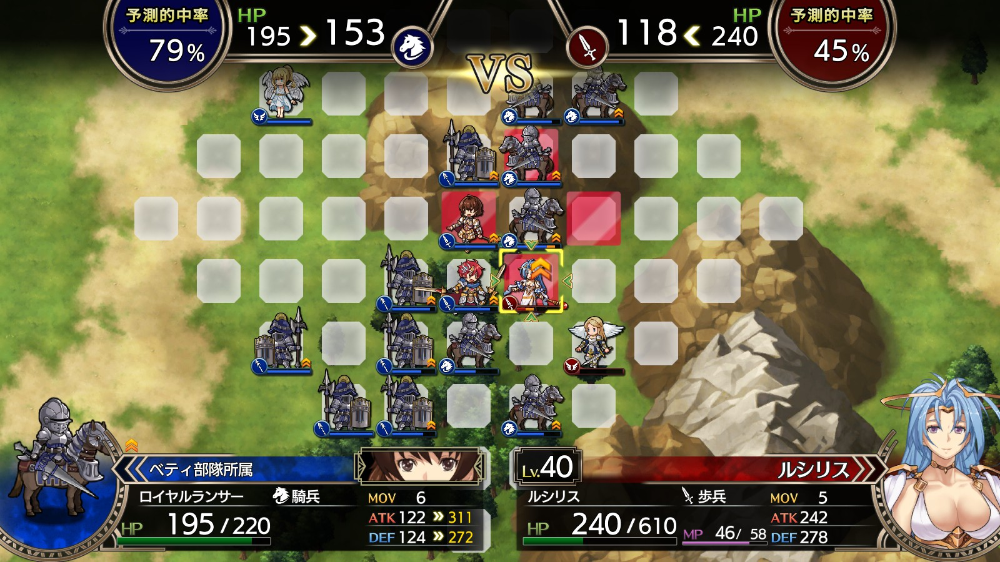

Steam 版ラングリッサーⅠ＆Ⅱリメイク > ラングリッサーⅠ

# F ルート 20 章：生きとし生けるものの敵

## マップ

  

光るマス無し

## 条件

- 勝利条件
    - 敵の全滅
- 敗北条件
    - レディンの死亡
- クリアボーナス
    - なし

## 敵軍

|指揮官|クラス|兵種|傭兵|傭兵兵種|
|---|---|---|---|---|
|ナーム|ドラゴンロード|飛兵|グリフォン|飛兵|
|ジェシカ|アークメイジ|魔法使い|クルセイダー|僧侶|

## 増援

|出現ターン|出現位置|指揮官|クラス|兵種|傭兵|傭兵兵種|
|---|---|---|---|---|---|---|
|2 ターン目|南西の海|テイラー|サーペンロード|水兵|ニクシー|水兵|
|2 ターン目|南西の陸|シカ族|シカゾク|盗賊|バンディット|盗賊|
|3 ターン目|東|帝国指揮官|ジェネラル|歩兵|グレナディーア|歩兵|
|3 ターン目|東|帝国指揮官|ジェネラル|歩兵|グレナディーア|歩兵|
|敵全滅時|中央山岳地帯|カオス|カオス|魔族|アークデーモン|魔族|
|カオス撃破時|南山岳地帯|ルシリス|ルシリス|歩兵|エンジェル|飛兵|

## 流れ

レディンを倒すためにかつての仲間の生き残りが蜂起するマップです。

敵は 1 ターン目から全軍で攻め寄せてきます。

敵を全滅させるとカオスが出現し、さらに、カオスを撃破するとルシリスが出現します。

  

## 攻略メモ

### 出撃指揮官

|指揮官|クラス|傭兵|
|---|---|---|
|レディン|キング|カルカスピデス|
|ベティ|クィーン|ロイヤルランサー|

  

### 控え指揮官

なし

### 作戦

[E ルート 20 章](Chapter20E.md)同様、指揮官を中心に撃破する作戦にします。

ベティは早々にフレイヤを召喚して回復要員としつつ、騎兵で東の歩兵に当たります。また、メテオとコールドウェイブを使えるジェシカに対しては、囮に魔法を打たせて足止めしつつ対応します。

レディンは山岳地帯に陣取ってナームを迎撃後、テイラーとシカ族に当たります。

カオスは厄介です。強力な魔法を使ってくるので早々に片付けたいところですが、取り巻きのアークデーモンがいるのでなかなか手出しができず、しかも 1 ターンで 100 以上も HP を回復してしまいます。まずアークデーモンを片付けたうえで、取り囲んでボコることにします。

レディンが召喚したデーモンロードがメテオを打つと、アークデーモンにかなりのダメージを与えられます。傭兵たちで攻撃すれば、アークデーモンはすぐに片付きます。カオスは強敵ですが、レディンを中心に攻め立てます。

  

ルシリスは南から攻め上げてきますが、取り巻きのエンジェルのほうが移動力が高いため、先にエンジェルと戦闘になります。ルシリスの魔法範囲になるべく入らないようにしながら、突出してきたエンジェルをなるべく片付けておきます。

ルシリス自身は歩兵なので、ロイヤルランサーで削ることができます。比較的広範囲の魔法を被弾しますが、ロイヤルランサーと指揮官たちで攻めればそう難しい相手ではありません。

  

### 反省点

寡兵のわりによく戦えたのではないかと思います。

  <a href="../README.md">［ホームへ戻る］</a>

