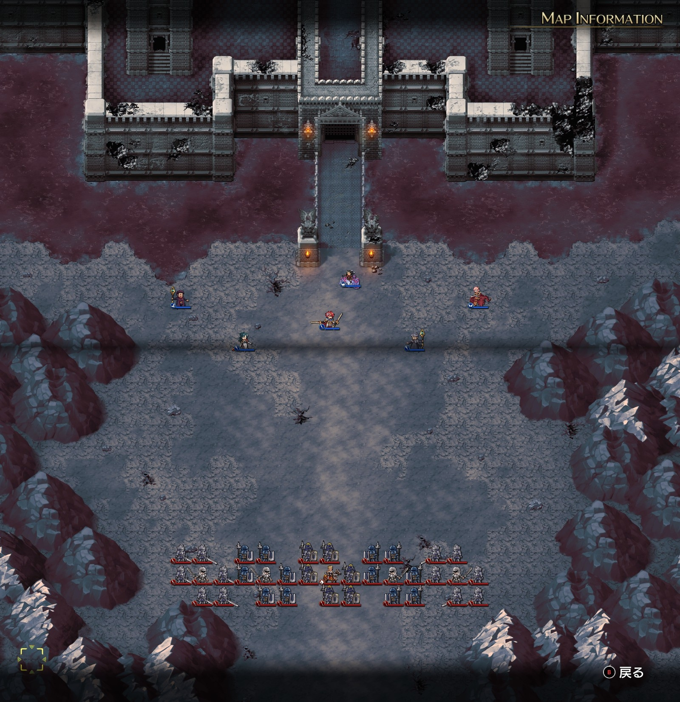
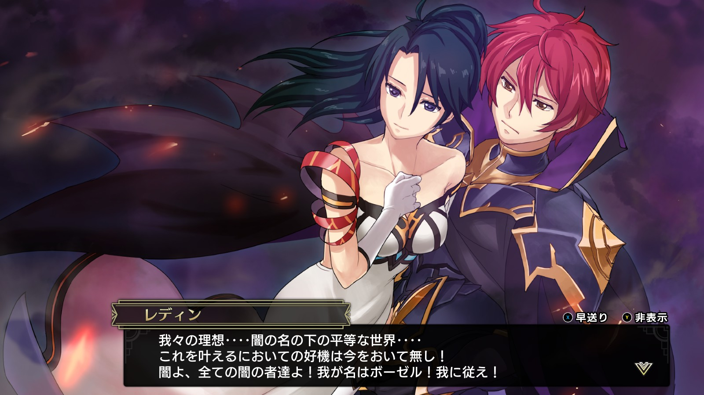
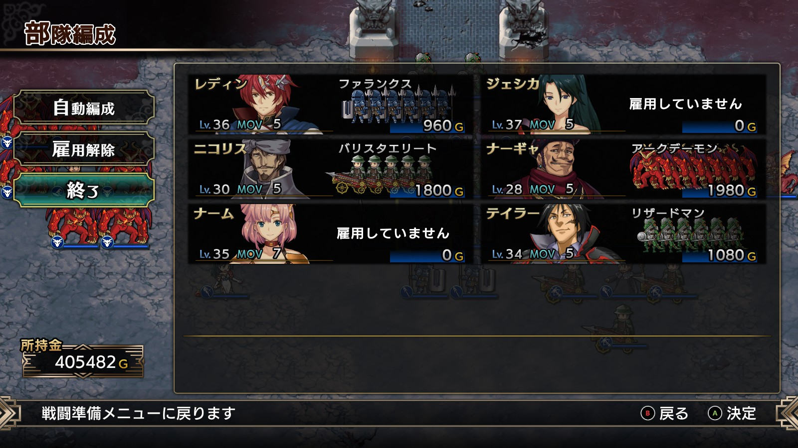
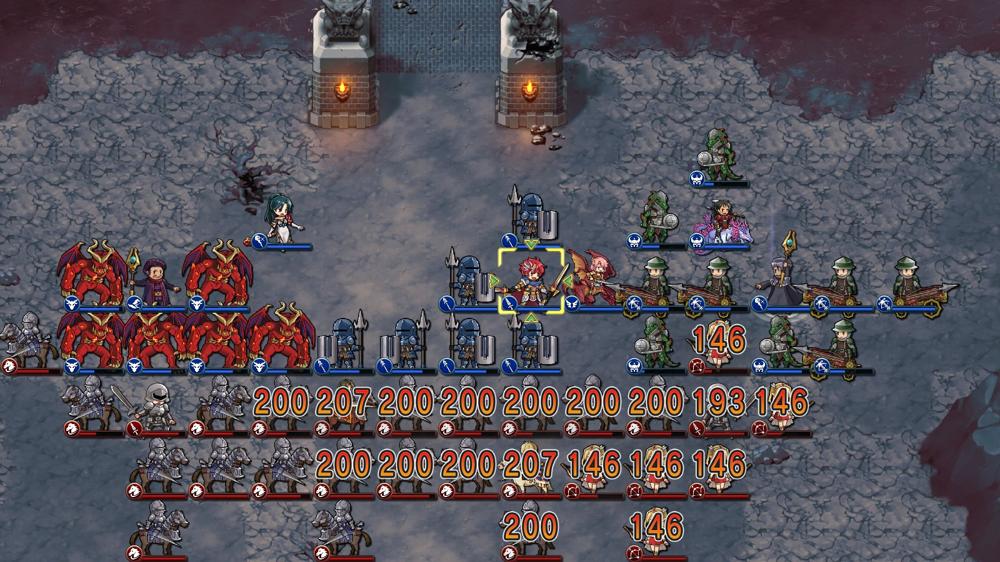

Steam 版ラングリッサーⅠ＆Ⅱリメイク > ラングリッサーⅠ

# H ルート 20 章：我が名はボーゼル

## マップ

  

光るマス無し

## 条件

- 勝利条件
    - 敵の全滅
- 敗北条件
    - レディンの死亡
- クリアボーナス
    - なし

## 敵軍

|指揮官|クラス|兵種|傭兵|傭兵兵種|
|---|---|---|---|---|
|ソーン|ナイトマスター|騎兵|カルカスピデス|槍兵|
|連合軍指揮官|ジェネラル|歩兵|グレナディーア|歩兵|
|連合軍指揮官|ジェネラル|歩兵|グレナディーア|歩兵|
|連合軍指揮官|ジェネラル|歩兵|ファランクス|槍兵|
|連合軍指揮官|ジェネラル|歩兵|ファランクス|槍兵|

## 増援

|出現ターン|出現位置|指揮官|クラス|兵種|傭兵|傭兵兵種|
|---|---|---|---|---|---|---|
|2 ターン目|南|ライアス|ナイトマスター|騎兵|ロイヤルランサー|騎兵|
|2 ターン目|南|レティシア|ナイトマスター|騎兵|ロイヤルランサー|騎兵|
|2 ターン目|南|連合軍指揮官|ジェネラル|歩兵|ハイエルフ|弓兵|
|2 ターン目|南|連合軍指揮官|ジェネラル|歩兵|ロイヤルランサー|騎兵|

## 流れ

ボーゼルの理想を受け継いだレディンが、闇の王子として最後の決戦を行うマップです。

敵は 1 ターン目から全軍で攻め寄せてきます。

  

## G ルートとの違い

- ショップで混沌の宝珠を販売している

## 攻略メモ

### 出撃指揮官

|指揮官|クラス|傭兵|
|---|---|---|
|レディン|キング|ファランクス|
|ナーム|ドラゴンロード|－|
|ジェシカ|エージェント|－|
|テイラー|サーペンマスター|リザードマン|
|ナーギャ|ダークマスター|アークデーモン|
|ニコリス|セージ|バリスタエリート|

  

### 控え指揮官

なし

### 作戦

基本は [G ルート 20 章](Chapter20G.md)と同様です。

押し寄せてくる敵を受け止める壁を横一列に作り、その後ろから魔法を打ちます。ジェシカとニコリスはメテオ、ナーギャはコールドウェイブ、ナームはバーンタイドです。

  

他の指揮官は、プロテクション、ヒールなどをしつつ、魔法から漏れた傭兵の片付けをします。

### 反省点

G ルートの時よりも傭兵ランクを上げたのですが、テイラーはリザードマンではなくニクシーにしたほうがよかったかもしれません。

  <a href="../README.md">［ホームへ戻る］</a>

