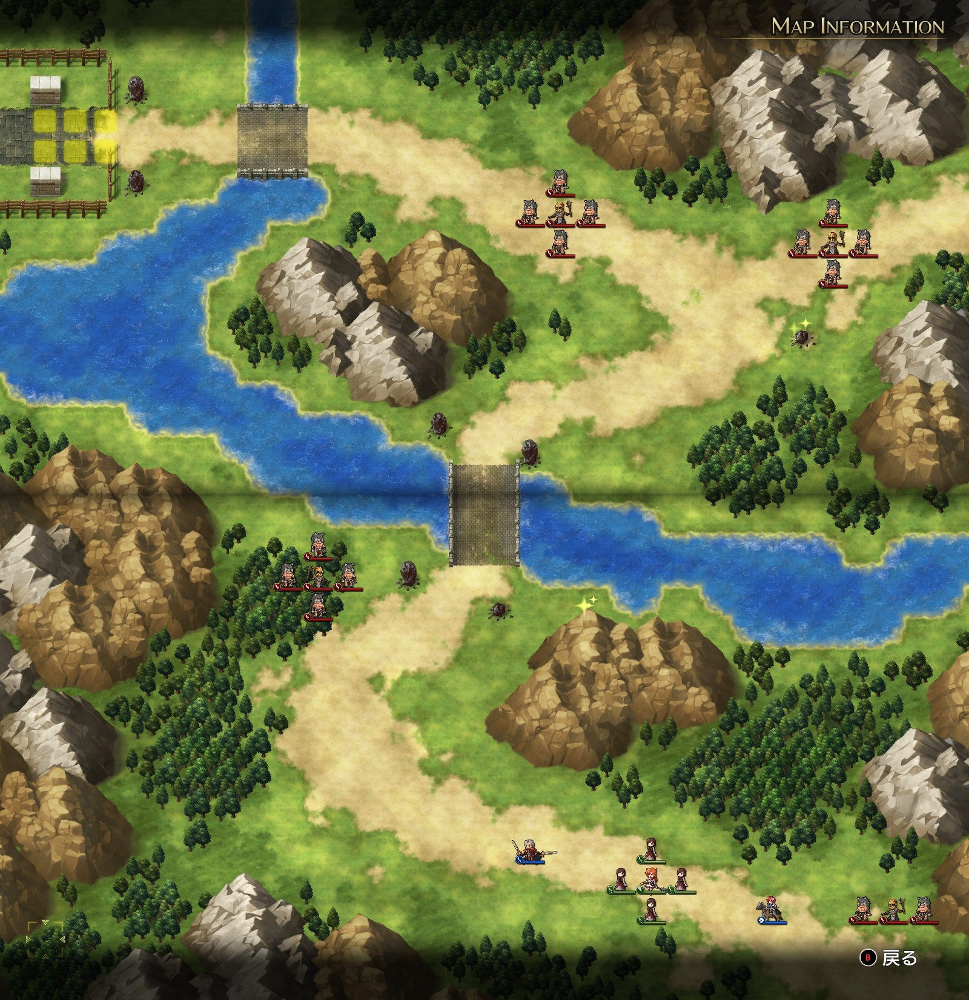

# A ルート 2 章：サルラスへ

## マップ

  

光るマス
- 北東の三叉路
- 中央の橋の南東

## 条件

- 勝利条件
    - 敵の全滅
    - クリスが街道入り口に到達
- 敗北条件
    - レディンの死亡
    - クリスの死亡

## 敵軍

|指揮官|クラス|兵種|傭兵|傭兵兵種|
|---|---|---|---|---|
|シカ族|シカゾク|盗賊|バーバリアン|盗賊|
|シカ族|シカゾク|盗賊|バーバリアン|盗賊|
|シカ族|シカゾク|盗賊|バーバリアン|盗賊|
|シカ族|シカゾク|盗賊|バーバリアン|盗賊|

## 増援

|出現ターン|出現位置|指揮官|クラス|兵種|傭兵|傭兵兵種|
|---|---|---|---|---|---|---|
|3 ターン目|街道入り口付近|ホーキング（味方 NPC）|シルバーナイト|騎兵|ランサー|騎兵|
|3 ターン目|街道入り口付近|ソーン（味方 NPC）|シルバーナイト|騎兵|ランサー|騎兵|
|6 ターン目|北東|ド・モトフ|シカゾク|盗賊|バーバリアン|盗賊|

## 流れ

同盟国のサルラスを目指して落ち延びるレディンが巡礼途中のクリスと出会い、街までの護衛を買って出ます。

盗賊達は全軍で攻め寄せてきます。

途中で、北側に味方と敵それぞれの増援が出てきます。増援同士で戦う流れになることが多いのではないでしょうか。

## 攻略メモ

### 出撃指揮官

|指揮官|クラス|傭兵|
|---|---|---|
|レディン|シルバーナイト|トルーパー|
|ヴォルコフ|ソードマスター|ランサー|

※指揮官の配置変更不可

### 作戦

盗賊を退けるだけであれば難しくありませんが、レベルを上げるためになるべくレディンで敵を倒そうとすると厄介になってきます。

レディンは後方（東側）のシカ族を速やかに片付けた後、ヴォルコフとクリスを追い越して前方のシカ族とも戦います。

NPC のクリスは北や西に最大 3 マス動きます。ヴォルコフ隊で 3 マス目を塞ぐようにすることで、移動量を 2 マスにできますので、クリスの邪魔をしながらレディンを待ちます。

ヴォルコフ隊のうち 1 ユニットは、なるべく早めに三叉路のアイテム回収に向かうようにします。

### 反省点

増援のホーキング達が敵を殲滅してしまったため、三叉路のアイテムを回収できませんでした。

  <a href="../README.md">［ホームへ戻る］</a>

