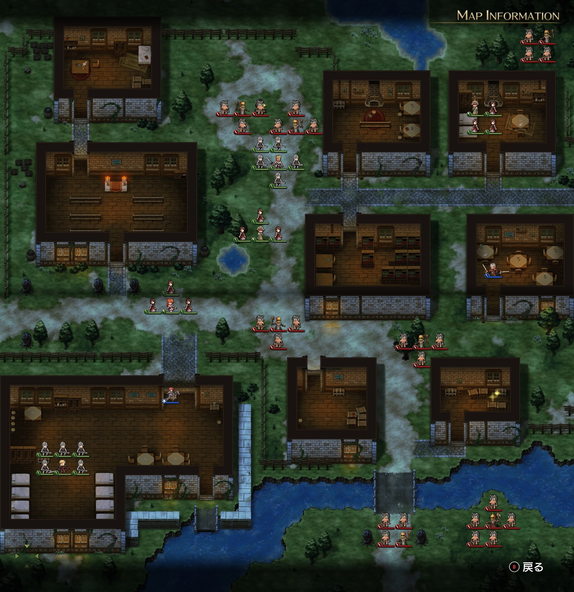

Steam 版ラングリッサーⅠ＆Ⅱリメイク > ラングリッサーⅠ

# A ルート 3 章：襲撃

## マップ

  

光るマス
- 北の広場中央（バーバリアンがいるところ）
- 南東の民家内

## 条件

- 勝利条件
    - 敵の全滅
- 敗北条件
    - レディンの死亡
    - 村人が全滅

## 敵軍

|指揮官|クラス|兵種|傭兵|傭兵兵種|
|---|---|---|---|---|
|カ・イロウ|シカゾク|盗賊|バーバリアン|盗賊|
|シカ族|シカゾク|盗賊|バーバリアン|盗賊|
|シカ族|シカゾク|盗賊|バーバリアン|盗賊|
|シカ族|シカゾク|盗賊|バーバリアン|盗賊|
|シカ族|シカゾク|盗賊|バーバリアン|盗賊|
|シカ族|シカゾク|盗賊|バーバリアン|盗賊|
|シカ族|シカゾク|盗賊|バーバリアン|盗賊|

## 増援

|出現ターン|出現位置|指揮官|クラス|兵種|傭兵|傭兵兵種|
|---|---|---|---|---|---|---|
|4 ターン目|西（教会の南）|ド・モトフ|シカゾク|盗賊|バーバリアン|盗賊|

## 流れ

サルラスがシカ族の夜襲に遭います。

カ・イロウ以外は 1 ターン目から攻め寄せてきて、カ・イロウも 2 ターン目から動き始めます。

中央の村人は、教会の南側から入るルートを取ります。北東の村人は、教会の北側から入るルートを取ります。村人は盗賊と交戦になると高確率で一撃で死にます。

嫌らしいことに、増援のド・モトフは教会の入口付近に出てきます。

クリア後、ナームが仲間となり、グレートソードを入手します。

また、村人からネックレス（指揮修正 ATK+10%、指揮修正 DEF+10%）をもらえます（別ハードでは村人が死ぬともらえないようですが、少なくとも村人傭兵 1 ユニットが死亡した程度ではもらえました）。

## 攻略メモ

### 出撃指揮官

|指揮官|クラス|傭兵|
|---|---|---|
|レディン|シルバーナイト|トルーパー|
|ヴォルコフ|ソードマスター|ランサー|

※指揮官の配置変更不可

### 作戦

レディンは急ぎ手近なシカ族を殲滅します。

その後、増援対策として 1 ユニットだけ教会入り口封鎖用に残し（壁役に徹していれば NPC のホーキングがなんとかしてくれます）、北側のシカ族をソーンと一緒に殲滅します。

ヴォルコフは民家から出て、南側から来るシカ族と戦いながら徐々に北上し、北側のシカ族にも対応します。1 ユニットはこっそり東側から回り込んでアイテム回収を済ませます。

### 反省点

北東の村人がソーンやレディンの戦場に突っ込んでいってしまい、村人 1 ユニットが死亡してしまいました。

多少の経験値は捨ててでも殲滅を急いだ方がすっきりとした結末になったかと思います。

  <a href="../README.md">［ホームへ戻る］</a>

