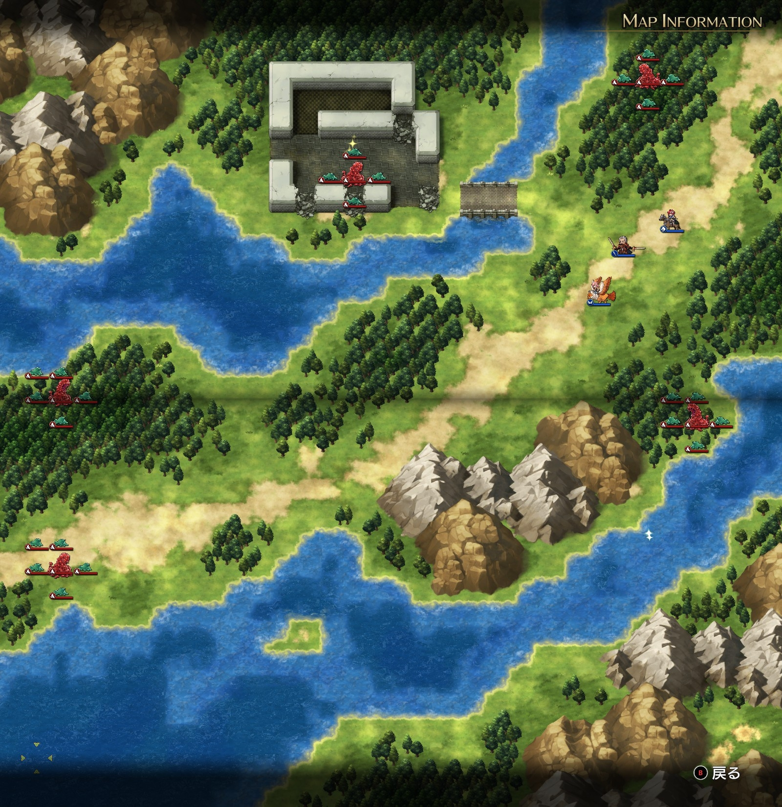

Steam 版ラングリッサーⅠ＆Ⅱリメイク > ラングリッサーⅠ

# A ルート 4 章：死霊の森

## マップ

  

光るマス
- 北の廃墟内
- 東の川の中

## 条件

- 勝利条件
    - 敵の全滅
    - 11 ターンの間レディン生存
- 敗北条件
    - レディンの死亡

## 敵軍

|指揮官|クラス|兵種|傭兵|傭兵兵種|
|---|---|---|---|---|
|ゲルギャザー|ゲルギャザー|怪物ゲル|ゲル|怪物ゲル|
|ゲルギャザー|ゲルギャザー|怪物ゲル|ゲル|怪物ゲル|
|ゲルギャザー|ゲルギャザー|怪物ゲル|ゲル|怪物ゲル|
|ゲルギャザー|ゲルギャザー|怪物ゲル|ゲル|怪物ゲル|
|ゲルギャザー|ゲルギャザー|怪物ゲル|ゲル|怪物ゲル|

## 増援

|出現ターン|出現位置|指揮官|クラス|兵種|傭兵|傭兵兵種|
|---|---|---|---|---|---|---|
|3 ターン目|南西|ソーン（味方 NPC）|ファイター|歩兵|ソルジャー|歩兵|
|3 ターン目|南西|クリス（味方 NPC）|シスター|僧侶|モンク|僧侶|

## 流れ

バルディア城が陥落したことを知ったレディン達は、バルディア城に戻るべく動きます（戻ってどうにかなるなら最初から脱出する必要なかった気もしますが……）。その途中、不気味な名前の森で、不気味な怪物に襲われるマップです。

1 ターン目から全ての敵軍が攻め寄せてきます。

3 ターン目に味方の増援が到着し、NPC として敵軍と交戦します。

クリア後、クリスとソーンが仲間になります。

## 攻略メモ

### 出撃指揮官

|指揮官|クラス|傭兵|
|---|---|---|
|レディン|シルバーナイト|ソルジャー|
|ヴォルコフ|ソードマスター|パイク|
|ナーム|ホークロード|ハーピー|

### 作戦

このマップから、ショップが役に立つラインナップを出してくるようになりますので、忘れずにチェックします。

このマップの一番の難関は、取りにくい位置にある廃墟内のアイテム回収だと思います。味方増援が強すぎて、登場から 2 ターンで 2 隊を片付けてしまいますので、いかに廃墟内のゲルギャザーと戦いながら（殺さないうちに）廃墟内のアイテムを回収するか、を考えて戦う必要があります。

今回は、ヴォルコフを殿として北側のゲルギャザーに、レディンが廃墟のゲルギャザーに、ナームが南側のゲルギャザーに対応しました。

レディンは、橋付近でゲルギャザーを迎え撃ち、交戦の隙をぬって、傭兵 1 ユニットで奥のアイテムを回収しました。ナームも同様に交戦とアイテム回収をこなします。

### 反省点

ナームが「攻撃が効かない」的なセリフを吐くのでかなり警戒しながら戦いました。レディンも橋付近で戦うことで、同時交戦数を 2 体程度に抑えました。

……が、実際にはそこまで敵は強くないので、レディンは橋の東側で戦えば、もっと速やかに回り込んでアイテムを回収できたのかなと思います。

  <a href="../README.md">［ホームへ戻る］</a>

